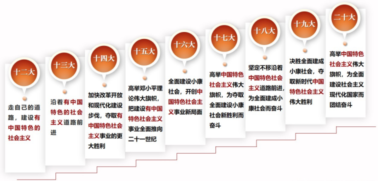
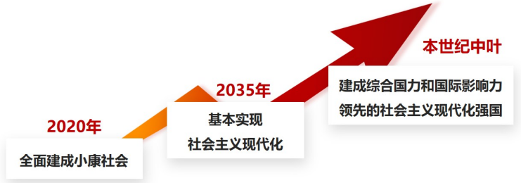

# 第一讲	马克思主义中国化时代化新的飞跃

> ​		习近平新时代中国特色社会主义思想是当代中国马克思主义、二十一世纪马克思主义，是中华文化和中国精神的时代精华，实现了马克思主义中国化新的飞跃。
>
> ​																			——《中共中央关于党的百年奋斗重大成就和历史经验的决议》
>
> ​																																					   (2021年11月11日)

## ==一、习近平新时代中国特色社会主义思想是如何创立的❤️==

**——时代是思想之母，实践是理论之源**

### （一）时代背景：”两个大局“同步交织、相互激荡

- ==“两个大局”==
  - 一个是中华民族伟大复兴的战略全局
  - 一个是世界百年未有之大变局
- 当前，世界百年未有之大变局加速演进，我国发展进入战略机遇和风险挑战并存、不确定难预料因素增多的时期，两者**同步交织、相互激荡。**
- **==世界百年未有之大变局加速演进==**
  - 当前**国际格局和国际体系**正在发生深刻调整
  - **全球治理体系**正在发生深刻变革
  - **国际力量对比**正在发生近代以来最具革命性的变化
  - 世界范围呈现出**影响人类历史进程和趋向的重大态势**

- **==中华民族伟大复兴正处于关键时期==**
  - 中国共产党和中国人民正信心百倍推进中华民族从站起来、富起来到强起来的伟大飞跃，实现中华民族伟大复兴进入了不可逆转的历史进程。

- 中华民族伟大复兴，是造成世界百年未有之大变局的重要原因；世界面临百年未有之大变局，给中华民族伟大复兴带来重大机遇。
- 世界需要**中国理念、中国智慧、中国方案**。中国发展理念、发展道路、发展模式的影响力、吸引力显著增强，中国日益发挥着世界和平建设者、全球发展贡献者、国际秩序维护者的重要作用。
- 习近平新时代中国特色社会主义思想，正是在**中华民族伟大复兴进入关键时期**创立并不断丰富发展的，正是在**把握世界发展大势、应对全球共同挑战、维护人类共同利益**的过程中创立并不断丰富发展的。

### （二）历史方位：中国特色社会主义进入新时代

- **==社会主要矛盾变化是进入新时代的重要依据==**
  - 改革开放后，我国社会主要矛盾是人民日益增长的物质文化需要同落后的社会生产之间的矛盾。进入新时代，**我国社会主要矛盾已经转化为人民日益增长的美好生活需要和不平衡不充分的发展之间的矛盾**。主要矛盾的变化，虽然没有改变我们对我国社会主义所处历史阶段的判断，但却是关系全局的历史性变化。
- **==新时代是怎样的时代？==**
  - 是承前启后、继往开来、在新的历史条件下继续**夺取中国特色社会主义伟大胜利**的时代
  - 是决胜全面建成小康社会、进而**全面建设社会主义现代化强国**的时代
  - 是全国各族人民团结奋斗、**不断创造美好生活、逐步实现全体人民共同富裕**的时代
  - 是全体中华儿女勤力同心、奋力**实现中华民族伟大复兴中国梦**的时代
  - 是我国不断**为人类作出更大贡献**的时代
- **==进入新时代意味着什么？==**
  - 意味着中华民族迎来了从站起来、富起来到强起来的伟大飞跃
  - 意味着科学社会主义在二十一世纪的中国焕发出强大生机活力
  - 意味着拓展了发展中国家走向现代化的途径，为解决人类问题贡献了中国智慧和中国方案
- **新时代孕育新思想**
  - 中国特色社会主义进入新时代，这是一个需要理论而且一定能够产生理论的时代，是一个需要思想而且一定能够产生思想的时代。习近平新时代中国特色社会主义思想正是**在这样的伟大时代中**应运而生、顺势而成的。

### （三）实践基础：历史性成就、历史性变革

- 党的十八大以来，采取一系列战略性举措，推进一系列变革性实践，实现一系列突破性进展，取得一系列标志性成果，经受住了来自**政治、经济、意识形态、自然界**等方面的风险挑战考验，党和国家事业取得历史性成就、发生历史性变革，推动我国迈上全面建设社会主义现代化国家新征程。
- **新时代十年**
  - 我们全面加强党的领导……
  - 对新时代党和国家事业发展作出科学完整的战略部署……
  - 经过接续奋斗实现了小康这个中华民族的千年梦想……
  - 提出并贯彻新发展理念……
  - 以巨大的政治勇气全面深化改革……
  - 实行更加积极主动的开放战略……
  - 坚持走中国特色社会主义政治发展道路……
  - 确立和坚持马克思主义在意识形态领域指导地位的根本制度……
  - 深入贯彻以人民为中心的发展思想……
  - 坚持绿水青山就是金山银山的理念……
  - 贯彻总体国家安全观……
  - 确立党在新时代的强军目标……
  - 全面准确推进“一国两制”实践……
  - 全面推进中国特色大国外交……
  - 深入推进全面从严治党……
- 新时代**十年**的伟大变革，在党史、新中国史、改革开放史、社会主义发展史、中华民族发展史上具有里程碑意义。
- ==实践是理论之源==
  - 当代中国正经历着最为广泛而深刻的社会变革，也正在进行着人类历史上最为宏大而独特的实践创新。习近平新时代中国特色社会主义思想是在**新时代的伟大实践**中应运而生、顺势而成的。

### （四）根本途径：“两个结合”

​		中华优秀传统文化是我们党创新理论的“**根**”，我们推进马克思主义中国化时代化的根本途径是“**两个结合**”。

​		坚持把马克思主义基本原理同中国具体实际相结合、同中华优秀传统文化相结合，用马克思主义观察时代、把握时代、引领时代，继续发展当代中国马克思主义、二十一世纪马克思主义!

​		坚持一切从中国具体实际出发，着眼解决新时代改革开放和社会主义现代化建设的实际问题，不断回答中国之问、世界之问、人民之问、时代之问，作出符合中国实际和时代要求的正确回答，得出符合客观规律的科学认识，形成与时俱进的理论成果，更好指导中国实践。

​		深刻把握中华优秀传统文化同科学社会主义价值观主张的高度契合性，坚定历史自信、文化自信，坚持古为今用、推陈出新，把马克思主义思想精髓同中华优秀传统文化精华贯通起来、同人民群众日用而不觉的共同价值观念融通起来，不断夯实马克思主义中国化时代化的历史基础和群众基础，让马克思主义真理之树根深叶茂。

​		习近平新时代中国特色社会主义思想正是在不断推进马克思主义中国化时代化，在坚持马克思主义基本原理同中国具体实际相结合、同中华优秀传统文化相结合中创立并不断丰富发展的。

​		习近平新时代中国特色社会主义思想，是党和人民实践经验和集体智慧的结晶。习近平总书记对关系新时代党和国家事业发展的一系列重大理论和实践问题进行了深邃思考和科学判断，提出一系列原创性的治国理政新理念新思想新战略，是习近平新时代中国特色社会主义思想的主要创立者。

## ==二、习近平新时代中国特色社会主义思想回答了什么重大时代课题❤️==

**——对新时代重大理论和实践问题的深邃思考**

### （一）新时代坚持和发展什么样的中国特色社会主义、怎样坚持和发展中国特色社会主义

​		坚持和发展中国特色社会主义，是改革开放以来我们党全部理论和实践的鲜明主题。

​		坚持和发展中国特色社会主义是一篇大文章，如何在新的时代条件下继续把这篇大文章写下去，是必须回答好的重大课题。

- **关于新时代坚持和发展中国特色社会主义的相关论述**
  - 中国特色社会主义是社会主义而不是其他什么主义，科学社会主义基本原则不能丢，丢了就不是社会主义。
  - 中国特色社会主义是全面发展的社会主义，我们要在经济不断发展的基础上，协调推进政治建设、文化建设、社会建设、生态文明建设以及其他各方面建设。
  - 在新的历史条件下坚持和发展中国特色社会主义，必须坚持走自己的路，必须顺应世界大势，必须代表最广大人民根本利益，必须加强党的自身建设，必须坚定中国特色社会主义自信。

### （二）建设什么样的社会主义现代化强国、怎么建设社会主义现代化强国

​		在党的第一个百年目标全面建成小康社会实现之后，我们开启全面建设社会主义现代化国家新征程。

- **关于建设社会主义现代化强国的相关论述**
  - 到那时，我国物质文明、政治文明、精神文明、社会文明、生态文明将全面提升，实现国家治理体系和治理能力现代化，成为综合国力和国际影响力领先的国家，全体人民共同富裕基本实现，我国人民将享有更加幸福安康的生活，中华民族将以更加昂扬的姿态屹立于世界民族之林。
  - 中国式现代化，是中国共产党领导的社会主义现代化，既有各国现代化的共同特征，更有基于自己国情的中国特色。中国式现代化的本质要求是：坚持中国共产党领导，坚持中国特色社会主义，实现高质量发展，发展全过程人民民主，丰富人民精神世界，实现全体人民共同富裕，促进人与自然和谐共生，推动构建人类命运共同体，创造人类文明新形态。

### （三）建设什么样的长期执政的马克思主义政党、怎样建设长期执政的马克思主义政党

​		我们党作为百年大党，如何永葆先进性和纯洁性、永葆青春活力，如何永远得到人民拥护和支持，如何实现长期执政，是我们必须回答好、解决好的一个根本性问题。

- **关于建设长期执政的马克思主义政党的相关论述**：*百年恰是风华正茂*
  - 我们党历史这么长、规模这么大、执政这么久，如何跳出治乱兴衰的历史周期率?毛泽东同志在延安的窑洞里给出了第一个答案，这就是只有让人民来监督政府，政府才不敢松懈。经过百年奋斗特别是党的十八大以来新的实践，我们党又给出了第二个答案，这就是自我革命。
  - 我们党作为世界上最大的马克思主义执政党，要始终嬴得人民拥护、巩固长期执政地位，必须时刻保持解决大党独有难题的清醒和坚定。
  - 全面从严治党永远在路上，党的自我革命永远在路上，决不能有松劲歇脚、疲劳厌战的情绪，必须持之以恒推进全面从严治党，深入推进新时代党的建设新的伟大工程，以党的自我革命引领社会革命。
- 新时代全部理论和实践的**着力点**
  - 中国特色社会主义，讲的是**方向性质**问题
  - 社会主义现代化强国，讲的是**目标路径**问题
  - 长期执政的马克思主义政党，讲的是**力量保证**问题

## 三、习近平新时代中国特色社会主义思想主要包含哪些内容

**——系统科学的理论体系**

​		党的十九大、十九届六中全会提出的“十个明确”“十四个坚持”“十三个方面成就”概括了习近平新时代中国特色社会主义思想的主要内容。

​		“十个明确”“十四个坚持”“十三个方面成就”彼此呼应、相互贯通，明确了新时代坚持和发展中国特色社会主义的总目标、总任务、总体布局、战略布局和发展方向、发展方式、发展动力、战略步骤、外部条件、政治保证等基本问题，构成了系统全面、逻辑严密、内涵丰富、内在统一的科学理论体系。

​		实践没有止境，理论创新也没有止境。习近平新时代中国特色社会主义思想是开放的发展的理论体系，必将在全面建设社会主义现代化国家、全面推进中华民族伟大复兴的伟大实践中不断发展、丰富完善。

### （一）“十个明确”

如果把习近平新时代中国特色社会主义思想比作一座**理论大厦**，“十个明确”就是支撑整座大厦的**“四梁八柱”**。
把握住了“十个明确”，就掌握了这一思想的**核心要义和基本精神。**

1. 明确中国特色社会主义最本质的特征是**中国共产党领导**，中国特色社会主义制度的最大优势是中国共产党领导。中国共产党是最高政治领导力量，全党必须增强“四个意识”、坚定“四个自信”、做到“两个维护”
2. 明确坚持和发展中国特色社会主义，**总任务是实现社会主义现代化和中华民族伟大复兴**，在全面建成小康社会的基础上，分两步走在本世纪中叶建成富强民主文明和谐美丽的社会主义现代化强国，以中国式现代化推进中华民族伟大复兴。
3. 明确新时代**我国社会主要矛盾**是人民日益增长的美好生活需要和不平衡不充分的发展之间的矛盾，必须坚持**以人民为中心**的发展思想。发展**全过程人民民主**，推动人的全面发展、全体人民共同富裕取得更为明显的实质性进展。
4. 明确中国特色社会主义事业**总体布局**是经济建设、政治建设、文化建设、社会建设、生态文明建设**五位一体**，**战略布局**是全面建设社会主义现代化国家、全面深化改革、全面依法治国、全面从严治党**四个全面**。
5. 明确**全面深化改革总目标**是完善和发展中国特色社会主义制度、推进国家治理体系和治理能力现代化。
6. 明确**全面推进依法治国**总目标是建设中国特色社会主义法治体系、建设社会主义法治国家。
7. 明确**必须坚持和完善社会主义基本经济制度**，使市场在资源配置中起决定性作用，更好发挥政府作用，把握**新发展阶段**，贯彻创新、协调、绿色、开放、共享的**新发展理念**，加快构建以国内大循环为主体、国内国际双循环相互促进的**新发展格局**，推动**高质量发展，统筹发展和安全**。
8. 明确党在**新时代的强军目标**是建设—支听党指挥、能打胜仗、作风优良的人民军队。把人民军队建设成为**世界一流军队**。
9. 明确**中国特色大国外交**要服务民族复兴、促进人类进步，推动建设新型国际关系，推动构建**人类命运共同体**。
10. 明确**全面从严治党**的战略方针，提出新时代党的建设总要求，全面推进党的政治建设、思想建设、组织建设、作风建设、纪律建设。把制度建设贯穿其中，深入推进反腐败斗争，落实管党治党政治责任，以伟大自我革命引领伟大社会革命。

### （二）“十四个坚持”

“十四个坚持”是新时代坚持和发展中国特色社会主义的**基本方略**，是习近平新时代中国特色社会主义思想的重要组成部分，是落实这一思想的**实践要求**。

- 坚持党对—切工作的领导
- 坚持以人民为中心
- 坚持全面深化改革
- 坚持新发展理念
- 坚持人民当家作主
- 坚持全面依法治国
- 坚持社会主义核心价值体系
- 坚持在发展中保障和改善民生
- 坚持人与自然和谐共生
- 坚持总体国家安全观
- 坚持党对人民军队的绝对领导
- 坚持“一国两制”和推进祖国统一
- 坚持推动构建人类命运共同体
- 坚持全面从严治党

### （三）“十三个方面成就”

“十三个方面成就”全景展示了以习近平同志为核心的党中央治国理政理念、成就和经验，既是习近平新时代中国特色社会主义思想指导的结果，又以一系列重要原创性成果丰富发展了这一重要思想。

- 在坚持党的全面领导上
- 在全面从严治党上
- 在经济建设上
- 在全面深化改革开放上
- 在政治建设上
- 在全面依法治国上
- 在文化建设上
- 在社会建设上
- 在生态文明建设上
- 在国防和军队建设上
- 在维护国家安全上
- 在坚持“一国两制”和推进祖国统一上
- 在外交工作上

## ==四、如何把握习近平新时代中国特色社会主义思想的世界观和方法论==

**——马克思主义世界观和方法论的丰富发展**

> 科学的世界观和方法论是我们研究问题、解决问题的“总钥匙”。
> 																						——习近平在二十届中央政治局第一次集体学习时的讲话
> 																																						(2022年10月25日)

​		把握好习近平新时代中国特色社会主义思想的世界观和方法论，坚持好、运用好贯穿其中的立场观点方法，必须**坚持人民至上、坚持自信自立、坚持守正创新、坚持问题导向、坚持系统观念、坚持胸怀天下。**

​		“六个必须坚持”是一个相互联系的有机整体，赋予了马克思主义世界观和方法论以新时代的内涵，彰显了习近平新时代中国特色社会主义思想的理论品格和鲜明特征，是深刻理解这一思想必须牢牢把握的基本点，也是继续推进理论创新必须始终坚持的基本点。

### （一）坚持人民至上

​		人民性是马克思主义的本质属性，党的理论是来自人民、为了人民、造福人民的理论，人民的创造性实践是理论创新的不竭源泉。一切脱离人民的理论都是苍白无力的，一切不为人民造福的理论都是没有生命力的。

​		我们要站稳人民立场、把握人民愿望、尊重人民创造、集中人民智慧，形成为人民所喜爱、所认同、所拥有的理论，使之成为指导人民认识世界和改造世界的强大思想武器。

### （二）坚持自信自立

​		中国人民和中华民族从近代以后的深重苦难走向伟大复兴的光明前景，从来就没有教科书，更没有现成答案。党的百年奋斗成功道路是党领导人民独立自主探索开辟出来的，马克思主义的中国篇章是中国共产党人依靠自身力量实践出来的，贯穿其中的一个基本点就是中国的问题必须从中国基本国情出发，由中国人自己来解答。

​		我们要坚持对马克思主义的坚定信仰、对中国特色社会主义的坚定信念，坚定道路自信、理论自信、制度自信、文化自信，以更加积极的历史担当和创造精神为发展马克思主义作出新的贡献，既不能刻舟求剑、封闭僵化，也不能照抄照搬、食洋不化。

### （三）坚持守正创新

​		我们从事的是前无古人的伟大事业，守正才能不迷失方向、不犯颠覆性错误，创新才能把握时代、引领时代。

​		我们要以科学的态度对待科学、以真理的精神追求真理，坚持马克思主义基本原理不动摇，坚持党的全面领导不动摇，坚持中国特色社会主义不动摇，紧跟时代步伐，顺应实践发展，以满腔热忱对待一切新生事物，不断拓展认识的广度和深度，敢于说前人没有说过的新话，敢于干前人没有干过的事情，以新的理论指导新的实践。

### （四）坚持问题导向

​		问题是时代的声音，回答并指导解决问题是理论的根本任务。今天我们所面临问题的复杂程度、解决问题的艰巨程度明显加大，给理论创新提出了全新要求。

​		我们要增强问题意识，聚焦实践遇到的新问题、改革发展稳定存在的深层次问题、人民群众急难愁盼问题、国际变局中的重大问题，党的建设面临的突出问题，不断提出真正解决问题的新理念新思路新办法。

### （五）坚持系统观念

​		万事万物是相互联系、相互依存的。只有用普遍联系的、全面系统的、发展变化的观点观察事物，才能把握事物发展规律。我国是一个发展中大国，仍处于社会主义初级阶段，正在经历广泛而深刻的社会变革，推进改革发展、调整利益关系往往牵一发而动全身。

​		我们要善于通过历史看现实、透过现象看本质，把握好全局和局部、当前和长远、宏观和微观、主要矛盾和次要矛盾、特殊和一般的关系，不断提高战略思维、历史思维、辩证思维、系统思维、创新思维、法治思维、底线思维能力，为前瞻性思考、全局性谋划、整体性推进党和国家各项事业提供科学思想方法。

### （六）坚持胸怀天下

​		中国共产党是为中国人民谋幸福、为中华民族谋复兴的党，也是为人类谋进步、为世界谋大同的党。

​		我们要拓展世界眼光，深刻洞察人类发展进步潮流，积极回应各国人民普遍关切，为解决人类面临的共同问题作出贡献，以海纳百川的宽阔胸襟借鉴吸收人类一切优秀文明成果，推动建设更加美好的世界。

## ==五、如何理解习近平新时代中国特色社会主义思想的历史地位❤️==

**——马克思主义中国化时代化的最新成果**

### ==（一）当代中国马克思主义、二十一世纪马克思主义==

- **坚持**
  - 一以贯之坚持马克思主义，在当代中国、在二十一世纪的世界高高举起了马克思主义的光辉旗帜。
- **发展**
  - 与时俱进发展马克思主义，在当代中国、在二十一世纪的世界开辟了马克思主义的崭新境界，展现了强大的真理力量，增强了马克思主义的生命力、说服力。

- **==续写了马克思主义中国化时代化新篇章==**
  - 这一思想把坚持马克思主义和发展马克思主义统一起来，既没有丢掉老祖宗，又讲出了许多新话，对马克思主义作出了许多原创性贡献，开辟了马克思主义中国化时代化新境界。
  - **在马克思主义哲学方面**
    - 提出人与自然是和谐共生的生命共同体，绿水青山就是金山银山，是对**马克思主义自然观**的新发展；提出新时代我国社会主要矛盾发生变化，是对**马克思主义社会矛盾学说**的新发展；强调要提高科学思维能力，要坚持系统观念，要强化问题导向等，是对**马克思主义认识论**的新发展；强调坚持以人民为中心，是对**唯物史观**的新发展；等等。
    - 这一思想对马克思主义哲学的发展，集中体现在“六个必须坚持”的世界观和方法论上。
  - **在马克思主义政治经济学方面**
    - 提出坚持和完善社会主义基本经济制度，使市场在资源配置中起决定性作用和更好发挥政府作用等思想，提出把握新发展阶段，贯彻新发展理念，加快构建新发展格局，推动高质量发展，是对**马克思主义经济学说**的新发展；等等。
  - **在科学社会主义方面**
    - 提出中国式现代化的中国特色、本质要求、重大原则等，进一步丰富发展了**马克思主义现代化理论**；提出坚持和加强党的全面领导、推进党的自我革命、解决大党独有难题的思想，是对**马克思主义建党学说**的新发展；提出坚持和完善中国特色社会主义制度、推进国家治理体系和治理能力现代化的思想，是对**马克思主义国家学说**的新发展；提出构建人类命运共同体的思想，是对**马克思主义世界历史理论**的新发展；等等。
  - 习近平新时代中国特色社会主义思想承前启后、继往开来，统筹把握中华民族伟大复兴战略全局和世界百年未有之大变局，**是关乎中国前途命运的当代中国马克思主义，是关乎科学社会主义发展前景的二十一世纪马克思主义**，为马克思主义在当今时代的大发展作出了开创性、全面性、历史性贡献。

### （二）中华文化和中国精神的时代精华

​		习近平新时代中国特色社会主义思想汲取中华优秀传统文化所蕴含的丰富**哲学思想、人文精神、道德理念和政治智慧**，有效激活了中华优秀传统文化的生命力，实现了中华优秀传统文化的创造性转化、创新性发展。

​		习近平新时代中国特色社会主义思想，对中华优秀传统文化蕴含的**天下为公、民为邦本、为政以德、革故鼎新、任人唯贤、天人合一、自强不息、厚德载物、讲信修睦、亲仁善邻**等，以新的时代内涵增强其生命力，使之成为治国理政的重要思想文化资源。

- **==从中华优秀传统文化中汲取治国理政智慧==**
  - ==坚持以人民为中心==
    - 汲取了“民惟邦本，本固邦宁”“以百姓心为心”的民本理念
  - ==全面深化改革==
    - 体现了“周虽旧邦，其命维新”“苟日新，日日新，又日新”的变革思想
  - ==人与自然和谐共生==
    - 秉承了“道法自然”“天地与我并生，而万物与我为一”的天人之道
  - ==推动构建人类命运共同体==
    - 吸收了“协和万邦”“天下一家”的和合智慧
  - 以“但愿苍生俱保暖，不辞辛苦出山林”要求敬民爱民，落实民生小事；
  - 以“安而不忘危，存而不忘亡，治而不忘乱”警示要做到喜不忘忧，未雨绸缪；
  - 以“为官避事平生耻”勉励勤勉任事，敢做敢当；
  - 以“慎易以避难，敬细以远大”强调做事不弃微末，精益求精；
  - 以“吾生也有涯，而知也无涯”建议博采知识精华，畅游知识海洋；等等

​		从习近平总书记引用的这些典故中，可以感悟“以百姓之心为心”的宗旨意识、“执古之道以御今之有”的政治智慧、“天下大事必作于细”的务实精神。

​		这一思想大力弘扬以爱国主义为核心的民族精神和以改革创新为核心的时代精神，深刻阐发了以伟大建党精神为源头的中国共产党人精神谱系，以及中国人民的伟大创造精神、伟大奋斗精神、伟大团结精神、伟大梦想精神，概括提炼了**脱贫攻坚精神、伟大抗疫精神、新时代北斗精神、北京冬奥精神**等，为实现中华民族伟大复兴提供了精神力量。

​		习近平新时代中国特色社会主义思想，充盈着**浓郁的中国味、深厚的中华情、浩然的民族魂**，具有强大的历史穿透力、文化感染力和精神感召力，是坚持马克思主义基本原理同中国具体实际相结合、同中华优秀传统文化相结合的**典范**。

### ==（三）马克思主义中国化时代化新的飞跃==

​		中国共产党为什么能，中国特色社会主义为什么好，归根到底是马克思主义行，是中国化时代化的马克思主义行。

​		推进马克思主义中国化时代化是一个追求真理、揭示真理、笃行真理的过程。

​		习近平新时代中国特色社会主义思想，深刻总结并充分运用党成立以来的历史经验，从新的实际出发，提出了一系列原创性的治国理政新理念新思想新战略，以全新的视野深化了对共产党执政规律、社会主义建设规律、人类社会发展规律的认识，**实现了马克思主义中国化时代化新的飞跃**。

### ==（四）深刻领悟“两个确立”的决定性意义==

​		==确立==习近平同志党中央的核心、全党的核心地位

​		==确立==习近平新时代中国特色社会主义思想的指导地位

​		反映了全党全军全国各族人民共同心愿，对新时代党和国家事业发展、对推进中华民族伟大复兴历史进程具有决定性意义。

​		在习近平新时代中国特色社会主义思想的指导下，中国共产党团结带领中国人民，创造了新时代中国特色社会主义的伟大成就，为实现中华民族伟大复兴提供了**更为完善的制度保证、更为坚实的物质基础、更为主动的精神力量**。

​		“两个确立”是推动新时代党和国家事业取得历史性成就、发生历史性变革的根本原因，是实现新时代新征程各项目标任务的根本保证。

## 六、如何学好用好习近平新时代中国特色社会主义思想

**——切实做到学、思、用贯通，知、信、行统一**

### （一）坚持读原著学原文悟原理

​		原著原文是最权威的，只有学深学透原著原文，才能全面把握习近平新时代中国特色社会主义思想的真谛真义、思想精华。要坚持原原本本地学、专心致志地读、细嚼慢咽地去感悟思考。

### （二）带着问题学、联系实际学

​		习近平新时代中国特色社会主义思想扎根中国大地、立足中国国情、着眼中国客观实际，是在解决中国实际问题的过程中形成和发展起来的。学好这一思想，要把理论和实践有机结合起来，发扬理论联系实际的马克思主义学风，既向书本学，又向实践学。

### （三）把握贯穿其中的立场观点方法

​		这一思想既讲是什么、为什么，又讲怎么看、怎么办，既部署“过河”的任务，又指导解决“桥或船”的问题，生动体现了马克思主义世界观和方法论的统一。我们要把握好习近平新时代中国特色社会主义思想的世界观和方法论，坚持好、运用好贯穿其中的立场观点方法，用以指导自己的学习和工作。

### （四）用党的创新理论认识世界、改造世界

​		为中国人民谋幸福、为中华民族谋复兴，为人类谋进步、为世界谋大同，是深刻理解和全面把握习近平新时代中国特色社会主义思想的金钥匙。学好用好这一思想，根本上是要用这一思想观察时代、把握时代、引领时代，用党的创新理论来认识世界、改造世界。

## 课堂小结

​		习近平新时代中国特色社会主义思想回答的重大时代课题是：新时代坚持和发展什么样的中国特色社会主义、怎样坚持和发展中国特色社会主义，建设什么样的社会主义现代化强国、怎样建设社会主义现代化强国，建设什么样的长期执政的马克思主义政党、怎样建设长期执政的马克思主义政党。

​		坚持人民至上、坚持自信自立、坚持守正创新、坚持问题导向、坚持系统观念、坚持胸怀天下，是习近平新时代中国特色社会主义思想的世界观和方法论。

​		习近平新时代中国特色社会主义思想是当代中国马克思主义、二十一世纪马克思主义，是中华文化和中国精神的时代精华，实现了马克思主义中国化时代化新的飞跃。
