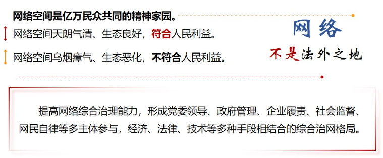
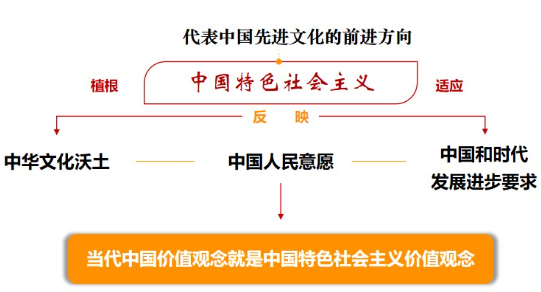

# 第十讲	建设社会主义文化强国

## ==一、为什么建设中国特色社会主义文化❤️==

**——文化兴国运兴，文化强民族强**

### （一）文化是一个国家、一个民族的灵魂

- **==为什么文化如此重要==**
  - **文化是一种重要的力量**

- **==为什么中国文化具有独特性==**

- **==为什么强调文化自信==**
  - 文化自信是更基础、更广泛、更深厚的自信，是一个国家、一个民族发展中最基本、最深沉、最持久的力量

- **==如何发挥文化的重要作用==**

### （二）没有文化繁荣兴盛就没有中华民族伟大复兴

- **==文化繁荣兴盛是中华民族伟大复兴的重要内容==**

- **==中华民族伟大复兴以文化繁荣兴盛为支撑条件==**

​		一个国家、一个民族的强盛，总是以文化兴盛为支撑的，中华民族伟大复兴需要以中华文化发展繁荣为条件。

- **==实现文化的繁荣兴盛需要强大的领导力量==**
  - ==党的领导是担负文化使命、实现中华民族伟大复兴的根本保证。==

### （三）更好满足人民日益增长的精神文化需要

- **==促进满足人民文化需求和增强人民精神力量相统一==**

- **==为人民提供更多优秀精神文化产品，善莫大焉==**
  - **我们要通过文艺作品**
    - 传递真善美
    - 传递向上向善的价值观
    - 引导人们增强道德判断力和道德荣誉感
    - 向往和追求讲道德、尊道德、守道德的生活
- **==促进人们精神生活共同富裕==**
  - 共同富裕是全体人民共同富裕，是**人民群众物质生活和精神生活都富裕**。要强化社会主义核心价值观引领，加强爱国主义、集体主义、社会主义教育，发展公共文化事业，完善公共文化服务体系，不断满足人民群众多样化、多层次、多方面的精神文化需求。

## ==二、为什么要坚持马克思主义在意识形态领域指导地位的根本制度==

**——意识形态工作是为国家立心、为民族立魂的工作**

### ==（一）意识形态工作是党的一项极端重要的工作==

- **==意识形态关乎旗帜、关乎道路、关乎国家政治安全==**
  - **美国在全球各地策动”颜色革命“危害世界**
    - 玫瑰革命
    - 橙色革命
    - 郁金香革命
    - 阿拉伯之春
    - 广场革命
  - 必须高举马克思主义、中国特色社会主义伟大旗帜，巩固马克思主义在意识形态领域的指导地位。

### ==（二）巩固马克思主义在意识形态领域的指导地位==

- **==为什么坚持马克思主义在意识形态领域的指导地位的根本制度是历史的结论、现实的必然==**
  - 坚持马克思主义在意识形态领域指导地位的根本制度
    - 恪守党的本质属性、巩固党的团结统一的必然要求
    - 筑牢全体人民共同思想基础、凝聚团结奋进强大精神力量的必然要求
    - 坚持正确发展道路、实现国家长治久安的必然要求
    - 保证我国文化建设正确方向、更好担负起新时代使命任务的必然要求
  - 党的十九届四中全会第一次明确提出了坚持马克思主义在意识形态领域指导地位的根本制度。

- **==为什么要坚持马克思主义在意识形态领域指导地位的根本制度❗==**
  - 是由马克思主义的理论性质决定的
    - 马克思主义是科学的理论、人民的理论、实践的理论、不断发展的开放的理论。无论时代如何变迁、科学如何进步，马克思主义依然显示出科学思想的伟力，依然占据着真理和道义的制高点。
  - 坚持马克思主义在意识形态领域指导地位这一根本制度，必须坚定不移，任何时候任何情况下都不能有丝毫动摇。
  - **马克思主义是共产党人的”真经“**
    - **中国共产党的初心使命源于马克思主义科学理论的指引和召唤**
  - **马克思主义是社会主义事业的”北斗“**
    - 找到一条正确道路、建立一个国家政权不容易，坚持住这条道路、巩固好这个政权更不容易。只有始终不渝坚持以马克思主义为指导，才能保证道路不偏向、江山不变色，保证国本永固、事业常青。
    - 必须坚持马克思主义在意识形态领或指导地位的根本制度，坚定主心骨、把准定盘星，确保我国始终沿着社会主义方向凝心聚力、阔步前进。
  - **马克思主义是当代中国文化发展的灵魂**
    - 必须坚持马克思主义在意识形态领域指导地位的根本制度，确保我国文化建设始终沿着正确方向前进。

### （三）不断增强意识形态领域主导权和话语权

- **==意识形态领域现状：形势依然复杂、挑战依然严峻==**
  - **社会思想意识复杂多样、相互交织**
    - 一些错误思想观点特别是<u>西方“宪政民主”、新自由主义、历史虚无主义</u>等仍然伺机冒头，妄图挑战马克思主义指导地位，攻击否定党的领导和我国政治制度、发展道路，竭力争夺意识形态话语权。
  - **社会主流价值遭遇市场逐利性的调整**
    - 市场存在的自身弱点和消极方面，等价交换原则等观念，必然反映和进入到人们的精神生活中来，甚至渗透到党内生活中来。
    - 必须弘扬社会主流思想道德和价值观念
    - 
  - **媒体格局和舆论生态发生深刻变化**
    - 主流媒体主导作用受到巨大冲击，网络容易成为负面舆情发酵、错误思想传播的策源地和放大器，大大增加了舆论引导和内容管理的难度。
    - 主流媒体舆论压力
      - 国际——国内
      - 线上——线下
      - 虚拟——现实
      - 体制内——外
  - **各种敌对势力对我国渗透遏制**
- **==如何应对：牢牢掌握意识形态工作领导权==**

### （四）互联网是意识形态斗争的主阵地、主战场、最前沿

- **==为什么网络意识形态如此重要==**
  - **互联网是社会舆论的放大器**
  - **互联网是意识形态交锋最前沿**
    - 没有硝烟的战场
    - 最大变量
- **==加强网络空间治理，构建良好网络秩序==**

## 三、为什么要用社会主义核心价值观凝心聚力

**——凝魂聚气、强基固本的基础工程**

### （一）文化的影响力首先是价值观念的影响力

- **==不同民族、国家有不同的核心价值观==**

- **==培育社会主义核心价值观的意义是什么==**
  - 一个国家的文化软实力，从根本上说，取决于其核心价值观的生命力、凝聚力、感召力。确立反映全国各族人民共同认同的价值观“最大公约数”，使全体人民同心同德、团结奋进，关乎国家前途命运，关乎人民幸福安康。要把培育和践行社会主义核心价值观作为凝魂聚气、强基固本的基础工程。
  - **我国是一个有着14亿多人口、56个民族的大国，如果没有共同的核心价值观，一个民族、一个国家就会魂无定所、行无依归。**

### （二）社会主义核心价值观的内涵要义

- **==应该坚守什么样的社会主义核心价值观==**

- **==核心价值观，其实就是一种德==**
  - 国无德不兴，人无德不立
  - 明大德，守公德，严私德

### （三）培育和践行社会主义核心价值观

- **==使核心价值观的影响像空气一样无所不在、无时不有==**

- **==融入法治建设和社会治理==**
  - 坚持依法治国和以德治国相结合，把社会主义核心价值观融入法治建设、融入社会发展、融入日常生活。

## 四、如何提升国家文化软实力和中华文化影响力

**——推动社会主义文化大发展大繁荣**

### （一）推动中华优秀传统文化创造性转化、创新性发展

- **==从中华优秀传统文化中寻找源头活水==**
  - 中华优秀传统文化是中华文明的智慧结晶和精华所在，是中华民族的根和魂，是我们在世界文化激荡中站稳脚跟的根基。
- **==传承弘扬中华优秀传统文化==**
  - 中国文化历来推崇“收百世之阙文，采千载之遗韵”。认真吸收中华优秀传统文化的**思想精华和道德精髓**，深入挖掘和阐发中华优秀传统文化**讲仁爱、重民本、守诚信、崇正义、尚和合、求大同**的时代价值，并结合新的时代条件加以继承和发扬。
- **==警惕对待传统文化的两种错误倾向==**
  - <u>反对：文化复古主义</u>
  - <u>反对：文化虚无主义</u>
  - 坚持守正创新，推动中华优秀传统文化同社会主义社会相适应，展示中华民族的独特精神标识，更好构筑中国精神、中国价值、中国力量。

### （二）用中国特色社会主义文化培根铸魂

- **==发展社会主义先进文化==**

- **==传承弘扬革命文化==**
  - **红色是中国共产党、中华人民共和国最鲜亮的底色**
    - 把红色传统发扬好
    - 把红色资源利用好
    - 把红色基因传承好

### （三）推进文化事业和文化产业全面发展

### （四）讲好中国故事，传播好中国声音

- **讲好中国故事的底气**
  - 文化软实力集中体现了一个国家基于文化而具有的凝聚力和生命力，以及由此产生的吸引力和影响力。古往今来，任何一个大国的发展进程，既是经济总量、军事力量等硬实力提高的进程，也是价值观念、思想文化等软实力提高的进程。
  - 体现一个国家综合实力最核心的、最高层的，还是文化软实力，这事关一个民族精气神的凝聚。

- **展现中国形象**
  - 提高对外文化交流水平，完善人文交流机制，创新人文交流方式，用好多种文化形式，综合运用大众传播、群体传播、人际传播等多种方式展示中华文化魅力。

## 课堂小结

​		文化是一个国家、一个民族的灵魂，文化兴国运兴，文化强民族强，没有高度的文化自信，没有文化的繁荣兴盛，就没有中华民族伟大复兴。发展中国特色社会主义文化，要坚定文化自信，增强文化自觉，坚持走中国特色社会主义文化发展道路，激发全民族文化创新创造活力，建设社会主义文化强国。
