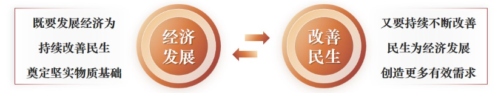
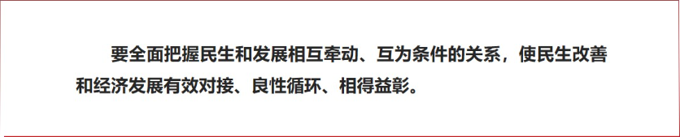
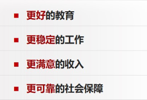
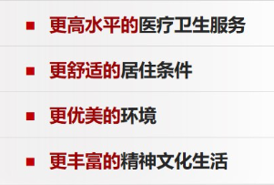
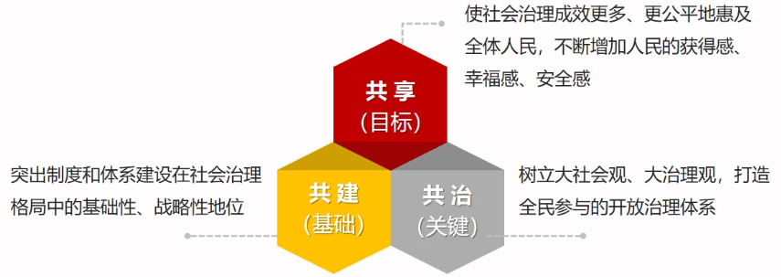

# 第十一讲	加强以民生为重点的社会建设

## ==一、为什么说”悠悠万事，民生为大“❤️==

**——为民造福是立党为公、执政为民的本质要求**

### （一）民生是最大的政治

- **==民生事关人民幸福生活==**
  - 民生是广大人民群众**最关心最直接最现实**的利益问题
  - 民生工作**离老百姓最近，同老百姓生活最密切**
- **==民生事关社会和谐稳定==**
  - **民生连着民心，民心凝聚人心，民生稳，人心就稳，社会就稳**
- **==民生事关党的事业成败和国家命运兴衰==**
  - **江山就是人民，人民就是江山**
  - **中国共产党领导人民打江山、守江山，守的是人民的心**
- **==抓民生也是抓发展==**
  - **做好经济社会发展工作，民生是”指南针“**
    - 既能有效解决群众后顾之忧，调动人们发展生产的积极性
    - 又可以增进社会消费预期，扩大内需，催生新的经济增长点，为经济发展、转型升级提供强大内生动力

### （二）人民美好生活需要日益增长

​		党的十八大以来，我国社会建设全面加强，人民生活全方位改善，人民群众获得感、幸福感、安全感更加充实、更有保障、更可持续，共同富裕取得新成效；社会治理社会化、法治化、智能化、专业化水平大幅度提升，发展了人民安居乐业、社会安定有序的良好局面，续写了社会长期稳定奇迹。在强国建设、民族复兴的新征程，要继续贯彻以人民为中心的发展思想，让现代化建设成果更多更公平惠及全体人民，在推进全体人民共同富裕上不断取得更为明显的实质性进展。

### （三）增进民生福祉是发展的根本目的

​		**党的十九大**明确了“坚持在发展中保障和改善民生”是新时代坚持和发展中国特色社会主义的**基本方略**之一，**党的二十大**把“增进民生福祉，提高人民**生活品质**“摆在了更加突出的位置。

## ==二、怎样增强人民获得感、幸福感、安全感<u>（民生建设的重点领域）</u>==

**——在发展中保障和改善民生**

### （一）抓住人民最关心最直接最现实的利益问题

- **==幼有所育==**
- **==学有所教==**
- **==劳有所得==**
  - 就业是最基本的民生
  - **==实施就业优先战略==**
- **==病有所医==**
- **==老有所养==**
- **==住有所居==**
- **==弱有所扶==**
- **==保障和改善民生的重要原则==**
  - **==既要==量力而为**
  - **==又要==量力而行**
  - 避免”中等收入陷阱“
  - 警惕”福利国家陷阱“
  - 阻止贫困现象代际传递

### （二）坚决打赢脱贫攻坚战

| 脱贫攻坚精神 |          |
| ------------ | -------- |
| 上下同心     | 尽锐出战 |
| 精准务实     | 开拓创新 |
| 攻坚克难     | 不负人民 |

- **==脱贫攻坚的伟大意义==**
  - 农村贫困人口全部脱贫，为实现全面建成小康社会目标任务作出了关键性贡献脱贫地区经济社会发展大踏步赶上来，整体面貌发生历史性巨变
  - 脱贫群众精神风貌焕然—新，增添了自立自强的信心勇气
  - 党群干群关系明显改善，党在农村的执政基础更加牢固
  - 创造了减贫治理的中国样本，为全球减贫事业作出了重大贡献
  - 出台一系列超常规政策举措，构建了一整套行之有效的政策体系、工作体系、制度体系，走出了一条中国特色减贫道路，形成了中国特色反贫困理论

### （三）抗疫斗争最大限度保护人民生命安全和身体健康

- **==抗击新冠肺炎疫情成果显著==**
- **==伟大抗疫精神==**
  - 生命至上
  - 举国同心
  - 舍生忘死
  - 尊重科学
  - 命运与共
- **==统筹推进疫情防控和经济社会发展工作==**

## 三、怎样推进社会治理现代化

**——建设人人有责、人人尽责、人人享有的社会治理共同体**

### （一）坚持系统治理、综合治理、依法治理、源头治理

| 系统治理                                                 | 综合治理                                                     | 依法治理                                         | 源头治理                                                     |
| -------------------------------------------------------- | ------------------------------------------------------------ | ------------------------------------------------ | ------------------------------------------------------------ |
| 加强党委领导，发挥政府主导作用，鼓励和支持社会各方面参与 | 加强党委领导，发挥政府主导作用，鼓励和支持社会各方面参与解决社会问题 | 加强法治保障，运用法治思维和法治方式化解社会矛盾 | 标本兼治、重在治本，及时反映和协调人民群众各方面各层次利益诉求 |

- **==打造共建共治共享的社会治理格局==**

- **==推动治理重心下移==**
  - 推动社会治理重心下移，畅通和规范群众诉求表达、利益协调、权益保障通道，完善网格化管理、精细化服务、信息化支撑的基层治理平台，健全城乡社区治理体系，为人民群众提供家门口的优质服务和精细管理，及时把矛盾纠纷化解在基层、化解在萌芽状态。
  - 枫桥经验

### （二）健全党组织领导的自治、法治、德治相结合的城乡基层治理体系

- ==坚持党组织领导基层群众性自治组织的制度==
  - **把抓基层、打基础作为长远之计和固本之举**
  - **强化党组织领导把关作用**
  - **健全村（社区）”两委“班子成员联系群众机制**

- **==推进基层法治与道德建设==**
  - ==推进基层治理法制建设==
  - ==加强思想道德建设==
  - ==发展公益慈善事业==

### （三）加强社会治安综合治理

- **==建设立体化、信息化的全方位社会治安防控体系==**
  - 加强社会治安防控网建设
  - 提高社会治安防控体系建设科技水平完善社会治安防控运行机制
  - 运用法治思维和法治方式推进社会治安防控体系建设
  - 建立健全社会治安防控体系建设工作格局

- **==防范化解影响社会安定的问题，打击违法犯罪活动==**
- **==扎实开展平安中国建设，维护社会稳定、保障人民安全==**
- **==常态化开展扫黑除恶斗争==**

## 课堂小结

​		民生是人民幸福之基、社会和谐之本。在发展经济的基础上不断提高人民生活水平，实现人民群众对美好生活的向往，是党和国家一切工作的根本目的。在发展中保障和改善民生，就是要多谋民生之利、多解民生之忧，在发展中补齐民生短板、促进社会公平正义，抓住人民最关心最直接最现实的利益问题，在幼有所育、学有所教、劳有所得、病有所医、老有所养、住有所居、弱有所扶等方面不断取得新进展，不断满足人民日益增长的美好生活需要。加强和创新社会治理，逐步实现社会治理结构的合理化、治理方式的科学化、治理过程的民主化，有力推进国家治理现代化。