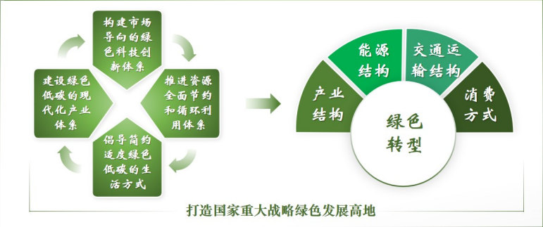
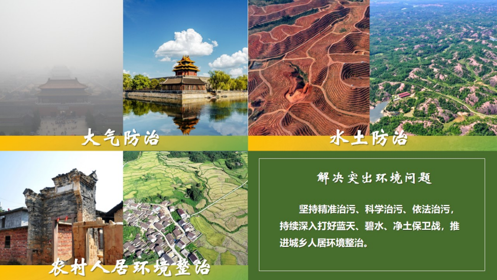

# 第十二讲	建设社会主义生态文明

> ​		**==党的十八大以来，我们党深刻回答了为什么建设生态文明、建设什么样的生态文明、怎样建设生态文明的重大理论和实践问题，提出了一系列新理念新思想新战略。==**
>
> ——习近平在全国生态环境保护大会上的讲话
>
> (2018年5月18日)

- ==习近平生态文明思想❤️==
  - 十个坚持
    - 坚持党对生态文明建设的全面领导
    - 坚持生态兴则文明兴
    - 坚持人与自然和谐共生
    - 坚持绿水青山就是金山银山
    - 坚持良好生态环境是最普惠的民生福祉
    - 坚持绿色发展是发展观的深刻革命
    - 坚持统筹山水林田湖草沙系统治理
    - 坚持用最严格制度最严密法治保护生态环境
    - 坚持把建设美丽中国转化为全体人民自觉行动
    - 坚持共谋全球生态文明建设之路

## ==一、为什么建设生态文明❤️==

**——关乎中华民族永续发展的根本大计**

### （一）顺应人类文明进程

- **==生态兴则文明兴，生态衰则文明衰==**
  - *美索不达米亚*
- **==人类文明进程的生态趋向==**
  - 建设生态文明是顺应人类文明进程、实现人与自然和谐共生的必然要求，具有历史必然性。
    - 原始文明
    - 农业文明
    - 工业文明
    - 生态文明

### （二）破解我国经济社会发展短板问题

- **==破解我国资源保障能力较弱对经济社会可持续发展的制约==**
- **==破解环境污染依然严重对人民生活质量和幸福感的制约==**
- **==破解我国生态系统依然脆弱对其服务经济社会发展能力的制约==**

### （三）满足人民日益增长的优美生态环境的需要

- **==生态环境状态与人民优美生态环境需要不相适应==**
- **==人民日益增长的优美生态环境需要==**
- **==凸显生态文明建设的惠民、利民、为民价值==**

### （四）应对全球生态环境领域挑战

- **==生态环境恶化是当代人类面临的严重全球性问题==**
- **==积极参与全球环境治理是我国生态文明建设的有机组成部分==**

## ==二、建设什么样的生态文明==

**——树立社会主义生态文明观**

### （一）人与自然和谐共生的现代化

- **==人与自然是生命共同体==**
  - **人因自然而生，人与自然是一种共生关系。**
  - **人类对大自然的伤害最终会伤及人类自身。**
- **==实现人与自然和谐共生的现代化==**

### （二）绿水青山就是金山银山

- **==绿水青山与金山银山的内在联系==**
  - 最大财富
  - 最大优势
  - 最大品牌

- **==绿水青山与金山银山的良性循环==**

### （三）良好生态环境是最普惠的民生福祉

- **==保护生态环境是为了民生==**
- **==人民共同建设共同享有的生态文明==**
  - **生态惠民、生态利民、生态为民、生态靠民**

### （四）山水林田湖草沙是生命共同体

- **==生态系统是有机关联的系统整体==**
- **==山水林田湖草沙系统治理之道==**
  - 植树造林、治山理水、养土护田、护草固沙
  - 坚持系统观念，保护生态环境
  - 国土绿化规模增大，生态安全屏障牢固
  - 各种生态环境要素之间的比例和空间关系得到维持、恢复、优化
  - 自然生态系统多样性、稳定性、持续性和生态服务功能全面提升

### （五）用最严格制度最严密法治保护生态环境

- **==保护生态环境必须依靠最严格制度最严密法治==**
  - **保证党中央关于生态文明建设决策部署落地生根见效**
    - ==牢固树立生态环境法治理念==
    - ==生态文明制度体系健全、配套完善==
    - ==管权治吏、护蓝增绿制度严格==
    - ==有权必有责、有责必担当、失责必追究==
- **==生态环境治理的体系化、法制化和效能化==**

### （六）共谋全球生态文明建设

- **==地球是全人类的共有家园==**
- **==全球生态文明建设的重要参与者、贡献者、引领者==**
  - 我国是全球气候变化谈判进程和《巴黎协定》签署、生效、实施的积极推动者，是将绿色发展纳入“一带一路”合作规划和中非合作计划的引领者，开展的生物多样性保护国际合作惠及众多国家。
  - 中国共产党是第一个把生态文明建设作为一个执政党的行动纲领。
  - 碳达峰、碳中和

## 三、怎样建设美丽中国

**——推进绿色发展、循环发展、低碳发展**

### （一）加快发展方式绿色转型

- **==推动形成绿色低碳的生产方式和生活方式==**

### （二）深入推进环境污染防治

### （三）系统推进生态环境保护修复

- **==提升生态系统多样性、稳定性和持续性==**
  - 推进以国家公园为主体的自然保护地体系建设
  - 实施生物多样性保护重大工程
  - 科学开展大规模国土绿化行动
  - 深化集体林权制度改革
  - 推行草原森林河流湖泊湿地休养生息
  - 完善生态产品价值实现机制和生态保护补偿制度
  - 加强生物安全管理，防治外来物种侵害
  - ***安徽歙县：“皖”美新安江***

### （四）积极稳妥推进碳达峰碳中和

- **==增加碳吸收、减少碳使用、加强碳转换、控制碳排放==**
  - 必须坚持全国统筹、节约优先、双轮驱动、内外畅通、防范风险的原则，更好发挥我国制度优势、资源条件、技术潜力、市场活力。
- **==注重处理好四对关系、落实六项举措==**
  - ==*四对关系*==
    - **发展和减排**
    - **整体和局部**
    - **长远目标和短期目标**
    - **政府和市场**
  - *==六项举措==*
    1. **加强统筹协调**
    2. **推动能源革命**
    3. **推进产业优化升级**
    4. **加快绿色低碳科技革命**
    5. **完善绿色低碳政策体系**
    6. **积极参与和引领全球气候治理**

### （五）改革完善生态环境监管考核体制

- **==健全落地见效的生态环境监管考核体制==**
  - ==监管考核==
    - **设立国有自然资源资产管理和自然生态监管机构**
    - **构建国土空间全方位开发保护制度体系**
    - **建立政府、企业、社会、公众参与的治理体系**
  - **党的十九大**
    - 对改革生态环境监管作出新部署，进一步理顺环保管理体制，使监管“一杆子插到底”。
  - **党的二十大**
    - 全面实行排污许可制，健全现代环境治理体系。深入推进中央生态环境保护督察。
- **党的十八大以来，我国全面加强生态文明建设，决心之大、力度之大、成效之大前所未有**

> 我们坚持绿水青山就是金山银山的理念，坚持山水林田湖草沙一体化保护和系统治理，全方位、全地域、全过程加强生态环境保护，生态文明制度体系更加健全，污染防治攻坚向纵深推进，绿色、循环、低碳发展迈出坚实步伐，生态环境保护发生历史性、转折性、全局性变化，我们的祖国天更蓝、山更绿、水更清。
>
> ——习近平在中国共产党第二十次全国代表大会上的报告
>
> (2022年10月16日)

## 课堂小结

​		生态文明建设是关乎中华民族永续发展的根本大计。建设社会主义生态文明主要涵括人与自然和谐共生的现代化，绿水青山就是金山银山，良好生态环境是最普惠的民生福祉，山水林田湖草沙是生命共同体，用最严格制度最严密法治保护生态环境，共谋全球生态文明建设。要加快推进绿色发展、循环发展、低碳发展，开创美丽中国建设新局面。