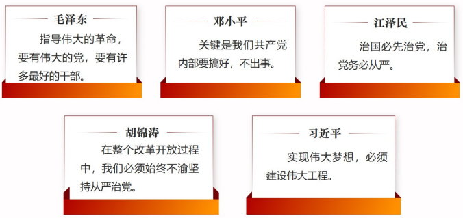
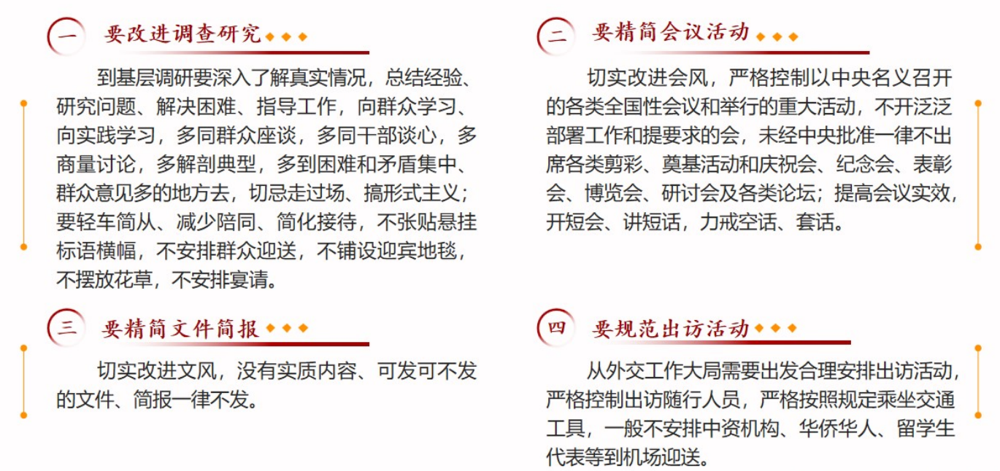
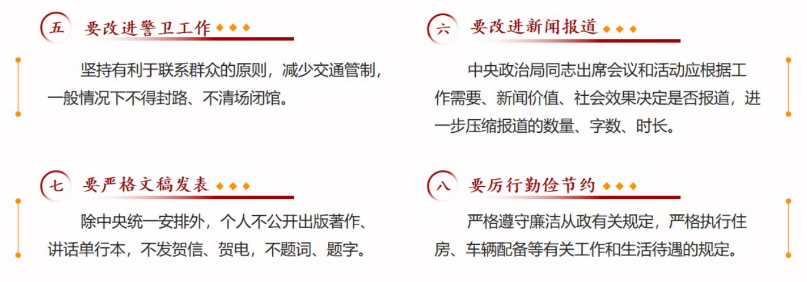
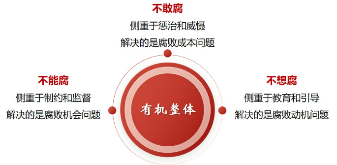
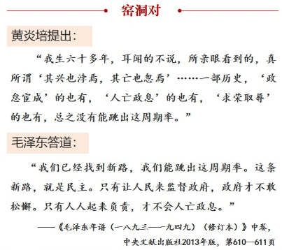
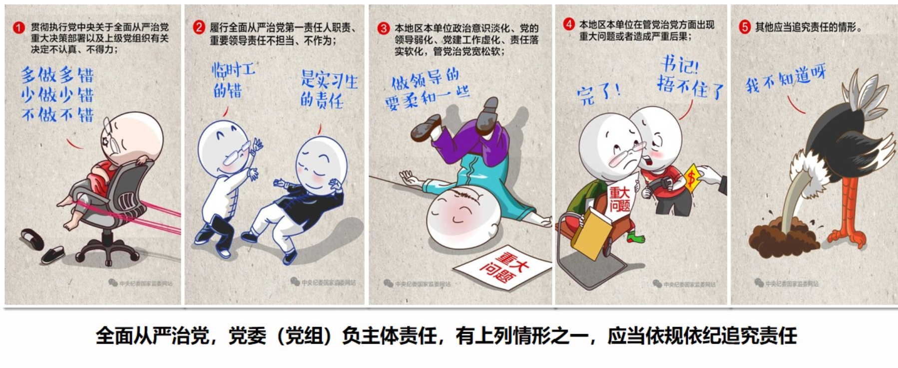
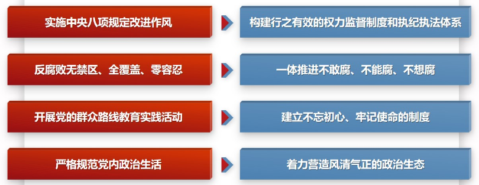

# 第十七讲	全面从严治党

## ==一、为什么要全面从严治党==

**——打铁必须自身硬**

### （一）从严治党是马克思主义政党的政治优势

- **==从严治党是马克思主义政党建设的一贯要求==**
  - 马克思在《国际工人协会共同章程》中提出，”每一支部应对接受的会员的品质纯洁负责“。
- **==从严治党是中国共产党建设的优良传统==**
  - 百年来，中国共产党始终把从严治党视为重中之重。新民主主义革命时期，红都瑞金打响了中国共产党惩治腐败分子的第一枪;社会主义革命和建设时期，针对刘青山、张子善等人的腐败行为，中国共产党坚持从严治党，坚决进行了处理;改革开放和社会主义现代化建设新时期，中共中央在1983年到1987年开展了全面整党工作。党始终坚持从严治党，保持了党的先进性和纯洁性。

### （二）全面从严治党是实现民族复兴的根本保证

> ​		全面建设社会主义现代化国家、全面推进中华民族伟大复兴，关键在党。
> ——习近平在中国共产党第二十次全国代表大会上的报告
> (2022年10月16日)

- **==把全面从严治党纳入”四个全面“战略布局==**
  - 党的十八大以来，以习近平同志为核心的党中央将全面从严治党纳入“四个全面”战略布局，把严的标准、严的措施贯穿管党治党全过程和各方面，为实现中华民族伟大复兴提供坚强政治引领和政治保障。

### （三）全面从严治党是决定党兴衰成败的关键因素

- **==新形势下党面临”四大考验“&”四种危险“==**
  - 当前，党面临的执政环境是复杂的，影响党的先进性、弱化党的纯洁性的因素也是复杂的。在这种情况下，有没有强烈的自我革命精神，有没有自我净化的过硬特质,能不能坚持不懈同自身存在的问题和错误作斗争，就成为决定党兴衰成败的关键因素。
  - **四大考验**
    - 执政考验
    - 改革开放考验
    - 市场经济考验
    - 外部环境考验
  - **四种危险**
    - **精神懈怠**危险
    - **能力不足**危险
    - **脱离群众**危险
    - **消极腐败**危险
- **==党内出现管党不利、治党不严的问题==**
  - 七个有之
    - 搞任人唯亲、排斥异己的有之
    - 搞团团伙伙、拉帮结派的有之
    - 搞匿名诬告、制造谣言的有之
    - 搞收买人心、拉动选票的有之
    - 搞封官许愿、弹冠相庆的有之
    - 搞自行其是、阳奉阴违的有之
    - 搞尾大不掉、妄议中央的也有之

​		从党的十八届四中全会开始，习近平反复强调警惕“七个有之”。“七个有之”本质上是政治问题，概括起来是两个方面。一个是政治问题和经济问题交织形成利益集团，妄图攫取党和国家权力;一个是山头主义和宗派主义作祟，大搞非组织活动，破坏党的集中统一。对政治上的这种隐患不能采取鸵鸟政策，王顾左右而言他，必须采取断然措施予以防范和遏制，消除隐患后患。

## 二、为什么十八大以来管党治党宽松软状况得到根本扭转

**——党在革命性锻造中更加坚强**

> ​		坚持和加强党的全面领导，坚持党要管党、全面从严治党，以加强党的长期执政能力建设、先进性和纯洁性建设为主线，以党的政治建设为统领，以坚定理想信念宗旨为根基，以调动全党积极性、主动性、创造性为着力点，全面推进党的政治建设、思想建设、组织建设、作风建设、纪律建设，把制度建设贯穿其中，深入推进反腐败斗争，不断提高党的建设质量，把党建设成为始终走在时代前列、人民衷心拥护、勇于自我革命、经得起各种风浪考验、朝气蓬勃的马克思主义执政党。
>
> ——习近平在中国共产党第十九次全国代表大会上的报告
>
> (2017年10月18日)

### （一）把党的政治建设摆在首位

- **政治建设决定党的建设的方向和效果**
  - 如果在方向问题上出现偏离，就会犯颠覆性错误。**只有党的政治建设抓好了，党的政治方向、政治立场、政治大局把握住了,党的政治能力提高了，党的建设才能铸魂扎根。**党的其他建设最终的着眼点和落脚点必须在政治建设上。不抓党的政治建设或背离党的政治建设指引的方向，党的其他建设就难以取得预期成效。
- **把政治建设摆在首位，抓住了全面从严治党的根本性问题**
  - 党的十八大以来，在全面从严治党实践中，党深刻认识到，党内存在的很多问题都同政治问题相关联，都是因为党的政治建设没有抓紧、没有抓实。不从政治上认识问题、解决问题，就会陷入头痛医头、脚痛医脚的被动局面，就无法从根本上解决问题。**“全面从严治党首先要从政治上看”。**
- **突出政治建设是十八大以来全面从严治党的成功经验**
  - 党的十八大以来，以习近平同志为核心的党中央突出强调党的政治建设，不断强化管党治党政治责任，严肃党内政治生活，严明政治纪律和政治规矩，党内政治生态明显好转，为党和国家各项事业发展提供了良好政治氛围和有力政治保证。这些成功实践使全党同志深刻认识到，党内存在的许多问题，原因都是过去一个时期管党治党宽松软，特别是对党的政治建设没有抓紧、抓实、抓好。党的十九大明确提出党的政治建设这个重大命题，强调党的政治建设是党的根本性建设，**把党的政治建设纳入党的建设总体布局并摆在首位，这是马克思主义党建理论的重大创新。**
- ==党的政治建设的基本内容==
  - 保证全党服从中央，坚持党中央权威和集中统一领导
  - 坚定执行党的政治路线，严格遵守政治纪律和政治规则
  - 尊崇党章，严格执行新形势下党内政治生活若干准则
  - 完善和落实民主集中制的各项制度
  - 弘扬忠诚老实、公道正派、实事求是、清正廉洁等价值观
  - 加强党性锻炼，不断提高政治觉悟和政治能力
- **保证全党服从中央，坚持和加强党中央集中统一领导**
  - 坚持和加强党中央权威和集中统一领导，保证全党服从中央，是党的政治建设的首要任务。党之所以能够领导和团结全国各族人民进行革命、建设和改革，不断取得新的成就，很重要的一点就在于能够汇聚各方力量，保证党的团结和集中统一。
- **”秦岭违建“欺上瞒下，习近平总书记六次批示揭示重要问题**
  - **秦岭违建别墅，不讲政治是根本**，暴露出有关党组织的政治建设缺失缺位、软弱无力，有关领导干部对政治纪律缺乏敬畏，政治规矩、意识淡薄等问题。

### （二）全面加强党的思想建设

- **==坚定理想信念是思想建设的首要任务==**
  - 基础不牢，地动山摇。信念不牢也是要地动山摇的。苏联解体、苏共垮台、东欧剧变不就是这个逻辑吗?历史和现实都告诫我们:全党理想信念坚定，党就拥有无比强大力量;全党理想信念淡薄，党就会成为乌合之众，风一吹就散。
  - **弘扬伟大建党精神和延安精神**
    - 在延安时期形成和发扬的光荣传统和优良作风，培育形成的以坚定正确的政治方向、解放思想实事求是的思想路线、全心全意为人民服务的根本宗旨、自力更生艰苦奋斗的创业精神为主要内容的延安精神，是党的宝贵精神财富，要代代传承下去。要弘扬伟大建党精神，弘扬延安精神，坚定历史自信，增强历史主动，发扬斗争精神，为实现党的二十大提出的目标任务而团结奋斗。
- **==用科学理论武装头脑==**
  - 党的十八大以来，我们党坚持思想建党和制度治党同向发力，**用党的创新理论武装全党，推进学习型政党建设，**教育引导广大党员、干部特别是领导干部从思想上正本清源、固本培元，筑牢信仰之基、补足精神之钙、把稳思想之舵，保持共产党人政治本色，挺起共产党人的精神脊梁。
  - 党的十八大以来的5次集中学习教育一脉相承、次第展开，环环紧扣、层层深入，**每一次都是理论武装的重要课堂**，每一次都是自我革命的生动实践，每一次都是凝心聚力的奋进号角。
  - **坚持不懈用习近平新时代中国特色社会主义思想凝心铸魂**
    - 用党的创新理论武装全党是党的思想建设的根本任务。全面加强党的思想建设，坚持用习近平新时代中国特色社会主义思想统─思想、统一意志、统一行动，组织实施党的创新理论学习教育计划，建设马克思主义学习型政党。

### （三）全面推进党的组织建设

- **==以组织体系建设为重点==**
  - **各级各类党组织应建尽建**
    - 党的地方委员会
    - 城市街道、乡镇、社区（居委会）、行政村党组织
    - 机关、事业单位、企业和社会组织党组织
  - **坚持大抓基层的鲜明导向**
    - 截至2021年12月31日，中国共产党现有基层组织**493.6**万个，比2020年净增11.7万个，增幅为2.4%。其中基层党委**27.8**万个，总支部**31.6**万个，支部**434.2**万个。
- **==建设堪当民族复兴重任的高素质干部队伍==**
  - **把新时代好干部标准落到实处**
    - 信念坚定
    - 为民服务
    - 勤政务实
    - 敢于担当
    - 清正廉洁
  - **树立选人用人正确导向**
    - *辽宁拉票贿选案*
      - 辽宁拉票贿选案共查处955人，其中中管干部34人，省管干部905人。45名拉票贿选的全国人大代表当选无效。523名收受贿赂的辽宁省人大代表被终止代表资格。辽宁拉票贿选案是新中国成立以来查处的第一起发生在省级层面、严重违反党纪国法、严重违反政治纪律和政治规矩的重大案件，造成恶劣影响。**要坚决整治选人用人上的不正之风**，特别是要选准用好主要负责同志，**加强监督执纪**，切实营造良好政治生态。

### （四）始终绷紧作风建设这根弦

- **==持之以恒纠治四风==**

  - 党的十八大以来，我们坚持党要管党、全面从严治党，持之以恒正风肃纪，以钉钉子精神纠治“四风”，反对特权思想和特权现象，坚决整治群众身边的不正之风和腐败问题，刹住了一些长期没有刹住的歪风，纠治了一些多年未除的顽瘴痼疾。

  - **《中央八项规定》**

    

  - **严肃整治享乐主义和奢靡之风**

    - 党的十八大以来，在以习近平同志为核心的党中央坚强领导下，各地各部门持之以恒落实中央八项规定精神，驰而不息将作风建设引向深入，反对特权思想和特权现象，狠刹公款送礼、公款吃喝、公款旅游、奢侈浪费等不正之风;“舌尖上的浪费”“会所中的歪风”“车轮上的铺张”“节日中的腐败”，高档小区“一桌餐”、调研考察搭车旅游等隐形变异“四风”问题得到严肃整治。

  - **力戒形式主义和官僚主义作风**

    - 党的十九大以来，作风建设更加注重集中整治形式主义、官僚主义问题。2019年，党中央、国务院发文数量都比上年减少30%以上;省区市文件和会议平均压缩39%、37%，中央和国家机关分别压缩39%、33%;中央和国家机关督查检查考核事项从近900项大幅压缩至96项，实际开展88项。力戒形式主义、官僚主义取得成效。

- **==党风政风与社会风气为之一新==**

  - 经过党的十八大以来的作风建设，党风政风为之一新，社风民风向上向善。作风建设永远在路上，永远没有休止符，形成优良作风不可能一劳永逸，克服不良作风也不可能一蹴而就。必须督促领导干部特别是高级干部严于律己、严负其责、严管所辖，对违反党纪、败坏党的作风的问题，发现一起坚决查处一起。坚持抓长、常抓，扭住不放，持之以恒，久久为功，加强制度机制建设，筑牢作风建设长效化的有力屏障。

### （五）把纪律的螺丝拧得紧而又紧

- **==加强纪律建设是全面从严治党的治本之策==**
  - 党要管党、从严治党，靠什么管，凭什么治?就要靠严明纪律和规矩。党员“破法”，无不始于“破纪”。党的十八大以来，我们党坚持纪严于法、纪在法前，严在日常，**把纪律和规矩挺在前面，**不断完善纪律规定，持续加强执纪问责，做到惩前z后、治病救人。
- **==必须使纪律成为带电的”高压线“==**
  - 遵守党的纪律是无条件的，要说到做到，有纪必执，有违必查，不能把纪律作为一个软约束或是束之高阁的一纸空文。对违规违纪、破坏法规制度踩“红线”、越“底线”、闯“雷区”的，要坚决严肃查处，不以权势大而破规，不以问题小而姑息，不以违者众而放任，**不留“暗门”、不开“天窗”。**深化运用监督执纪“四种形态”，特别是要在用好第一种形态上下功夫，多做红脸出汗、咬耳扯袖的工作。
  - **运用监督执纪“四种形态”**
    - 经常开展批评和自我批评、约谈函询，让“红红脸、出出汗”成为常态
    - 让党纪轻处分、组织调整成为违纪处理的大多数
    - 让党纪重处分、重大职务调整的成为少数
    - 让严重违纪涉嫌违法立案审查的成为极少数

### （六）将制度建设贯穿党的各项建设之中

- **==不断扎紧扎牢制度笼子==**
  - 没有笼子是不行的，笼子太松了也是起不了什么作用的。
  - 坚持依规治党、加强自我革命制度建设成为“中国共产党之治”的独特密码。
- **==抓好党内法规制度的落实==**
  - 制定制度很重要，更重要的是抓落实。有了好的制度如果不抓落实，只是写在纸上、贴在墙上、锁在抽屉里，制度就会成为稻草人、纸老虎。要抓好党内法规制度的落实，强化制度意识，自觉尊崇制度，严格执行制度，坚决维护制度，健全权威高效的制度执行机制，加强对制度执行的监督，真正让铁规发力，让禁令生威，确保各项法规制度落地生根。
  - **发挥政治巡视利剑作用，加强巡视整改和成果运用**
    - 进入新时代，党中央把巡视作为全面从严治党的战略性制度安排，突出政治监督定位，确立巡视工作方针，坚持问题导向，创新方式方法，着力发现和纠正各级党组织在履行党的领导职能责任上的政治偏差，建立健全巡视巡察上下联动格局，持续深化巡视整改，高质量完成巡视全覆盖任务，有力推动各级党组织和广大党员、干部勘误纠错、忠诚履职。巡视已经成为促进改革发展稳定、推动事业进步的强大力量。

### （七）坚决打赢反腐败斗争攻坚战持久战

- **==“打虎” “拍蝇” “猎狐”多管齐下==**

  - **”微腐败“也可能成为“大祸害”**

- **==一体推进不敢腐、不能腐、不想腐==**

  - 深化标本兼治、系统治理，把不敢腐、不能腐、不想腐有效贯通起来，把不敢腐的震慑力、不能腐的约束力、不想腐的感召力结合起来。

    

  - **“三不”一体推进叠加效应凸显**

- **==反腐败斗争取得空前成效==**

  - **不敢腐的震慑效应充分体现**

  - **不能腐的笼子越扎越牢**

  - **不想腐的自觉不断增强**

  - > 正如外媒评价，中国共产党的反腐败成绩是“足以同在中国这样一个世界上人口最多的国家解决温饱问题、极大消除贫困相提并论的一个巨大贡献”。

- **==打好反腐败攻坚战持久战==**

  - 我们必须清醒认识到，腐败和反腐败较量还在激烈进行,并呈现出一些新的阶段性特征,防范形形色色的利益集团成伙作势、“围猎”腐蚀还任重道远,有效应对腐败手段隐形变异、翻新升级还任重道远,彻底铲除腐败滋生土壤、实现海晏河清还任重道远,清理系统性腐败、化解风险隐患还任重道远。

## ==三、如何理解全面从严治党这场伟大自我革命❤️==

**——跳出历史周期律的第二个答案**

### ==（一）勇于自我革命是跳出历史周期律的第二个答案==

> 

- **==勇于自我革命是我们党最鲜明的品格和最大的优势==**
  - ==马克思主义政党==
    - 马克思主义政党以实现人的自由全面发展和解放全人类为己任，要实现这样的崇高使命，永葆先进性和纯洁性，就必须一刻不放松地解决自身存在的问题，以彻底的自我革命来推动深刻的社会革命。
  - ==中国共产党==
    - 中国共产党的伟大不在于不犯错误,而在于从不讳疾忌医,敢于直面问题,勇于自我革命,具有极强的自我修复能力。
  - 百年来，我们党每一次自我革命，都不是简单的自我修复，而是从里到外的深刻改造、深度重塑，同一切影响党的先进性、弱化党的纯洁性的问题作坚决斗争，实现自我净化、自我完善、自我革新、自我提高，这是我们党**最大的优势**，使党能够一次次转危为安、化危为机，不断由小到大、由弱变强，带领中国人民从胜利走向胜利。
  - 中国共产党人用一次又一次的自我革命，以高度的政治自觉、思想自觉和行动自觉不断进行革命性锻造，使我们党一路勘误纠错,永葆先进。
    - 从第一次国内革命失败后，纠正了右倾机会主义错误，提出“枪杆子里出政权”的**八七会议**到挽救红军、挽救党的**遵义会议**
    - 从“惩前念后，治病救人”的**延安整风**，到中华人民共和国成立初期践行“两个务必”思想的**整风整党运动**
    - 从粉碎“四人帮”的胜利和党的十一届三中全会开始的全面“**拨乱反正**”，到党的十八大以来开启的**全面从严治党**新征程
- **==勇于自我革命是我们党区别于其他政党的显著标志==**
  - **批评与自我批评**
    - 毛泽东曾经讲过，“**有无认真的自我批评，也是我们和其他政党互相区别的显著的标志之一**”，正是因为具备这种独有的政治品格，我们党才能穿越百年风风雨雨，多次在危难之际重新奋起、失误之后拨乱反正，成为打不倒、压不垮的马克思主义政党。
  - **不私，而天下自公**
    - **我们党没有任何自己特殊的利益，这是我们党敢于自我革命的勇气之源、底气所在。**正因为无私，才能本着彻底的唯物主义精神经常检视自身、常思己过，才能摆脱一切利益集团、权势团体、特权阶层的“围猎”腐蚀，并向党内被这些集团、团体、阶层所裹挟的人开刀。

### ==（二）全面从严治党以其丰富内涵诠释了自我革命的内在要求==

- ==全面==：**就是管全党、治全党，面向全体党员、党组织，覆盖党的建设各个领域、各个方面、各个部门，重点是抓住“关键少数”。**

  - ==对象全覆盖==：把从严治党的要求落实到每个党组织中、落实到每名党员身上。
  - ==领域全范围==：体现到党的思想建设、组织建设、作风建设、反腐倡廉建设和制度建设各个领域、各个方面。
  - ==责任全担负==：一把尺子量到底、一根竿子插到底，层层传导责任压力，让全面从严治党真正落地生根。

- ==严==

  - **真管真严**：要动真格，不降标准，不图形式，不走过场，确保全面从严治党真正落实。
  - **敢管敢严**：要敢于碰硬，不惧压力，不畏艰难，不避矛盾，让一切违纪违规的言行无处遁形。
  - **长管长严**：要善始善终，不松劲头，不减力度，不打折扣，坚持不懈严管严治。
  - **从2021打虎通报看“严”的主基调**

- ==治==：**就是从党中央到地方各级党委，从中央部委、国家机关部门党组（党委)到基层党支部,都要肩负起主体责任。**

  - **拔“烂树”**：对烂掉的腐败分子—抓到底，坚决清除害群之马。

  - **治“病树”：**对犯了小错的干部，要对症下药，抓早抓小，惩前瑟后，治病救人。

  - **正“歪树”**：对处于“亚健康”状态的干部，要及时提醒，拉回正轨，使其远离违反纪律和规矩的红线。

    

- **全面从严治党体系**

  - 动态系统：功能完备、内涵丰富、运行高效、科学规范
  - 新时代十年，我们党不断深化对自我革命规律的认识，不断推进党的建设理论创新、实践创新、制度创新，初步构建起全面从严治党体系。要坚持内容上全涵盖、对象上全覆盖、责任上全链条、制度上全贯通，**进一步健全全面从严治党体系**，使全面从严治党各项工作更好体现时代性、把握规律性、富于创造性。
  - 全面从严治党，要求增强系统性、预见性、创造性、实效性，使从严治党的一切努力都集中到增强党自我净化、自我完善、自我革新、自我提高能力上来，集中到提高党的领导能力和执政能力、保持和发展党的先进性和纯洁性上来。不断以勇于自我革命的精神打造和锤炼自己，实现管党治党真正从宽松软走向严紧硬。

### （三）全面从严治党推进自我革命不断走向深入

- **时刻保持解决大党独有难题的清醒和坚定，一刻不停推进全面从严治党**
  1. 如何始终不忘初心、牢记使命
  2. 如何始终具备强大的执政能力和领导水平
  3. 如何始终能够及时发现和解决自身存在的问题
  4. 如何始终统一思想、统一意志、统一行动
  5. 如何始终保持干事创业精神状态
  6. 如何始终保持风清气正的政治生态
- 全面从严治党永远在路上
  - 泰山半腰有一段平路叫“快活三里”，一些人爬累了，喜欢在此歇脚。然而,挑山工一般不在此久留,因为休息时间长了，腿就会“发懒”，再上“十八盘”就更困难了。**全面从严治党不能有丝毫松懈。**只要以滚石上山的劲头、爬坡过坎的勇气，保持定力、寸步不让，深化整治、见底见效，就能一步步实现弊绝风清、海晏河清。

## 课堂小结

​		全面从严治党是新时代党的自我革命的伟大实践,开辟了百年大党自我革命的新境界。面向未来,我们党要承担起新时代坚持和发展中国特色社会主义的历史使命,就必须永远保持“赶考”的清醒和坚定,以永远在路上的信念和执着,以伟大自我革命引领伟大社会革命,坚持不懈把全面从严治党向纵深推进。