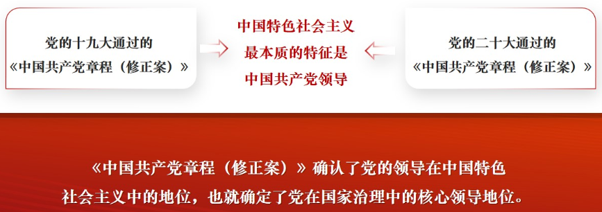
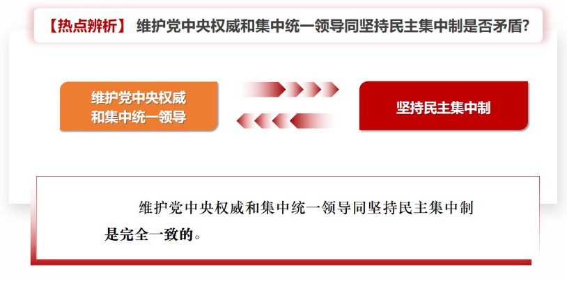

# 第三讲	坚持党的全面领导

## ==一、为什么要坚持党的领导❤️==

​		党的领导是党和国家事业不断发展的“定海神针”。我国之所以能保持长期稳定，根本的一条就是我们始终坚持共产党领导。中国共产党是最高政治领导力量。中国共产党领导是中国特色社会主义最本质的特征，是中国特色社会主义制度的最大优势。

### （一）党是最高政治领导力量

​		党是最高政治领导力量，这是由我国国家性质和国体政体所决定的，是由国家宪法所确立的，是经过中国革命、建设、改革伟大实践所检验的，具有无可置疑的历史合理性、实践合理性和价值合理性。党是最高政治领导力量，主要体现在引领政治方向、统领政治体系、决断重大事项、领导社会治理等方面。

- **==引领政治方向==**
  - 方向决定道路，道路决定命运。中国共产党始终坚持共产主义理想和社会主义信念。党的十八大以来，以习近平同志为核心的党中央高举中国特色社会主义伟大旗帜，把准把好新时代改革开放的方向盘。这个方向就是中国特色社会主义道路，而不是其他什么道路。
- **==统领政治体系==**
  - 国家政治体系是一个大系统，包括根本政治制度、基本政治制度和国家治理各方面具体的体制机制，涵盖国家机关、政党组织和各种政治主体。在这个大系统中，中国共产党处于统领地位。
- **==决断重大事项==**
  - 中国共产党作为最高政治领导力量，很重要的是就党和国家的重大事项进行决策。离开决策权，所谓领导就是一句空话。中国共产党一路走来，不断从胜利走向胜利，每一步都离不开科学有效的决策及周密部署和有效实施。善于抓问题、想办法、作决策，是党的领导水平和执政本领的集中体现。
- **==领导社会治理==**
  - 社会治理离不开一定的组织形态。中国共产党的组织形态既推进了社会的有序治理，又保证了社会充满活力。
    - **党的政治功能为社会治理提供方向**
    - **以党的服务功能推进社会有效运转**
    - **以强大的组织体系确保社会治理和谐有序**

### （二）中国共产党领导是中国特色社会主义最本质的特征

​		中国共产党领导是中国特色社会主义最本质的特征，要置于科学社会主义基本原理中去认识，要置于国际共产主义运动历史经验教训中去分析，要置于中国共产党领导中国社会发展中去把握。中国共产党领导是中国特色社会主义最本质的特征，就在于党的领导直接关系着中国特色社会主义的性质、方向和命运。

- **==中国共产党领导是由科学社会主义的理论逻辑决定的==**
  - 坚持无产阶级政党的领导是无产阶级革命和社会主义建设取得胜利的根本保证。马克思和恩格斯在《共产党宣言》中明确指出:“在实践方面，共产党人是各国工人政党中最坚决的、始终起推动作用的部分;在理论方面，他们胜过其余无产阶级群众的地方在于他们了解无产阶级运动的条件、进程和一般结果。”
  - 中国特色社会主义是科学社会主义基本原则同当代中国实际和时代特征相结合的产物，是植根于当代中国的科学社会主义。坚持党的全面领导是坚持和发展中国特色社会主义的必由之路。只有坚持中国共产党的领导，才能保证中国特色社会主义的性质和正确方向。
- **==中国共产党领导是由中国特色社会主义产生与发展的历史逻辑决定的==**
  - 坚持党的领导，是在党领导人民进行伟大社会革命100多年的实践中得来的，是在党领导改革开放40多年的伟大实践中得来的，是党和人民历经千辛万苦、付出各种代价取得的宝贵成果。
  - 中国共产党是中国特色社会主义事业的开创者、推动者、引领者，团结带领人民开辟了中国特色社会主义道路，创立了中国特色社会主义理论，创建了中国特色社会主义制度，发展了中国特色社会主义文化。历史和现实证明，没有中国共产党的领导，就没有中国特色社会主义的产生和发展。
- **==中国共产党领导是由中国特色社会主义迈向新征程的实践逻辑决定的==**
  - 百余年来，为了实现中华民族伟大复兴的历史使命，中国共产党初心不改、矢志不渝，团结带领人民历经千难万险、付出巨大牺牲，取得了一个又一个伟大斗争的胜利。今天，我们已经全面建成小康社会、踏上了建设社会主义现代化强国的新征程。
  - 在实现中华民族伟大复兴征程中，面临着来自国际国内多种多样前所未有的挑战，不知还要爬多少坡、过多少坎，经历多少风风雨雨、克服多少艰难险阻。坚定走中国道路，把14亿多人民凝聚成中国力量，焕发出中国精神，把新时代中国特色社会主义这篇大文章继续写好、写精彩，从根本上要靠党的全面领导，靠党把好方向盘。

### （三）中国共产党领导是中国特色社会主义制度的最大优势

- **==中国共产党是中国特色社会主义制度的创建者==**
  - 没有中国共产党，就没有中国特色社会主义制度的形成、发展和完善，制度优势就无从谈起。中国共产党把科学社会主义原则和中国实际相结合，创建了根本政治制度、基本政治制度和重要政治制度，中国特色社会主义法律体系，公有制为主体、多种所有制经济共同发展的基本经济制度。党领导中国人民通过改革不断完善中国特色社会主义制度。
- **==中国共产党领导是充分发挥中国特色社会主义制度优势的根本保障==**
  - 党的领导作为一项制度安排是中国特色社会主义制度的重要组成部分。作为党的根本组织制度和领导制度的民主集中制，最能体现中国特色社会主义制度的优越性。这项制度把充分发扬党内民主和正确实行集中有机结合起来，既可以最大限度激发全党创造活力，又可以统一全党思想和行动，有效防止和克服议而不决、决而不行的分散主义，是科学合理而又有效率的制度。
- **==中国共产党的自身优势是中国特色社会主义制度优势的主要来源==**
  - 回顾党的历史，我们可以清楚地看到，在长期奋斗中，党形成了自身的理论优势、政治优势、组织优势、制度优势和密切联系群众的优势。正是这些优势使党能够由小到大、由弱到强，团结带领全国各族人民谱写了中国革命、建设、改革的壮丽篇章，根本改变了中国人民和中华民族的前途和命运;也正是这些优势引领和锻造了中国特色社会主义的制度优势，从根本上保证中国特色社会主义不变色、不变质。

## 二、怎样理解党的领导是全面的、系统的、整体的

**——党中央是坐镇中军帐的“帅”**

### （一）党的领导是全面的

- **领导对象要全面覆盖**
- **领导内容要全面**
- **领导过程要全面**
- **领导方法要全面**

### （二）党的领导是系统的

- 中国特色社会主义制度是一个严密完整的科学制度体系，起四梁八柱作用的是根本制度、基本制度、重要制度，其中中国共产党的领导是载入宪法的，党的领导制度是我国的根本领导制度，居于统领地位。
- 坚持党的领导，是通过党的制度来保证实施的。制度带有根本性、全局性、稳定性和长期性，健全的领导制度体系对于保证党的领导活动的正常进行，发挥党的领导机关和领导者的作用，发挥党的各级组织和广大党员的积极性主动性创造性，保证党和国家事业的健康发展，具有十分重要的作用。
- 党的领导制度是我国的根本领导制度。党的十九届四中全会从制度建设层面对坚持和加强党的全面领导作出新的战略安排。把党的领导制度明确为我国的根本领导制度，这是我们党第一次从坚持和完善中国特色社会主义制度的高度，确定党的领导制度在我国国家制度和国家治理体系中关乎长远、关平全局的地位和作用，抓住了制度建设和国家治理的关键和根本。
- 建立**不忘初心、牢记使命**的制度
- 完善**坚定维护党中央权威和集中统一领导**的各项制度
- 健全**党的全面领导**制度
- 健全**为人民执政、靠人民执政**各项制度
- 健全**提高党的执政能力和领导水平**制度
- 完善**全面从严治党**制度

### （三）党的领导是整体的

​		从党的中央组织到地方组织再到基层组织，都要按照党章的规定发挥应有作用，党的领导作用要体现到治国理政的全过程，领导功能的发挥要完整。

​		党的领导不是空洞的、抽象的，要在各方面各环节落实和体现。中国共产党是国家治理体系的核心。哪个领域、哪个方面、哪个环节缺失了弱化了，都会削弱党的力量，损害党和国家事业。党的领导，体现在党的科学理论和正确路线方针政策上，体现在党的执政能力和领导水平上，体现在党的政治判断力、政治领悟力、政治执行力上，同时也体现在党的严密组织体系和强大组织能力上。

​		坚持党对一切工作的领导，不能只停留在口头表态上，必须落实到行动上，切实贯彻和体现到改革发展稳定、内政外交国防、治党治国治军各个领域各个方面，确保党始终总揽全局、协调各方。

### （四）提高党把方向、谋大局、定政策、促改革的能力

- **==方向涉及根本、关系全局、决定长远==**
  - **着力提高党把方向的能力和定力**
- **==不谋全局者不足谋一域==**
  - **着力提高谋大局的能力和定力**
- **==政策是体现执政党性质宗旨的试金石，是反映治国理政水平的标志==**
  - **着力提高定政策的能力和定力**
- **==改革开放是决定当代中国命运的关键一招==**
  - **着力提高促改革的能力和定力**

## ==三、怎样才能做到自觉在思想上政治上行动上同党中央保持高度一致==

**——党中央集中统一领导是党的领导的最高原则**

### （一）增强“四个意识“

- ==政治意识==
  - 政治意识表现为坚定政治信仰，坚持正确的政治方向，坚持政治原则，站稳政治立场，保持政治清醒和政治定力，不断提高政治判断力、政治领悟力、政治执行力。
- ==大局意识==
  - 大局意识就是要正确处理中央与地方、局部与全局、当前与长远的关系，自觉从党和国家大局出发想问题、办事情、抓落实，坚决贯彻落实中央决策部署，确保中央政令畅通。
- ==核心意识==
  - 核心意识就是要始终坚持、切实加强党的领导，特别是党中央的集中统一领导，更加紧密地团结在以习近平同志为核心的党中央周围，更加坚定地维护党中央权威，更加自觉地在思想上政治上行动上同党中央保持高度一致。
- ==看齐意识==
  - 看齐意识就是要求向党中央看齐，向党的理论和路线方针政策看齐，向党中央决策部署看齐，做到党中央提倡的坚决响应、党中央决定的坚决执行、党中央禁止的坚决不做。

### （二）做到“两个维护”

- **坚决维护习近平总书记党中央的核心、全党的核心地位，坚决维护党中央权威和集中统一领导。**

  - **确立和维护无产阶级政党的领导核心，始终是马克思主义建党学说的一个基本观点**

- **==坚决维护习近平总书记党中央的核心、全党的核心地位==**

  - 一个国家、一个政党，领导核心至关重要。坚决维护习近平总书记党中央的核心、全党的核心地位，保证全党令行禁止，形成思想和行动高度统一的整体，这是一个成熟的马克思主义执政党的必然要求。
  - 坚决维护习近平总书记党中央的核心、全党的核心地位，必须自觉同以习近平同志为核心的党中央保持高度一致，在思想上高度认同，政治上坚决维护，组织上自觉服从，行动上紧紧跟随，把“四个意识”落实到一言一行之中。
  - 坚决维护习近平总书记党中央的核心、全党的核心地位，形成思想和行动高度统一的整体，是党和国家前途命运所系，是全国各族人民根本利益所在。

- **==坚决维护党中央权威和集中统一领导==**

  - 党和国家大政方针的决定权在党中央。历史表明，要治理好中国共产党这个大党、治理好中国这个大国，保证党的团结和集中统一至关重要，维护党中央权威至关重要。党的任何组织和成员必须以实际行动维护党中央的权威，必须服从党中央集中统一领导，这是党的领导的最高原则。

  

- **==明确维护党中央权威和集中统一领导与坚持民主集中制的关系==**

  - 民主集中制包括民主和集中两个方面，两者互为条件、相辅相成、缺一不可。民主是正确集中的前提和基础，离开民主讲集中，集中就成了个人专权专断。集中是民主的必然要求和归宿，离开集中搞民主，就会导致极端民主化和无政府状态。
  - 中国共产党实行民主集中制。在充分发扬民主的基础上进行集中，坚持党中央权威和集中统一领导，集中全党智慧，体现全党共同意志，是党的一大创举。
  - 坚持党中央权威和集中统一领导，不是说不要民主集中制了，不要发扬党内民主了，而是体现了充分发扬民主基础上的正确集中，把这两者对立起来是不对的、有害的。

## 课堂小结

​		中国共产党领导是中国特色社会主义最本质的特征，是中国特色社会主义制度的最大优势，坚持党的全面领导是坚持和发展中国特色社会主义的必由之路。党的领导是全面的、系统的、整体的。要增强“四个意识”，做到“两个维护”，自觉在思想上政治上行动上同党中央保持高度一致。

​		正如《中共中央关于党的百年奋斗重大成就和历史经验的决议》指出的，“只要我们坚持党的全面领导不动摇，坚决维护党的核心和党中央权威，充分发挥党的领导政治优势，把党的领导落实到党和国家事业各领域各方面各环节，就一定能够确保全党全军全国各族人民团结一致向前进”。