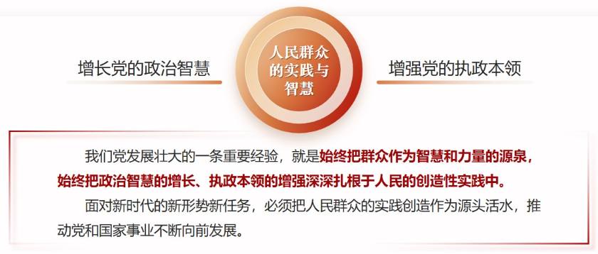
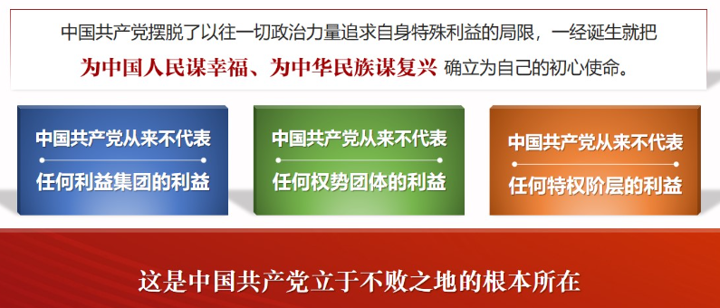
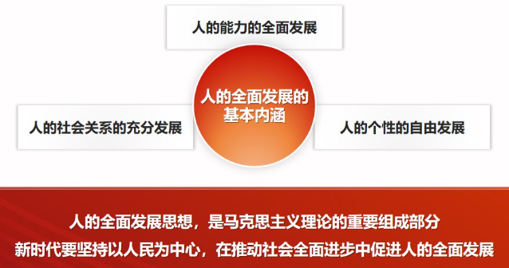
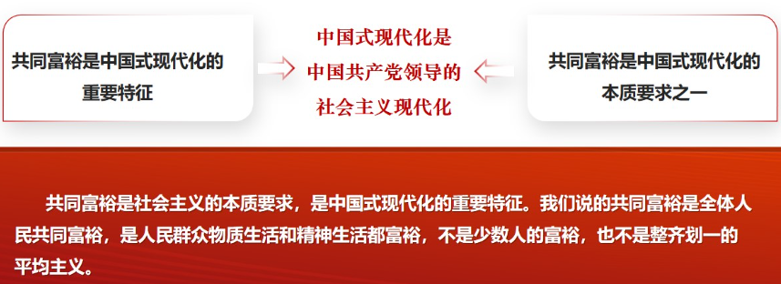
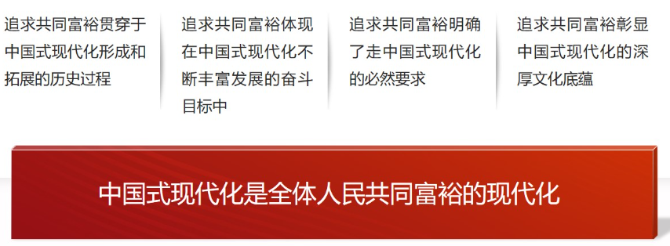

# 第四讲	坚持以人民为中心

## ==一、为什么必须坚持以人民为中心❤️==

**——人民是决定党和国家前途命运的根本力量**

### （一）人民是创造历史的动力

- 人民是真正的英雄
- 党的历史伟业是人民创造的
- 党坚持走群众路线
  - 不论过去、现在和将来，我们都要坚持一切为了群众，一切依靠群众，从群众中来，到群众中去，把党的正确主张变为群众的自觉行动。坚持以人民为中心的根本立场，必须把群众路线贯彻到治国理政全部活动之中。

### （二）江山就是人民、人民就是江山

- 我国的政权是人民的政权

  - **江山就是人民、人民就是江山。**深刻揭示了人民与政权之间的辩证关系，闪耀着历史唯物主义的真理光芒，充分说明我国国体政体的人民性。人民是中国共产党执政兴国的最大底气，人民是我们党的生命之根、执政之基、力量之源。

- 历史是最好的教科书，也是最好的清醒剂
- 打江山、守江山，守的是人民的心

  - 治国有常，利民为本。**为民造福是立党为公、执政为民的本质要求。**必须坚持在发展中保障和改善民生，鼓励共同奋斗创造美好生活，不断实现人民对美好生活的向往。

- 尊重人民群众的首创精神

  

### （三）党依靠人民创造历史伟业

- 党依靠人民夺取新民主主义革命伟大胜利
- 党依靠人民完成社会主义革命和推进社会主义建设
- 党依靠人民进行改革开放和社会主义现代化建设
- 党依靠人民开创中国特色社会主义新时代
  - 党依靠人民，推动党和国家事业发生历史性变革、取得历史性成就，推动中国特色社会主义进入新时代。中国人民的**前进动力更加强大、奋斗精神更加昂扬、必胜信念更加坚定**，焕发出更为强烈的历史自觉和主动精神，中国共产党和中国人民正信心百倍推进中华民族从站起来、富起来到强起来的伟大飞跃。

## 二、如何理解不断实现人民对美好生活的向往

**——人民对美好生活的向往是党的奋斗目标**

### （一）人民立场是中国共产党的根本立场

- 人民立场是马克思主义政党区别于资产阶级政党的显著标志
- 全心全意为人民服务是党的根本宗旨
- 党性和人民性是高度一致的（统一的）

### （二）为中国人民谋幸福是中国共产党的初心

- 中国共产党是人民利益的忠实代表

  

- 党始终把人民放在心中最高位置

### （三）中国共产党为人民的美好生活而不懈奋斗

- 准确把握人民对美好生活的新期待
- 把所有精力都用在让老百姓过好日子上
- 党带领人民继续创造美好生活

## 三、怎么推动人的全面发展、全体人民共同富裕

**——践行以人民为中心的发展思想**

### （一）科学认识人的全面发展、全体人民共同富裕

- 实现人的全面发展是共产主义的基本原则

- 人的全面发展是中国特色社会主义的价值目标

  

- 共同富裕是中国共产党始终不渝的奋斗目标

  

- 共同富裕是中国特色社会主义的本质要求

- 共同富裕是中国式现代化的重要特征

  

- 促进人的全面发展与促进共同富裕是高度统一的

### （二）推进全体人民共同富裕取得更为明显的实质性进展

- 践行以人民为中心发展思想的必然要求
- 是更好满足人民日益增长的美好生活需要的重要着力点
- 是关系党的执政基础的重大政治问题
- 是解决我国发展不平衡不充分问题的现实需要
- 新时代推进共同富裕有了更加坚实的发展基础

### ==（三）实现全体人民共同富裕的实践举措==

- 扎实推进共同富裕的总体思路
- 把握扎实推进共同富裕的基本原则
  - **鼓励**勤劳创新致富
  - **坚持**基本经济制度：**要立足社会主义初级阶段，坚持“两个毫不动摇”**。
  - **尽力**而为**量力**而行：**要建立科学的公共政策体系，把蛋糕分好，形成人人享有的合理分配格局。**
  - **坚持**循序渐进：**共同富裕是一个长远目标，需要一个过程，不可能一蹴而就。**
- 扎实推动共同富裕的重大举措
  1. 提高发展的平衡性、协调性、包容性
  2. 着力扩大中等收入群体规模
  3. 促进基本公共服务均等化
  4. 加强对高收入的规范和调节
  5. 促进人民精神生活共同富裕
  6. 促进农民农村共同富裕

## 课堂小结

​		人民是创造历史的动力，江山就是人民、人民就是江山，党依靠人民创造历史伟业；人民立场是中国共产党的根本政治立场，为中国人民谋幸福是党的初心，我们党为人民的美好生活二不懈奋斗；坚持以人民为中心的发展思想，促进人的全面发展、全体人民共同富裕，使全体人民朝着共同富裕目标扎实迈进。