# 第六讲	以新发展理念引领高质量发展

## ==一、如何把握新发展阶段、贯彻新发展理念、构建新发展格局❤️==

**——我国经济发展的历史方位、指导原则、路径选择**

### （一）进入新发展阶段是中华民族伟大复兴历史进程的大跨越

- **==进入新发展阶段是我国经济发展的历史方位==**
  - Q：如何理解我国进入新发展阶段的基本依据？
    - 理论依据：马克思主义是远大理想和现实目标相结合、历史必然性和发展阶段性相统一的统一论者，我们坚信人类社会必然走向社会主义，但实现这一崇高目标必然历经若干历史阶段。
    - 历史依据：新发展阶段是我们党带领人民迎来从站起来、富起来到强起来历史性跨越的新阶段。
    - 现实依据：我们已经拥有开启新征程、实现新的更高目标的雄厚物质基础。
  - **新发展阶段是社会主义初级阶段中的一个阶段**
    - **社会主义初级阶段**
      - 不是一个静态、一成不变、停滞不前的阶段
      - 不是一个自发、被动、不用费多大气力自然而然就可以跨过的阶段
      - 而是一个动态、积极有为、始终洋溢着蓬勃生机活力的过程
      - 而是一个阶梯式递进、不断发展进步、日益接近质的飞跃和量的积累和发展变化的过程
    - ==**新发展阶段**==
      - 今天我们所处的新发展阶段，就是社会主义初级阶段中的一个阶段，同时是其中经过几十年积累、站到了新的起点上的一个阶段。全面建设社会主义现代化国家、基本实现社会主义现代化，既是社会主义初级阶段我国发展的要求，也是我国社会主义从初级阶段相更高阶段迈进的要求。
  - **新发展阶段是全面建设社会主义现代化国家的阶段**
- **==我国发展仍然处于重要战略机遇期==**
  - **经济方面的五个新机遇**
    - 加快经济结构优化升级带来新机遇
    - 提升科技创新能力带来新机遇
    - 深化改革开放带来新机遇
    - 加快绿色发展带来新机遇
    - 参与全球经济治理体系变革带来新机遇
  - **国内外环境深刻变化带来的新挑战**
    - 国际环境日趋复杂，新冠肺炎疫情影响广泛深远，经济全球化遭遇逆流，世界进入新的动荡变革期，大国博弈日趋激烈，单边主义、保护主义、霸权主义对世界和平与发展构成威胁。
    - 我国发展不平衡不充分问题仍然突出，重点领域关键环节改革任务仍然艰巨，创新能力不适应高质量发展等。

### （二）贯彻新发展理念是关系我国发展全局的一场深刻变革

- ==**新发展理念是新时代我国经济发展的指导原则**==
  - **新发展理念的重大意义**
    - 党的十八大以来，我们党对经济社会发展提出了许多重大理论和理念，其中新发展理念是**==最重要、最主要的==**。
    - 新发展理念是一个系统的理论体系：
      - 回答了关于发展的==**目的、动力、方式、路径**==等一系列理论和实践问题。
      - 阐明了我们党关于发展的==**政治立场、价值导向、发展模式、发展道路**==等重大政治问题。
  - **新发展理念的提出背景**
    - ==**新发展理念**==
      - 不是凭空得来的
      - 是深刻总结==**国内外发展经验教训**==、分析==**国内外发展大势**==的基础上形成的
      - 集中反映了我们党对经济社会==**发展规律认识的深化**==
      - 针对我国发展重大==**突出矛盾**==和==**问题**==
      - 是关系我国发展全局的==**一场深刻变革**==
  - **创新注重解决发展动力问题**
    - ==创新==发展理念
      - 完善科技创新体系，坚持创新在我国现代化建设全局中的核心地位
      - 加快实施创新驱动发展战略，不断推进==**理论创新、制度创新、科技创新、文化创新**==等各方面创新
      - ==**重大科技创新成果**==是国之重器、国之利器，必须牢牢掌握在自己手上，必须依靠自力更生、自主创新
      - **抓住了创新，就抓住了牵动经济社会发展全局的==”牛鼻子“==**
      - **关键核心技术是==要不来、买不了、讨不来==的**
  - **我国科技创新力量磅礴发展**
  - **协调注重解决发展不平衡问题**
    - ==协调==发展理念
      - 协调既是==**发展手段**==又是==**发展目标**==，同时还是评价发展的**==标准==**和**==尺度==**
      - 注重发展的整体效能，否则”==**木桶效应**==“就会愈加显现，一系列社会矛盾会不断加深
  - **绿色注重解决人与自然和谐共生问题**
    - ==绿色==发展理念
      - 坚定不移走**==生态优先==**、**==绿色发展==**之路
      - 2030年前二氧化碳排放达到==**峰值**==，2060年前实现**==碳中和==**
      - 建立健全**==绿色低碳循环发展经济体系==**，促进经济社会发展全面绿色转型
  - **开放注重解决发展内外联动问题**
    - ==开放==发展理念
      - 对外开放是我国的**==基本国策==**，任何时候都不能动摇
      - 经济全球化遇到一些回头浪，但==**开放合作**==仍然是==**历史潮流**==，**==互利共赢==**依然是**==人心所向==**
      - 当今时代，任何关起门来搞建设的想法，任何拒人于千里之外的做法，都是==**逆历史潮流**==而动的**共享注重解决社会公平正义问题**
    
    - ==共享==发展理念
      - 改革发展搞得成功不成功，最终的**==判断标准==**是人民是不是**==共同享受==**到了改革发展**==成果==**
      - 坚持==**全民**==共享、==**全面**==共享、==**共建**==共享、==**渐进**==共享，使全体人民有更多获得感、幸福感、安全感，朝着共同富裕方向稳步前进
- ==**完整、准确、全面贯彻新发展理念**==
  
  - **从根本宗旨把握新发展理念**
    - 为人民谋幸福、为民族谋复兴，这既是我们党领导现代化建设的出发点和落脚点，也是新发展理念的”根“和”魂“。
  - **从问题导向把握新发展理念**
    - **==突出问题和挑战：==**
      - 发展==不平衡不充分==的一些突出问题尚未解决
      - ==发展质量和效益==还不高
      - ==创新能力==不够强
      - ==实体经济==水平有待提高
      - ==生态环境==保护任重道远
      - ==民生领域==还有不少短板
      - ==城乡区域==发展和==收入分配==差距依然较大
      - 群众在==就业、教育、医疗、居住、养老==等方面面临不少难题
  - **从忧患意识把握新发展理念**
    - *增强忧患意识 坚持底线思维*
    - *积极主动 未雨绸缪*
    - *见微知著 防微杜渐*
    - *下好先手棋 打好主动仗*

### （三）构建新发展格局是把握发展主动权的战略性布局

- **==构建新发展格局是我国经济发展的路径选择==**
  - **构建新发展格局的重大意义**
    - **==是根据我国发展阶段、环境、条件变化，特别是基于我国比较优势变化，审时度势作出的重大决策==**
  - **构建新发展格局的提出背景**
  - **构建新发展格局是对我国客观经济规律的自觉把握**
  - **构建新发展格局的本质特征**
    - **==实现高水平的自立自强==**
  
- ==**把握扩大内需战略基点**==
  
  - **加快培育完整内需体系**
    - **==市场资源==是我国的巨大优势：**
      - 我国具有全球最完整、规模最大的==**工业体系**==
      - 有强大的==**生产能力**==、完善的==**配套能力**==
      - 拥有1亿多==**市场主体**==和1.7亿多受过高等教育或拥有各类专业技能的==**人才**==
      - 还有包括4亿多中等收入群体在内的14亿多人口所形成的超大规模==**内需市场**==
  - **加快建设全国统一大市场**
  
- **==以国内大循环为主体、国内国际双循环相互促进==**
  - **畅通国内大循环**
    - ==依托==国内强大市场
    - ==形成==需求牵引供给、供给创造需求的更高水平动态平衡
    - ==贯通==生产、分配、流通、消费各环节
    - ==促进==国民经济良性循环
  - **国内国际双循环相互促进**
    - 构建新发展格局，**绝不是**关起门来搞国内循环。
    - **顺应**经济全球化的历史潮流，坚定不移全面扩大开放，推动建设**开放型世界经济**。
    - 以国际循环提升国内大循环效率和水平，改善国内生产要素质量和配置水平
    - 通过参与国际市场竞争，增强出口产品和服务竞争力
    - 推动国内产业转型升级，增强我国在全球产业链供应链创新链中的影响力
  
- **==新发展阶段、新发展理念、新发展格局紧密关联==**

  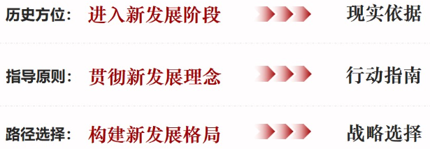

## 二、如何理解高质量发展是全面建设社会主义现代化国家的首要任务

**——我国经济发展的鲜明主题**

### ==（一）我国经济发展进入新常态==

- **==进入新常态的判断依据==**

  - **从时间上看，新常态是我国不同发展阶段更替变化的结果**
  - **从空间上看，新常态是我国出口优势和参与国际产业分工模式变化的体现**
    - 维持出口高增长、出口占国内生产总值的高比例已不大可能，必须把经济增长动力更多放在创新驱动和扩大内需特别是消费需求上。

- **==新常态下我国经济发展的特点和趋势==**

  - **新常态下我国经济发展的主要特点**

    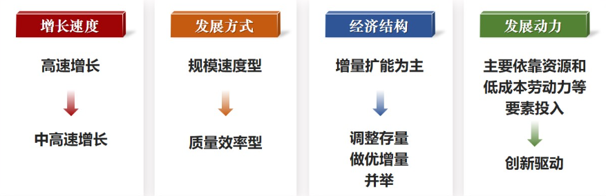

  - **新常态下我国经济发展大势**

    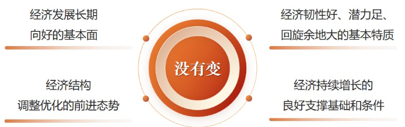

- **==转向高质量发展❤️==**

  - **是从“有没有”转向“好不好”**
  - **是能够很好满足人民日益增长的美好生活需要的发展**
  - **是体现新发展理念的发展**

- **==推动高质量发展的必要性❤️==**

  - **推动高质量发展是保持经济持续健康发展的必然要求**

    - 只有推动高质量发展，才能适应科技新变化、人民新需要，形成优质高效多样化的供给体系，提供更多优质产品和服务，在新的水平上实现供求均衡和经济持续健康发展。

  - **推动高质量发展是适应我国社会主要矛盾变化的必然要求**

    - 我国经济发展阶段也在发生历史性变化，不平衡不充分的发展就是发展质量不高的表现，发展中的矛盾和问题主要就集中在发展质量上。解决我国社会的主要矛盾，必须把发展质量摆在更为突出的位置，着力提升发展质量和效益，推动高质量发展。我们既要重视量的发展，更要重视解决质的问题，在质的大幅度提升中实现量的有效增长。

  - **推动高质量发展是遵循经济发展规律的必然要求**

    - 经济发展是一个螺旋式上升的过程，上升不是线性的，量积累到一定阶段，必须转向质的提升，我国经济发展要遵循这一规律。

      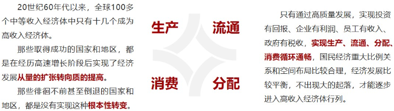

- **==全面建设社会主义现代化国家的首要任务==**

  - ==高质量发展==
    - **为全面建设社会主义现代化国家提供更为坚实的物质基础**
    - **是全面建设社会主义现代化国家的基本路径**
    - **是确保现代化建设能不断满足人民对美好生活需要的根本支撑**
    - **是推动现代化建设行稳致远的重要保障**

### ==（二）以供给侧结构性改革为主线==

- **==供给侧结构性改革的提出依据==**

  - **供给侧管理和需求侧管理**

    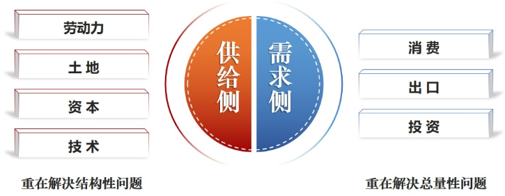

  - **供给侧结构性改革的提出**

    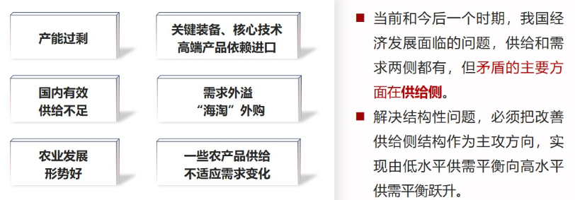

- **==完整准确理解供给侧结构性改革==**

  - **供给侧结构性改革的内涵和目的**

    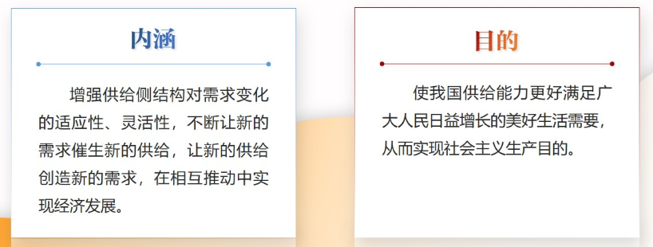

  - **供给侧结构性改革不是西方“供给学派”的翻版**

- **==深化供给侧结构性改革的意义和方向==**

  - **供给侧改革的必要性**

    - 适应把握引领经济发展新常态的重大创新
    - 适应国际金融危机发生后综合国力竞争新形势的主动选择
    - 推动我国经济实现高质量发展的必然要求

  - **推进供给侧结构性改革是一场硬仗**

    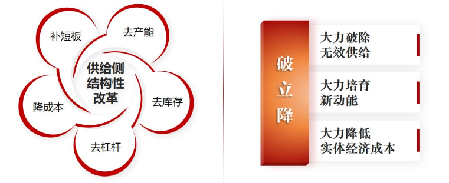

  - **深化供给侧结构性改革的八字方针**

    - 巩固（“三去一降一补”成果）
    - 增强（微观主体活力）
    - 提升（产业链水平）
    - 畅通（国民经济循环）

### ==（三）建设现代化经济体系==

- **现代化经济体系的内容**

  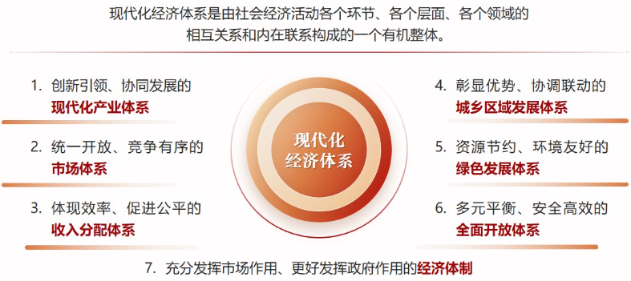

- **建设现代化经济体系的重点举措**

  - **筑牢坚实基础**
    - 建设现代化产业体系
    - 大力发展实体经济
  - **强化战略支撑**
    - 实施创新驱动发展战略
  - **夯实重要基础**
    - 实施乡村振兴战略
  - **优化空间布局**
    - 实施区域协调发展战略
  - **提高国际竞争力**
    - 着力发展开放型经济
  - **完善制度保障**
    - 深化经济体制改革

## ==三、如何坚持和完善社会主义基本经济制度❤️==

**——筑牢我国经济发展的制度基础**

### （一）社会主义基本经济制度是我国经济发展的制度基础

> 公有制为主体、多种所有制经济共同发展，按劳分配为主体、多种分配方式并存，社会主义市场经济体制等社会主义基本经济制度，既体现了社会主义制度优越性，又同我国社会主义初级阶段社会生产力发展水平相适应，是党和人民的伟大创造。
> ——《中共中央关于坚持和完善中国特色社会主义制度、推进国家治理体系和
> 治理能力现代化若干重大问题的决定》(2019年10月31日)

- **社会主义基本经济制度的发展**

  - ==社会主义革命和建设时期==：通过社会主义改造，建立了以公有制和按劳分配为基础的社会主义经济制度。
  - ==改革开放和社会主义现代化建设新时期==：逐步确立了公有制为主体、多种所有制经济共同发展的基本经济制度，按劳分配为主体、多种分配方式并存的基本分配制度，实现了从计划经济体制到社会主义市场经济体制的历史性转变。
  - ==进入新时代==：党的十九届四中全会将公有制为主体、多种所有制经济共同发展，按劳分配为主体、多种分配方式并存，社会主义市场经济体制等作为社会主义基本经济制度。

- **社会主义基本经济制度的科学内涵**

  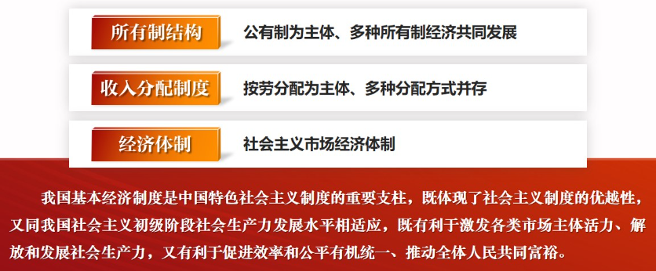

### （二）坚持公有制为主体、多种所有制经济共同发展

- **毫不动摇巩固和发展公有制经济**

  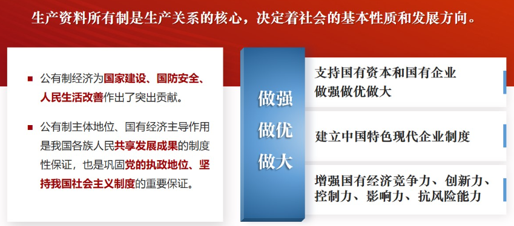

​		国有企业是中国特色社会主义的重要物质基础和政治基础,关系公有制主体地位的巩固,关系我们党的执政地位和执政能力，关系我国社会主义制度。

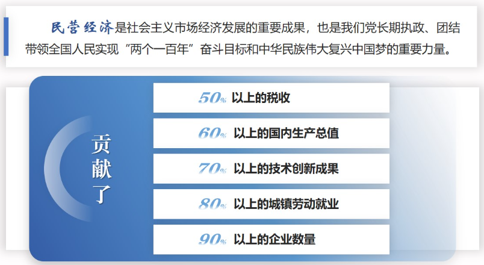

### （三）坚持按劳分配为主体、多种分配方式并存

> 分配制度是促进共同富裕的基础性制度。坚持按劳分配为主体、多种分配方式并存，构建初次分配、再分配、第三次分配协调配套的制度体系。
> ——习近平在中国共产党第二十次全国代表大会上的报告
> (2022年10月16日)

- **初次分配**
  - ==完善制度、规范秩序==
    - 社会总产品在生产资料所有者、劳动者和国家间的分配，表现为**利润**、**劳动报酬**和**流转税**等
    - 坚持**按劳分配主体地位**，增加劳动者特别是一线劳动者劳动报酬，提高劳动报酬在初次分配中的比重
    - 完善**按要素分配**体制机制，允许一部分人靠**诚实劳动**和**合法经营**先富起来
- **再分配**
  - ==统筹兼顾、公平合理==
    - 履行好**政府**再分配调节**职能**
    - 强化**税收**调节，合理调节城乡、区域、不同群体间的分配关系；合理调节过高收入，清理规范不合理收入
    - 强化互助共济功能，把更多人纳入**社会保障**体系
    - 加大对革命老区、民族地区、边疆地区、欠发达地区的**转移支付**
- **第三次分配**
  - ==鼓励引导、自觉自愿==
    - 发挥第三次分配作用，发展**慈善**等社会公益事业
    - 加强公益慈善事业**规范管理**，鼓励高收入人群和企业更多回报社会
    - 提升社会公益事业透明度，推动社会公益资源配置更加**公平公正**

### （四）加快完善社会主义市场经济体制

- **==完善社会主义市场经济体制的核心问题是处理好政府和市场关系==**

  - **有效的市场，有为的政府**

    - ==市场配置资源的决定性作用==：市场配置资源是最有效率的形式，市场决定资源配置是市场经济的一般规律，市场经济本质上就是市场决定资源配置的经济。
    - ==更好发挥政府作用==：保持宏观经济稳定，优化公共服务，保障公平竞争，加强市场监管，维护市场秩序，推动可持续发展，促进共同富裕，弥补市场失灵。

  - **用好“看不见的手”和“看得见的手”**

    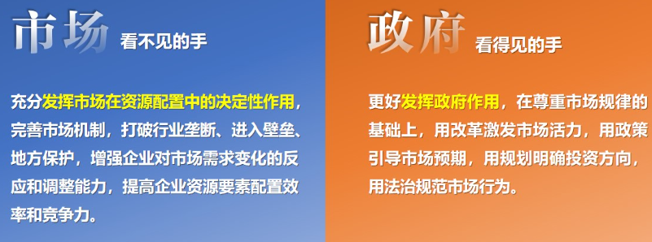

  - **发挥社会主义市场经济体制优势的内在要求**

    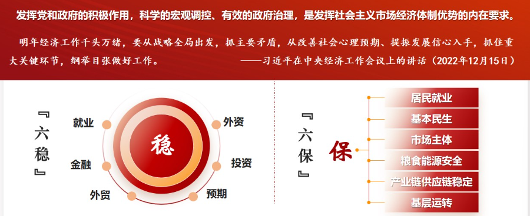

- **==正确认识和把握资本的特性和行为规律==**

  - **为资本设置“红绿灯”**
    - 资本是带动各类生产要素集聚配置的**重要纽带**
    - 要促进各类资本良性发展、共同发展
    - 发挥资本**发展生产力、创造社会财富、增进人民福祉**的作用
    - 各类资本都不能横冲直撞
    - 要防止有些资本野蛮生长
    - 不让“资本大鳄”恣意妄为
    - 要**反垄断、反暴利、反天价、反恶意炒作、反不正当竞争**
    - 资本是社会主义市场经济的重要生产要素,在社会主义市场经济条件下规范和引导资本发展，既是一个重大经济问题、也是一个重大政治问题，既是一个重大实践问题、也是一个重大理论问题。

## 课堂小结

​		党的十八大以来,以习近平同志为核心的党中央,深入把握我国经济发展的基本规律、核心目标、重点任务,强调加强党对经济工作的全面领导,坚持以人民为中心的发展思想,坚持稳中求进工作总基调,坚持和完善社会主义基本经济制度,立足新发展阶段、贯彻新发展理念、构建新发展格局,推动高质量发展,统筹发展和安全,全面深化改革开放,促进全体人民共同富裕，书写了新时代中国特色社会主义经济发展的崭新篇章。