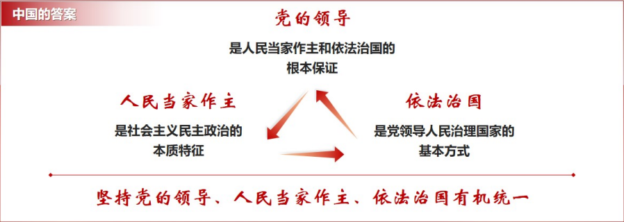
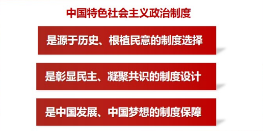

# 第八讲	发展全过程人民民主

## ==一、什么是全过程人民民主❤️==

<u>**——全链条、全方位、全覆盖的民主**</u>

### ==（一）民主是一种国家形式==

**==民主==：是一种阶级统治的国家制度，是统治阶级用来实现其阶级利益的政治形式和手段**

- **==古希腊的雅典民主==**
- **==近现代的西方资本主义民主==**
  - **资产阶级在反对封建专制、取缔封建特权、争取民主方面是值得称道的，但是他们所作的一切改良，只不过是用金钱特权代替了个人特权和世袭特权。资产阶级的阶级本质决定其民主是虚假的民主，是资产阶级维护其统治的工具。**
  - **资本主义民主的局限性：**
    - 一方面：资本主义民主并没有完全实现人的经济和社会解放，没有完全实现社会成员经济和社会权利的平等，是残缺不全的政治形态。
    - 另一方面：资本主义民主政治在实现人的政治权利平等和政治解放方面也存在着很大局限性。
      - **金钱民主**
      - **形式民主**
      - **“否决政治”民主**
      - **特权利益民主**
  
- **==社会主义民主==**

  - 社会主义民主在人类历史上第一次实现多数人对少数人的统治，它不同于以往的一切少数剥削阶级占统治地位的国家的民主。

  - **为什么说社会主义民主是一种新的民主类型？**

| 资本主义民主                                                 | 社会主义民主                                                 |
| ------------------------------------------------------------ | ------------------------------------------------------------ |
| 建立在生产资料私有制的经济基础之上                           | 建立在以生产资料公有制为主体的经济基础之上                   |
| 关注政治权利和政治平等，却无视人民群众经济权力平等，反对实行经济平等和社会平等 | 不仅要实现全体人民的政治民主，还要实现人民群众的经济权力和社会权利 |
| 私人资本和权势集团控制公共权力                               | 国家一切权力属于人民                                         |
| 民主形式与实质相背离                                         | 民主内容和形式是一致的                                       |
| 实质是**资产阶级的专政**                                     | 实质是**人民当家作主**                                       |

- **==社会主义民主的实质是人民当家作主==**

  - **如何理解人民当家作主的基本内涵？**
    - **人民当家做主是社会主义民主政治的本质和核心**

- **==怎样评价民主❤️==**

  - **从主体看，民主应该由这个国家的人民来评判**

  - **从功效看，民主要用来解决人民需要解决的问题**

    - |                    要看                    |               更要看               |
      | :----------------------------------------: | :--------------------------------: |
      |              人民有没有投票权              |        人民有没有广泛参与权        |
      |     人民在选举过程中得到了什么口头许诺     |      选举后这些承诺实现了多少      |
      | 制度和法律规定了什么样的政治程序和政治规则 | 这些制度和法律是不是真正得到了执行 |
      |         权力运行规则和程序是否民主         |   权力是否真正受到人民监督和制约   |

  - **从标准看，民主作为一种国家制度，有其==基本的评价依据==**
  
    1. **国家领导层**能否依法有序更替
  
    2. **全体人民**能否依法管理国家事务和社会事务、管理经济和文化事业
  
    3. **人民群众**能否畅通表达利益要求
  
    4. **社会各方面**能否有效参与国家政治生活
  
    5. **国家决策**能否实现科学化、民主化
  
    6. **各方面人才**能否通过公平竞争进入国家领导和管理体系
  
    7. **执政党**能否依照宪法法律规定实现对国家事务的领导
  
    8. **权力运用**能否得到有效制约和监督
  

### （二）人民民主是社会主义的生命

- **没有民主就没有社会主义**
  - *苏联解体的悲剧：践踏社会主义民主和法制，从而丢掉了社会主义*
- **没有民主就没有社会主义的现代化**
  - ==人民民主，是实现社会主义现代化的政治前提==
  - ==人民民主，是实现社会主义现代化的内在要求==
  - ==人民民主，是实现社会主义现代化的重要力量==
- **没有民主就没有中华民族伟大复兴**
  - **必要条件**和**显著标识**
  - **民主既是政治文明的精髓，也是社会主义的核心价值之一**
  - **只有大力发扬人民民主，才能充分调动广大人民群众的首创精神**

### ==（三）全过程人民民主是全链条、全方位、全覆盖的民主==

> ==**我国全过程人民民主实现了过程民主和成果民主、程序民主和实质民主、直接民主和间接民主、人民民主和国家意志相统一，是全链条、全方位、全覆盖的民主，是最广泛、最真实、最管用的社会主义民主。**==

- **==全过程人民民主重大理念发展历程==**
- **==具有完整的制度程序和完整的参与实践==**
  - ==在领域上==
    - 全过程人民民主涵盖经济、政治、文化、社会、生态文明等各个方面
    - 以多样、畅通、有序的民主渠道，充分调动各地区、各民族、各方面、各阶层的积极主动性创造性
    - 充分发挥各级国家机关和武装力量、各政党和各社会团体、各企业事业组织的作用
  - ==在环节上==
    - **人民民主具体地、生动地体现在人民当家作主的全过程各环节**
      - 民主选举
      - 民主协商
      - 民主决策
      - 民主管理
      - 民主监督
    - **五个环节，环环相扣，内在统一，形成全过程人民民主的完整链条，实实在在解决人民群众关心的事，为实现人民对美好生活的向往提供了有力保障**
  - ==在形式和特点上==
    - **人民通过选举、投票行使权力**
    - **人民内部各方面在重大决策之前进行充分协商**
  - ==在实际效果上==
    - **过程民主和成果民主**：过程民主体现民主的流程，成果民主体现民主的成效，二者相辅相成
    - **程序民主和实质民主**：程序民主是指民主的制度安排，实质民主是指民主始终追求的价值目标，二者有机结合
    - **直接民主和间接民主**：民主政治的实现形式同时包含直接民主和间接民主因素，二者相互配合
    - **人民民主和国家意志**：人民民主体现人民意志，国家意志反映人民意志，二者有机统一
- **==党的领导是根本保证==**
  - 坚持以人民为中心、坚持人民主体地位，真正为人民执政、靠人民执政
  - 充分发挥总揽全局、协调各方的领导核心作用，保证党领导人民有效治理国家。
  - 坚持群众路线，密切同人民群众的联系，凝聚起最广大人民的智慧和力量。
  - 坚持党内民主，带动和促进人民民主的发展。
  - 健全选人用人机制，确保领导权掌握在忠于马克思主义、忠于党、忠于人民的人手中。
  - 坚持依法执政、依法治国，通过法制保障党的政策有效实施、保障人民当家作主。

## ==二、全过程人民民主好在哪里❤️==

**——最广泛、最真实、最管用的社会主义民主**

**==民主的阳光照耀中华大地==**

### （一）人民民主参与不断扩大

- **==民主参与的形式不断创新、渠道不断拓展==**
  - **党和国家要做什么、如何做、做得怎么样，人们参与贯穿始终**
  - **民事民议、民事民定、民事民办**
- **==人民参与的广度和深度不断拓展==**
  - *”无知少女“（无党派人士、知识分子、少数民族、妇女）*
  - **青年群体政治参与的广泛性不断增强**
- **==人民利益要求畅通表达==**
  - ==党和国家在作出重大决定和决策之前，都要广泛征求和听取各方面意见，最大限度吸纳民意、汇集民智、凝聚民力。==
- **==人民利益要求得到回应==**
  - **==有地方说、说了有人听、听了有反馈。==**

### （二）国家治理高效

- **==为什么国家能够治理高效？==**
  - 充分彰显人民的主体地位
  - 有效调节国家政治关系
  - 把党的主张、国家意志、人民意愿紧密融合在一起
  - 始终把中国人民的利益放在第一位
- **==充分彰显人民的主体地位==**
  - 人民既是民主的参与者，也是民主的受益者，智慧力量充分激发，即为自己也为国家、民族拼搏奋斗。
- **==有效调节国家政治关系==**
  - 发展充满活力的政党关系、民族关系、宗教关系、阶层关系、海内外同胞关系，增强凝聚力，形成安定团结的政治局面和团结干事的强大合力。
- **==把党的主张、国家意志、人民意愿紧密融合在一起==**
  - 形成集中力量办大事的制度优势，有效促进了社会生产力解放和发展，促进了现代化建设各项事业，促进了人民生活质量和水平不断提高。

### （三）社会和谐稳定

- **==人民民主是中国社会进步的推进器和润滑剂==**
  - 发展民主，要推进社会向着自由、平等、公正、文明、团结、和谐的方向前行。

### （四）权力运用得到有效制约和监督

- **权力是一把双刃剑**
  - ==权力在有效制约和监督下运行才能实现民主、造福人民==
  - ==权力失去约束、恣意妄为必然破坏民主、危害人民==
- **==人民民主监督的形式和成效不断拓展深化==**
  - **人民民主监督的形式不断丰富**
  - **民主好不好，实践最有说服力，人民最有发言权**

## ==三、如何进一步发展全过程人民民主==

**——把民主价值和理念转化为科学有效的制度安排**

- **==发展全过程人民民主的目标==**
  - 未来五年
    - 全过程人民民主制度化、规范化、程序化水平进一步提高
  - 到二〇三五年
    - 全过程人民民主制度更加健全

### （一）坚持走中国特色社会主义政治发展道路

- 如何使亿万人民能够成为一个整体，从而把国家权力切实掌握在人民手中

- **”三者有机统一“的内在机理**
  - 人民通过中国共产党领导凝聚为有机整体
  - 党和人民共同意志体现并成为宪法和法律
  - 国家以宪法为根本法得以组织、运行和发展
  - 权力运行必须在法治的框架内
  - 人民以中国共产党为领导核心，通过各种途径和形式依法管理国家事务、管理经济和文化事业、管理社会事务，宪法、法律及其实施都要有效体现人民意志、保障人民权益、激发人民创造活力
- **==绝不照搬西方政治制度模式==**
  - **不能”照搬“**
    - ==西方民主概念陷阱==
      - 概念泛化
      - 价值矮化
      - 原理神化
      - 模式幻化
  - **”照搬“危险**
  - **不用”照搬“**

### （二）加强人民当家作主制度保障

​		坚持和完善我国根本政治制度、基本政治制度、重要政治制度，拓展民主渠道，丰富民主形式，确保人民依法通过各种途径和形式管理国家事务，管理经济和文化事业，管理社会事务。

- **如何加强人民当家作主制度保障**

  1. **支持和保证人民通过人民代表大会会行使国家权力**

     保证各级人大都由民主选举产生、对人民负责、受人民监督。

  2. **支持和保证人大及其常委会依法行使立法权、监督权、决定权、任免权**

     健全人大对行政机关、监察机关、审判机关、检察机关监督制度，维护国家法治统一、尊严、权威。

  3. **加强人大代表工作能力建设**

     密切人大代表同人民群众的联系。

  4. **健全吸纳民意、汇集民智工作机制**

     建设好基层立法联系点。

  5. **深化工会、共青团、妇联等群团组织改革和建设**

     有效发挥桥梁纽带作用。

  6. **坚持走中国人权发展道路**

     积极参与全球人权治理，推动人权事业全面发展。

### （三）全面发展协商民主

- **==协商民主是实践全过程人民民主的主要形式==**
  - 社会主义协商民主是实现党的领导的重要方式，是党领导人民有效治理国家、保证人民当家作主的重要制度设计，是我国社会主义民主政治的特有形式和独特优势。
- **==如何进一步发展协商民主==**
  - ==完善协商民主体系==
  - ==坚持和完善中国共产党领导的多党合作和政治协商制度==
  - ==发挥人民政协作为专门协商机构作用==

### （四）积极发展基层民主

- **==基层民主是全过程人民民主的重要体现==**
  - **基层民主的建立和发展**
    - 实现了基层群众的自我管理、自我服务、自我教育、自我监督
    - 基层群众广泛、直接、有效行使民主权利
    - 人民当家作主的广泛性、真实性、有效性
- **==如何进一步发展基层民主==**
  - ==健全基层党组织领导的基层群众自治机制==
  - ==完善办事公开制度==
  - ==全心全意依靠工人阶级==

### （五）巩固和发展最广泛的爱国统一战线

- **==实现中华民族伟大复兴的梦想，需要海内外中华儿女共同奋斗==**
  - **加强新时代统一战线工作根本在于坚持党的领导**
    - 发挥我国社会主义新型政党制度优势
    - 以铸牢中华民族共同体意识为主线
    - 坚持我国宗教中国化方向
    - 加强党内外知识分子思想政治工作
    - 全面构建亲清政商关系
    - 加强和改进侨务工作

## 课堂小结

​		人民民主是社会主义的生命，是全面建设社会主义现代化国家的应有之义。党的十八大以来，以习近平同志为核心的党中央深化对民主政治发展规律的认识，提出了全过程人民民主的重大理念。全过程人民民主是社会主义民主政治的本质属性，是全链条、全方位、全覆盖的民主，是最广泛、最真实、最管用的社会主义民主。新征程上，我们必须坚持走中国特色社会主义政治发展道路、加强人民当家作主制度保障、全面发展协商民主、积极发展基层民主、巩固和发展最广泛的爱国统一战线，让民主之光更亮、民主之路更广。