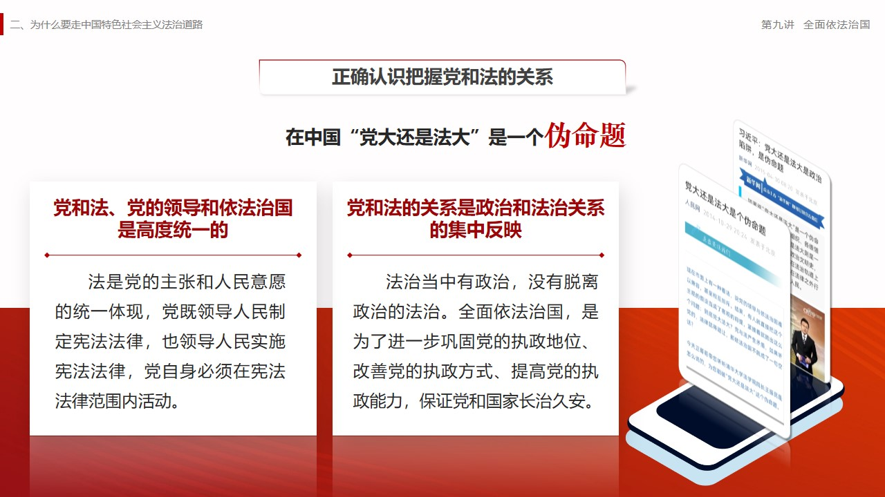
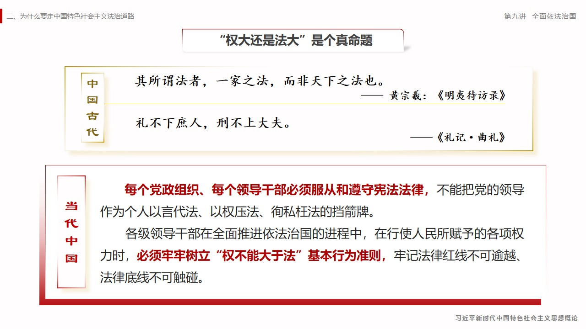
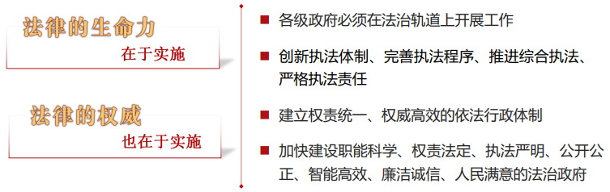
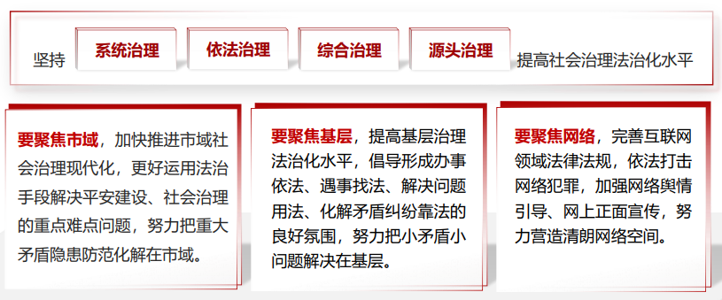
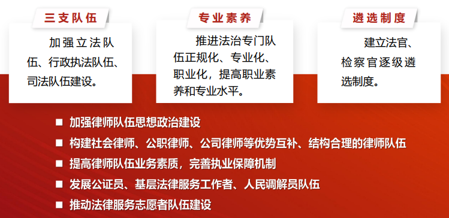

自学

# 第九讲	全面依法治国

## 一、为什么要全面推进依法治国

**——法治兴则国兴，法治强则国强**

### （一）法治是社会文明进步的重要标志

​		法治和人治问题是人类政治文明史上的一个基本问题，也是推进国家治理体系和治理能力现代化进程中必须面对和解决的一个重大问题。

​		**依法治理是最可靠、最稳定的治理。**

### （二）全面依法治国是国家治理现代化的必然要求

- **==党对法治的理论认识和实践探索经历了一个不断深化的过程==**

1. **全面依法治国是坚持和发展中国特色社会主义制度、推进国家治理体系和治理能力现代化的重要方面。**
2. **全面依法治国是社会主义法治建设的“全面升级版”，是国家治理的一场深刻革命。**
3. **全面依法治国是解决党和国家事业发展面临的重大问题、促进社会公平正义、确保党和国家长治久安的根本要求。**
4. **全面依法治国，既是立足于解决事关我国发展大局的现实考量，也是着眼于长远的战略谋划。**

### （三）在法治轨道上全面建设社会主义现代化国家

**坚持党的领导、人民当家作主、依法治国有机统一**

- **==法治固根本==**
- **==法治稳预期==**
- **==法治利长远==**

## 二、为什么要走中国特色社会主义法治道路

**——全面依法治国的唯一正确道路**

### （一）全面依法治国必须走对路

- **==中国特色社会主义法治道路，有着深厚的中华优秀传统法律文化底蕴。==**
- **==中国特色社会主义法治道路，是中国人民长期探索出来的，符合中国国情的法治道路。==**

### （二）中国特色社会主义法治道路的核心要义

1. ==**坚持党的领导**==
2. **==坚持中国特色社会主义制度==**
3. **==贯彻中国特色社会主义法治伦理==**

### （三）走中国特色社会主义法治道路必须坚持的基本原则

1. ==**坚持党的领导是中国特色社会主义法治之魂**==
2. **==坚持人民主体地位==**
3. **==坚持法律面前人人平等==**
4. **==坚持依法治国和以德治国相结合==**
5. **==坚持从中国实际出发==**

## 三、如何理解全面依法治国的总目标

**——中国特色社会主义法治体系**

### （一）全面依法治国的总抓手

### （二）中国特色社会主义法治体系的基本框架

- **==加快形成完备的法律规范体系==**
- **==加快形成高效的法治实施体系==**
- **==加快形成严密的法治监督体系==**
- **==加快形成有利的法制保障体系==**
- **==加快形成完善的党内法规体系==**

### （三）坚持和完善中国特色社会主义法治体系

1. **==健全保证宪法全面实施的体制机制==**
2. **==完善立法体制机制==**
3. **==健全社会公平正义法治保障制度==**
4. **==加强对法律实施的监督==**

## ==四、如何建设法治中国==

**——法治国家、法治政府、法治社会一体建设**

### （一）完善以宪法为核心的中国特色社会主义法律体系

- **==坚持依宪治国、依宪执政，加强宪法实施和监督==**
  - **宪法是治国理政的总章程**
    - 坚持依法治国首先要坚持依宪治国，坚持依法执政首先要坚持依宪执政，坚持宪法确定的中国共产党领导地位不动摇，坚持宪法确定的人民民主专政的国体和人民代表大会制度的政体不动摇。
    - 加强宪法实施和监督，健全保证宪法全面实施的制度体系。
    - 进一步加强对宪法法律实施情况的监督检查，积极稳妥推进合宪性审查工作，完善健全宪法解释程序机制。
- **==加强重点领域、新兴领域、涉外领域立法==**
  - 积极推进国家安全、科技创新、公共卫生、生物安全、生态文明、防范风险等**重要领域立法**，加快数字经济、互联网金融、人工智能、大数据、云计算等**新兴领域立法**，填补法律制度薄弱点和空白区。
  - 加强**民生领域立法**，回应人民群众反映强烈的突出问题，满足人民日益增长的美好生活需要。
  - 推进**设区的市立法**建设，立足地方特色和解决突出问题，充分发挥地方立法实施性、补充性、探索性作用。
  - 统筹推进国内法治和涉外法治，加快**涉外领域立法**，完善涉外条款规定，补齐涉外法律制度短板，加快涉外法律法规体系建设。
- **==推进科学立法、民主立法、依法立法==**
  - **发挥人大在立法工作中的主导作用**
    - 尊重客观规律，科学编制立法规划，增强立法调研、座谈、起草、论证、协调、审议、评估等机制
    - 建立基层立法联系点制度
  - **健全法律法规规章起草征求人大代表意见制度**
    - 增加人大代表列席人大常委会会议人数
    - 更多发挥人大代表参与起草和修改法律作用
  - **健全立法机关和社会公众沟通机制**
    - 创新公众参与方式，发挥基层立法联系点民意“直通车”的作用
    - 完善和加强法规备案审查制度，最大程度凝聚立法共识

### （二）扎实推进依法行政

- ###### **==坚持科学决策、民主决策、依法决策==**

  - 完善**重大决策程序制度**，健全公众参与、专家论证、风险评估、合法性审查、集体讨论决定等机制，确保决策制度科学、程序正当、过程公开、责任明确。
  - 完善**政府法律顾问制度**，建立以政府法制机构人员为主体、专家和律师参加的法律顾问队伍，完善工作机制，确保法律顾问在重大决策中发挥积极作用。
  - 完善**重大决策责任追究和倒查机制**，强化决策主体责任，造成严重后果的要依法严格追责。
  
- **==加快转变政府职能==**

  - 用法治给行政权力定规矩、划界限，优化政府职责体系和组织结构，推进政府**机构、职能、权限、程序、责任**法定化，提高行政效率和公信力。
  - 用法治来规范政府和市场的边界，遏制一些政府部门不当干预经济的惯性和冲动，解决好职能**越位、缺位、错位**的问题，坚决消除权力设租寻租的空间。
  - 加强对政府内部权力的制约，推进各级政府事权规范化、法制化，**分事行权、分岗设权、分级授权，**全面推进政务公开。
  - 深化事业单位改革，坚持优化协调高效，改革**机构设置、职能配置**，实现整体性重塑。

- **==深化行政执法体制改革==**

  - 严格执法资质，完善行政执法人员持证上岗和资格管理制度。
  - 加大关系群众切身利益的重点领域执法力度，加强重点领域严格执法。
  - 完善行政执法程序，健全执法全过程记录制度。
  - 健全行政裁量基准，细化量化行政裁量标准。

- **==强化行政执法监督机制和能力建设==**

  - 加强对**执法活动的制约和监督**，充分发挥各监督主体的作用和积极性，完善监督体系，科学设定监督职责，严密监督程序，增强监督合力与实效。
  - 全面落实**行政执法责任制**，严格确定不同部门及机构、岗位执法人员执法责任和责任追究制度，完善**纠错问责机制**，构成犯罪的要依法追究刑事责任，做到有权必有责、滥权必追责。

- **==完善基层综合执法体制机制==**

  - **探索综合执法**，推动在食品药品安全、工商质检、公共卫生、安全生产等领域实行跨领域跨部门综合执法，减少市县两级政府执法队伍种类，提高执法质效。
  - **理顺体制**，加强城市管理综合执法机构建设，完善管理和协调机制，提高执法和服务水平。
  - **加强协调**，建立健全执法队伍主管部门和相关行业管理部门相互支持、密切配合、信息共享的联动机制，加强统一领导和相互协作，形成监管合力，提高整体效能。

### （三）严格公正司法

- **==规范司法权力运行==**
  - 进一步健全**公安机关、检察机关、审判机关、司法行政机关**各司其职、相互配合，**侦查权、检察权、审判权、执行权**相互制约的体制机制，着力破解配合不够、制约监督不力等突出问题。
  - 进一步规范**上下级法院、检察院层级关系**，深化四级法院审级职能定位改革试点，完善检察一体化运行机制，加强上级机关统一法律适用、监督执法办案质效的职能。
  - 深化执法司法权力运行机制改革，紧盯司法权力运行重点环节，加快构建**科学合理、规范有序、权责一致、监管有力**的执法司法权运行机制，确保司法权行使严格精准、公正高效。
- **==深化司法体制综合配套改革==**
  - 全面准确落实**司法责任制**，深入推行**办案责任制**，加强新型办案组织建设，明确领导干部正负面权力清单。
  - 完善司法人员**分类管理制度**，深化法官检察官**员额制改革**，加强司法辅助人员管理，增强司法人员职业荣誉感和使命感。
  - 健全**执法司法质效评价体系**，优化办案质效和公信力评判标准，严格落实**办案责任制和激励机制**，推动司法惩戒制度实质化运行。
- **==推进严格司法，加强人权司法保障==**
  - 坚持以事实为根据、以法律为准绳，健全事实认定符合客观真相、办案结果符合实体公正、办案过程符合程序公正的法律制度。
  - ==强化==：诉讼过程中当事人和其他诉讼参与人的**知情权、陈述权、辩护辩论权、申请权、申诉权**的制度保障。
  - ==加强==：对刑讯逼供和非法取证的源头预防，健全冤假错案有效防范、及时纠正机制。
  - ==落实==：终审和诉讼终结制度，实行诉访分离，**保障当事人依法行使申诉权利。**
- **==保障人民群众参与司法，加强对司法活动的监督==**
  - 坚持人民司法为人民，依靠人民推进公正司法，通过公正司法维护人民权益。在**司法调解、司法听证、涉诉信访**等司法活动中保障人民群众参与。
  - 司法机关既要及时**回应社会关切**，又要规范媒体对案件的报道，防止舆论影响司法公正。
  - **坚决破除各种潜规则**，绝不允许法外开恩，绝不允许办关系案、人情案、金钱案**，对司法领域的腐败“零容忍”**。

### （四）加快建设法治社会

​		法治社会是构筑法治国家的基础。法律的权威源自人民的内心拥护和真诚信仰。要增强全社会厉行法治的积极性和主动性，形成守法光荣、违法可耻的社会氛围，培育办事依法、遇事找法、解决问题用法、化解矛盾靠法的法治环境。

- 让尊法学法守法用法成为全体人民的共同追求

  - 忠实崇尚者
  - 自觉遵守者
  - 坚定捍卫者

- **==传承中华优秀传统法律文化，增强全民法治观念，弘扬社会主义法治精神==**

  - 发掘和传承中华法律文化精华，推动中华法系的优秀思想和理念实现创造性转化、创新性发展，使中华法制文明焕发出新的生命力。
  - 建设社会主义法治文化，加强以社会主义核心价值观为基础的公民道德建设，做到法治和德治相辅相成、相互促进。
  - 坚持把全民法治宣传教育作为依法治国的长期基础性工作，加强青少年法治教育，提升全体公民法治意识和法治素养。
  - 深化领导干部学法用法工作，以“关键少数”带动绝大多数，发挥示范带头作用。

- **==推进多层次多领域依法治理，提升社会治理法治化水平==**

  

- **==建设完备的法律服务体系，健全依法维权和化解纠纷机制==**

  - 推进覆盖城乡居民的公共法律服务体系建设，完善法律援助制度，扩大援助范围，健全司法救助体系，发展律师、公证等法律服务业，发展涉外法律服务业，健全统一司法鉴定管理体制。
    - 构建对维护群众利益具有重大作用的制度体系
    - 健全社会矛盾纠纷预防化解机制
    - 深入推进社会治安综合治理，健全落实领导责任制

### （五）加强法治工作队伍建设

​		全面推进依法治国，必须大力提高法治工作队伍**思想政治素质、业务工作能力、职业道德水准**，着力建设一支**忠于党、忠于国家、忠于人民、忠于法律**的社会主义法治工作队伍，为加快建设社会主义法治国家提供强有力的组织和人才保障。

- **==建设高素质法治专门队伍，加强法律服务队伍建设==**

  

- **==创新法治人才培养机制==**

  - 办好法学教育，必须坚持走中国特色社会主义法治道路，坚持以马克思主义法学思想和中国特色社会主义法治理论为指导。推动习近平法治思想进教材进课堂进头脑，培养造就熟悉和坚持中国特色社会主义法治体系的法治人才及后备力量。
  - 打破高校和社会之间的体制壁垒，将实际工作部门的优质实践教学资源引进高校，加强校企、校地、校所合作，发挥政府、法院、检察院、律师事务所、企业等在法治人才培养中的积极作用。
  - 加强法学教师队伍建设，重点打造一支政治立场坚定、理论功底深厚、熟悉中国国情的高水平法学家和专家团队，建设高素质学术带头人、骨干教师、专兼职教师队伍。

## 课堂小结

​		党的十八大以来，以习近平同志为核心的党中央深刻回答了新时代为什么实行全面依法治国、怎样实行全面依法治国等一系列重大问题，形成了习近平法治思想，推进法治中国建设取得历史性成就。

​		全面依法治国是国家治理的一场深刻革命，必须在法治轨道上全面建设社会主义现代化国家。中国特色社会主义法治道路是社会主义法治建设成就和经验的集中体现，是建设社会主义法治国家的唯一正确道路，必须在中国共产党领导下，坚持人民主体地位、法律面前人人平等、依法治国与以德治国相结合，从中国实际出发，走好中国特色社会主义法治道路。