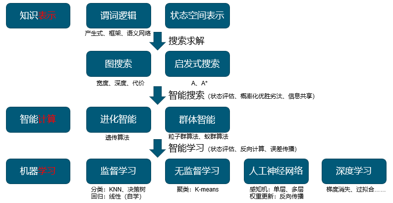
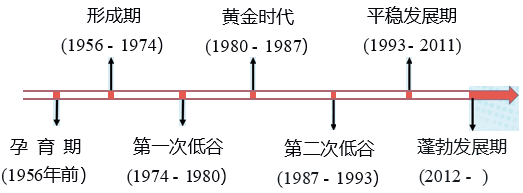
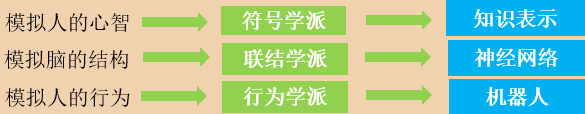
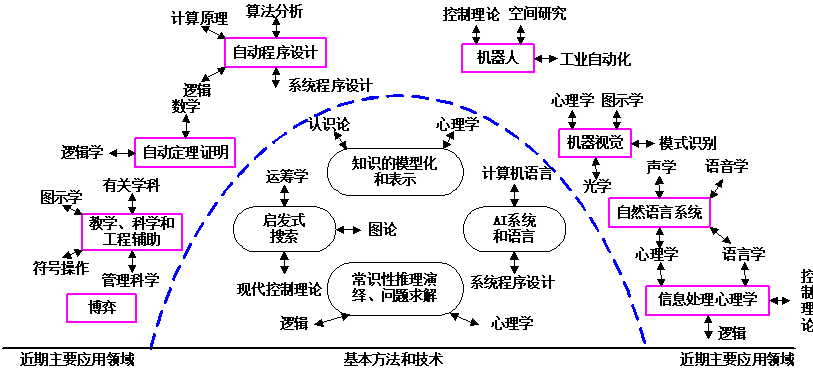

# 人工智能导论

## 课程内容

- **绪论**：AI定义、起源与发展，AI人才与技术市场，AI的研究与应用介绍
- **知识表示**：状态空间法；问题归约法、谓词逻辑法。
- **逻辑与推理**：规则演绎系统；产生式系统；模糊逻辑
- **搜索求解**：盲目搜索；启发式搜索；广度优先原则
- **智能计算**：群种选取；算法框架；学习优化
- **机器学习**：定义、主要策略与结构
- **深度学习**：网络结构；激励函数；参数学习；非线性拟合

## 核心内容

## 第一节	人工智能概述

人工智能：以机器为载体实现的人类智能

### 什么是人工智能（AI）？

**人工智能：**

- 理解“我们如何思考”是人类长期的研究目标
- 人工智能不仅试图要理解心智能力,而且要建造智能体

**什么是人工智能？**

- 人工智能（Artificial Intelligence），英文缩写为AI。它是研究、开发用于模拟、延伸和扩展人的智能的理论、方法、技术及应用系统的一门新的技术科学。
- 它企图了解智能的实质，并生产出一种新的能以人类智能相似的方式做出反应的智能机器，该领域的研究包括机器人、语言识别、图像识别、自然语言处理和专家系统等。
- 人工智能是对人的意识、思维的信息过程的模拟。人工智能不是人的智能，但能像人那样思考、也可能超过人的智能。

**人工智能有哪些类型？**

- **弱人工智能**，包含基础的、特定场景下角色型的任务，如Siri等聊天机器人和AlphaGo等下棋机器人；
- **通用人工智能**，包含人类水平的任务，涉及机器的持续学习；
- **强人工智能**，指比人类更聪明的机器；

### 人工智能发展历程

- **孕育期（1956年以前）**

  - 数理逻辑——*符号主义学派*

    - 数理逻辑初创期，亚里士多德，演绎法，**三段论**
    - 逻辑代数时期，莱布尼茨，**形式逻辑符号化**，奠定**数理逻辑**基础
    - 后来：启发式算法$\rightarrow$专家系统$\rightarrow$知识工程理论与技术

    - 人工神经网络——*连接主义学派*
      - 詹姆士，**人脑的结构及功能**，及记忆、学习、联想相关功能的规律
      - <u>麦克洛奇和皮兹</u>，首个神经网络模型（**MP模型**）
      - <u>赫布</u>，提出改变神经网络连接强度的**Hebb规则**

    - *行为主义学派*
      - <u>维纳</u>，控制论创始人，**控制论**对人工智能的影响，形成了行为主义学派。
      - 代表作：<u>布鲁克斯</u>（Brooks）的六足行走机器人，被看作是新一代“控制论动物”

    - 人工智能的载体——计算机
      - **第一台通用计算机**“ENIAC”

  - 图灵：英国数学家
    - 自动机理论，图灵机
      - 首次提出”机器也能思维“
      - **图灵试验**
      - **人工智能之父**

- **人工智能诞生（1956年）**
  - AI诞生于一次历史性的聚会
    - 达特茅斯大学
    - 由**麦卡锡**提议正式采用了**Artificial Intelligence**这一术语
- **形成期（1956-1970）**
  
  1. **塞缪尔**，西洋跳棋程序
  2. 逻辑理论机（LT）的数学定理证明程序
  3. 行动规划咨询系统
  4. 通用问题求解（GPS）程序
  5. 归结（消解原理）
  6. Shakey
  
- **低谷期（1966-1980）**
  
  - 过高预言的失败，给AI的声誉造成重大伤害。
  - *下棋程序告负世界冠军*
  - 归结法能力有限
  - **翻译问题**
  - **“人工智能即使不是骗局，也是庸人自扰”***
  
- **黄金期（1980-1987）**

  - **专家系统**

  - Hopfield网络，解决旅行商问题

  - 反向传播（Back Propagation, BP）算法，解决多层神经网络学习问题

- **第二次低谷期（1987-1993）**

  - 最初大获成功的专家系统维护费用居高不下

  - 十年前日本人宏伟的“第五代工程”并没有实现

- **平稳发展期（1993-2011）**

  - 机器学习、人工神经网络、智能机器人和行为主义研究趋向深入。

  - 智能计算弥补了人工智能在数学理论和计算上的不足，更新和丰富了人工智能理论框架，使人工智能进入新的发展时期 

  - *深蓝、阿莫西、沃森*

- **蓬勃发展期（2012至今）**

  数据的爆发式增长为人工智能提供了充分的“养料”，泛在感知数据和图形处理器等计算平台及新型的以深度学习为代表的新方法等因素合力造势，人工智能迎来它的蓬勃发展期，**人类已经正式跨入了人工智能的时代**。

### 人工智能的发展现状、研究进展和”智能+“

- 现状：专用人工智能
- 起步：通用人工智能
- 应用范式日趋成熟，Al向各行各业快速渗透融合避而重塑整个社会发展，这是人工智能驱动**第四次技术革命**的最主要表现方式

## 第二节	人工智能与学科

### 几大门派

符号学派、联结学派、进化学派、贝叶斯学派、类推学派

### 学科结构

### 人工智能的核心方法

- **直觉获取**
  - 直觉：不经过思考过程，很快就能出现的直接想法、感觉、信念或者偏好（这个非常重要，其强大的力量。如：落子的直觉，胜负的直觉、棋盘的直觉、棋形的直觉）
  - 通过深度神经网络和大数据的训练而获得
- **搜索验证**
  - 验证：为直觉建立真实性、准确性和可靠性的检验过程
  - 验证是核实直觉不存在偏差的一个充分条件
  - 由于廉价并行计算和大数据的支持，直觉可以通过搜索计算来验证
- **优化选择**
  - 直觉获取和搜索验证的结合使用，可以提供优化选择

### 新特征

- **深度学习+自我博弈进化技术**
  - AlphaGo：”直觉感知“、”棋局推理“、”新颖落子“
  - 将记忆人类棋局和自我博弈积累棋局结合起来。
- **基于网络的群体智能已经萌芽**
  - 结合群体智慧与机器性能来解决快速增长难题。
  - 其将群智计算按难易程度分为三种类型：
    - 实现任务分配的众包模式（Crowdsourcing）
    - 较复杂支持工作流模式的群（Complex workflows）
    - 最复杂的协同求解问题的生态系统模式（Problem solving  ecosystem ）
- **人机一体化技术导向混合智能**
  - 在语言、视觉、图形和听觉之间语义贯通，是实现联想、推理、概括等智能的重要关键
- **跨媒体推理已经兴起**
- **无人系统迅速发展**

## 第三节	人工智能与人才

略

## 第四节	智能产业发展趋势

略

## 第五节	人工智能与重庆大学

略
