# 搜索求解

### 求解一个问题涉及两个方面

- **该问题的知识表示**：若找不到合适的表示$\rightarrow$谈不上对其求解
- **选择相对合适的求解方法**
  - 设计自驾旅行最佳的出行路线
  - 制订合理的课程表
- 在知识表示基础上研究问题求解方法，是AI研究的又一核心问题
- 内容：
  - *早期搜索*技术，如图搜索、盲目搜索、启发式搜索
  - *高级搜索*技术，如规则演绎系统、产生式系统
- 绝大多数AI求解问题缺直接方法→搜索不失为一种有效途径
- 给定待求解问题→搜索算法按事先设定的逻辑自动寻找答案

### 搜索技术

是AI的基本技术之一 ,  在人工智能各应用领域中被广泛地使用

早期的AI程序与搜索技术联系紧密：几乎所有的（智力难题、棋类游戏、简单数学定理证明）都是以**搜索**为基础的

现在，搜索技术已渗透在各种AI系统中，可以说没有哪一种AI应用不用搜索方法，在专家系统、自然语言理解、自动程序设计、模式识别、机器人学、信息检索和博弈都在广泛使用

搜索算法——问题求解智能体

智力游戏：*3传教士+3野人渡河、一条船、每次2人；如何规划摆渡方案？可有几种方案？所用步骤是否最少——如何找到？* 

### 什么是搜索？

- 定义

  - 根据问题的实际情况不断寻找可利用的知识，构造出**一条代价较少的推理路线**，使问题得到圆满解决的过程。
- 包括两个方面：
  - 找到从初始事实到问题最终答案的一条推理路径
  - 找到的这条路径在时间和空间上复杂度最小

### 搜索推理技术

- 一般一个问题可以用好几种搜索技术解决，选择一种好的搜索技术对解决问题的效率很有关系，甚至关系到求解问题有没有解。
- 搜索方法好的标准, 一般认为有两个：
  - **搜索空间小**
  - **解最佳**

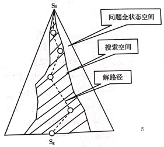

[TOC]

## 3-1	图搜索策略

- 图的搜索
  - 一种在图中寻找路径的方法
  - 图中**每个节点对应一个状态，每条连线对应一个操作符**
- 分类（图的一般搜索策略）
  - 对OPEN表中节点排序方式产生了不同的搜索策略， 不同的搜索搜索策略效率不同。
  - 无信息搜索（==排序是任意的，及盲目的——盲目搜索==）
    - 宽度优先搜索
    - 深度优先搜索
    - 等代价搜索
  - 有信息搜索（==排序用启发信息为依据——启发式搜索==）
    - A算法
    - A*算法

### 状态图搜索

- 由于搜索的目的是为了**寻找初始节点到目标节点的路径**，所以在搜索过程中就得随时**记录搜索轨迹**。
  - 必须记住下一步还可以走哪些点：  **OPEN表**==**（存放待扩展的节点表）**==
  - 必须记住哪些点走过了：   **CLOSED表**==**（存放已扩展的节点）**==
  - 必须记住从目标返回的路径
  - 每个表示状态的节点结构中必须有==**指向父节点的指针**==
- 所谓对一个节点进行**“扩展”是指对该节点用某个可用操作进行作用，生成该节点的一组子节点（后续节点）**

#### 数据结构

- OPEN表：未扩展的节点表
  - 扩展：用合适算符对一个节点进行操作，生成一组子节点
  - 存放刚生成的节点
  - **不同的搜索策略，节点在OPEN表中的排列顺利不同**
- CLOSED表：已扩展的节点表
  - 存放将扩展或已扩展的节点

					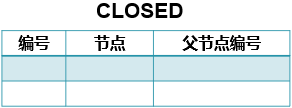

#### 例题

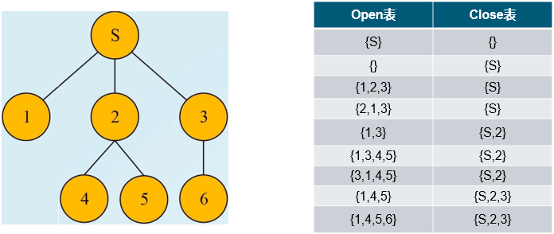

### 图的搜索策略

#### 图的一般搜索策略

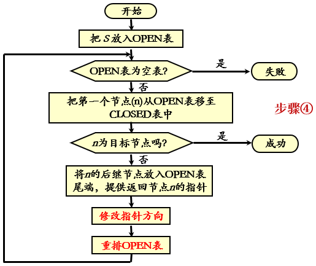

- 注：这是一个通用的搜索过程，后面讨论的状态空间各种搜索策略都是其特例。
- 各种搜索策略的主要区别在于：
  - ==步骤“重排OPEN表”对OPEN表上的节点进行排序的准则==，以便选出一个“最好”的节点作为步骤④（如图）扩展使用
- **搜索图和搜索树**
  - 算法结束后，将生成一个图G，称为==搜索图==。
  - 由图G中所有节点及反向指针（每个节点都有一个指针指向父节点）构成G的一个支撑树，称为==搜索树==。
- 从目标节点开始，将指针指向的状态回串起来，即找到一条解路径。

#### 修改返回指针示例

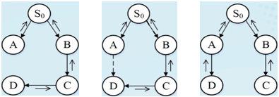

- **进一步说明**：
  - 第7步修改返回指针的原因是，因为这些节点又被第二次生成，所以它们返回初始节点的路径已有两条，但这两条路径的“长度”可能不同。 那么，**==当新路径短时自然要走新路==**
    - 如果搜索中某一节点出现了两个或者两个以上的父节点，那么就需要进行修改指针操作。
    - 需要比较从初始节点到这个节点的几条路径的代价，选择最优路径。
    - 该节点的指针只指向最优路径的父节点，其他父节点的指针要删掉。
  - 这里对路径的长短是按照路径上的节点数来衡量的，后面我们将会看到**==路径的长短也可以其“代价”==（如距离、费用、时间等）==衡量==**

### 盲目式搜索（Blind Search）

- 概念
  - 对特定问题不具有任何相关信息的条件下，==按照固定的步骤==（依次或者随机）进行搜索，搜索过程中获得的中间信息不用来改进控制策略。一般只适用于==求解比较简单的问题==
- 种类
  - ==**宽度优先**==（Breadth-first search）
  - ==**深度优先**==（Depth-first search）
  - ==**等代价**==（代价优先）搜索（Uniform-cost search）
- 特点
  - 没有启发信息的一种搜索形式
  - 搜索过程中不使用与问题有关的经验信息
  - 搜索效率低
  - 不适合大空间的实际问题求解

#### 宽度优先搜索（Breadth First Search）

- 宽度/广度优先搜索基本思想：
  - 首先扩展根节点；
  - 接着扩展根节点的所有后继节点；
  - 然后再扩展后继节点的后继，依此类推；
  - 在第n层节点还没有全部搜索完之前，不进入第n+1层节点的搜索。
- **==先生成的节点先拓展==**
- **OPEN表采用==先进先出的队列结构==**

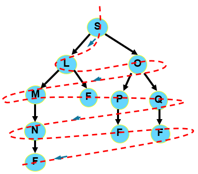				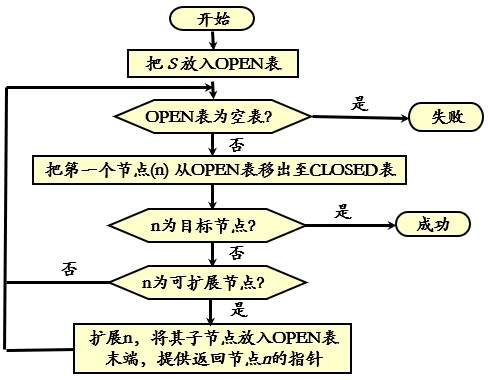

- **Example：**

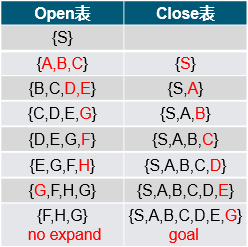					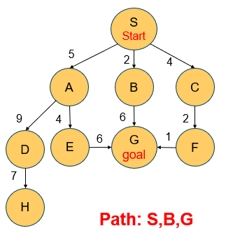

- **性质：**

  - 属于图搜索方法

  - **新扩展的节点排在open表的末端**

  - 当问题有解时，一定能找到解

  - 方法与问题无关，具有通用性

  - 效率较低

#### 深度优先搜索（Depth First Search）

- 深度优先搜索基本思想：
  - 总是扩展搜索树的当前扩展分支中最深的节点；
  - 搜索直接伸展到搜索树的最深层，直到那里的节点没有后继节点；
  - 然后搜索算法回退到下一个还有未扩展后继节点的上层节点继续扩展
- 其生成节点并与目标节点进行比较是沿着==**树的最大深度方向**==进行的，只有当上次访问的节点不是目标节点、且没有其他节点可以生成时，才转到上次访问节点的父节点。
- 转移到父节点后，该算法会搜索父节点的其它的子节点。
- 防止搜索过程沿着无益的路径扩展下去，往往给出一个节点扩展的最大深度——==**深度界限**==
- 定义-节点的深度：
  - 起始节点的深度为0。
  - 任何其他节点的深度==**等于其父辈节点的深度加1**==。
-  **==先拓展最新产生的（即最深的）节点==**
- **OPEN表采用==先进后出的堆栈结构==**

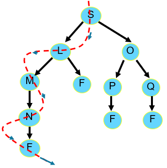						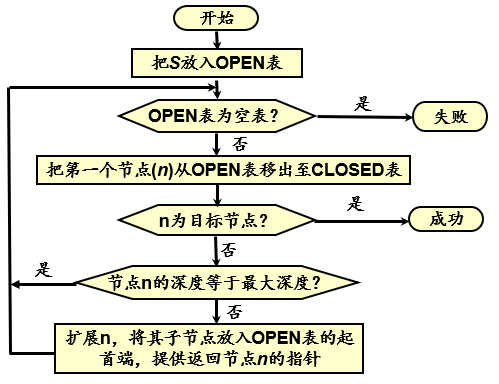

- **Example：**

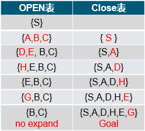					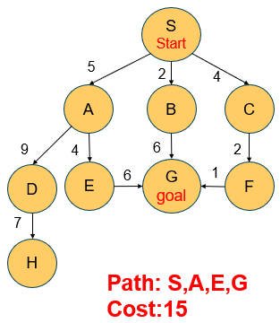

- **限制：（例子：八数码难题，略）**
  - 一般不能保证找到最优解
  - 当深度限制不合理时，可能找不到解，可以将算法改为可变深度限制
  - 最坏情况时，搜索空间等同于穷举

#### 等代价搜索（Uniform-cost Search）

- **BFS**的扩展版本：Expand node with ==***lowest path cost***==
- **1959年由Dijkstra**（迪科斯彻）**提出——Dijkstra算法**
- **基本思想：**
  - 是宽度优先搜索的一种推广，不是沿着等长度路径断层进行扩展，而是沿着等代价路径断层进行扩展。
  - 状态图中每条连接弧线上的有关代价，表示时间、距离等开销。
  - 节点代价的定义：
    - $g(n)$： 表示从初始节点$ S$。到节点$n$的代价；
    - $c (n_1, n_2) $: 表示从父节点$n_1 $到其子节点$ n_2 $的代价；
    - $g (n_2) = g (n_1) + c ( n_1 ,n_2)$

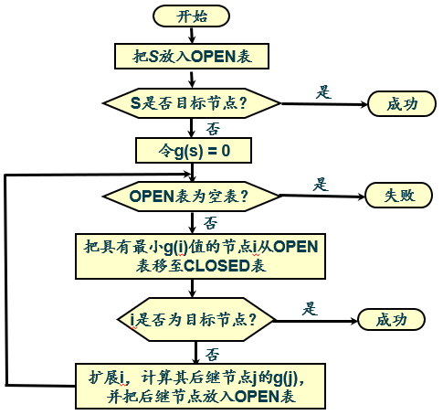

- **Example：**

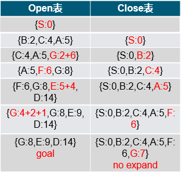				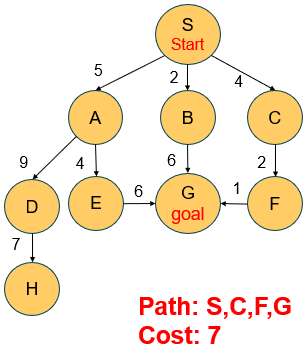

#### 小结

- 按照事先规定的路线进行搜索

  - ==宽度优先搜索是按“层”进行搜索的==，先进入OPEN 表的节点先被考察
  - ==深度优先搜索是沿着纵深方向进行搜索的==，后进入OPEN表的节点先被考察

- 等代价搜索首先扩展最小代价节点。
  - ==**按预先设置的策略或已付出的代价进行搜索，没有利用搜索过程中的信息指导搜索！**==

## 3-2	启发式搜索

#### 为什么需要启发式搜索？

- 盲目搜索的不足
  - 效率低，耗费过多的计算空间与时间
  - 可能带来组合爆炸
  - 分析前面介绍的宽度优先、深度优先搜索，或等代价搜索算法, 其主要的差别是**OPEN表中待扩展节点的顺序问题**。人们就试图找到一种方法用于排列待扩展节点的顺序，即选择最有希望的节点加以扩展，那么，搜索效率将会大为提高。
- <u>*选择最有希望的节点进行扩展*</u>
- 什么可以做为启发式信息？
  - 启发性信息是指那种与具体问题求解过程有关的，并可**指导搜索过程朝着最有希望方向前进的控制信息**。
- 启发式就是要猜测：
  - 从节点n开始，找到最优解的可能性有多大？
  - 从起始节点开始，经过节点n，到达目标节点的最佳路径的费用是多少？
- 启发式搜索是利用与问题有关的启发性信息，并以这些启发性信息指导的搜索的问题求解过程。
  - ==需定义一个评价函数，对当前的搜索状态进行评估， 找出一个最有希望的节点来扩展。==
  - **重排OPEN表**， 选择**最有希望的节点**加以扩展。
- 种类
  - A算法
  - A*算法
  - ……

### A算法

- ==局部择优：==1964年，尼尔逊提出一种算法以提高最短路径搜索的效率，被称为A1算法
- ==有序搜索：==1967年，拉斐尔改进了A1算法，称为A2算法（A算法）
- **估计函数**
  - **定义**：估价函数（evaluation function)，估算节点希望程度的量度
  - **表示方法**：$f(n)=g(n)+h(n)$
    - $f(n)$——表示节点n的估价函数值
    - $g(n)$——**从起始状态到当前状态n的实际代价**
    - $h(n)$——**从当前状态到目标状态的估计代价（启发式函数）**

#### 例子——八数码问题

- 定义评价函数：
  - $f(n)=g(n)+h(n)$
  - $g(n)$为从初始节点到当前节点的路径长度（深度）
  - $h(n)$与目标相比, 错位的数字数目;

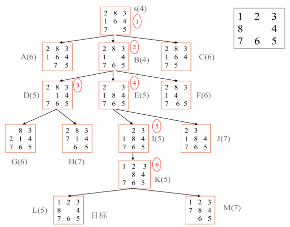

|          | 宽度搜索（$h(n)=0$） | 深度搜索（界为5） | A算法 |
| :------: | :------------------: | :---------------: | :---: |
| 扩展节点 |          26          |        18         |   6   |
| 生成节点 |          46          |        34         |  13   |

#### 有序搜索

- **有序搜索**，也称优先搜索/全局择优， 选择OPEN表上具有**最小 f 值的节点**作为下一个要扩展的节点。

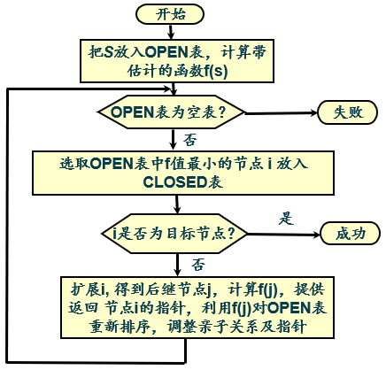

#### 小结

- 特征：
  - 估价函数 :  $f (n) = g (n) + h (n)$
  - 对$h(n)$无限制，虽提高了算法效率，但不能保证找到最优解
  - 不合适的$h(n)$定义会导致算法找到不解
- 性能：
  - 不完备（*它可能沿着一条无限的路径走下去而不回来做其他的选择尝试，因此无法找到最佳路径这一答案。*）
  - 不最优

### A*算法

- 1968年，彼得.哈特对A算法进行了很小的修改，并证明**了当估价函数满足一定的限制条件时，算法一定可以找到最优解。**
- 隶属于A算法，估价函数满足一定限制条件的算法称为A*算法
- **==A*算法的限制条件==**： $f (n) = g (n) + h (n)$
  - $g(n)$——==大于0==
  - $h(n)$——==不大于n到目标节点的实际代价==

#### 估计函数的设计

- 把OPEN表中的节点按估计函数的值从小到大进行排序

$$
f(n)=g(n)+h(n)
$$

- $g(n)$是对$g^*(n)$的估计

$$
g(n) \ge g^*(n)
$$

- $h(n)$是$h^*(n)$的下界，对所有的节点$n$

$$
h(n) \le h^*(n)
$$

- **$f(n)$可视为经过节点$n$，具有最小开销代价值的路径**

- ==满足以上约束的估计函数定义的A算法就是A*算法==

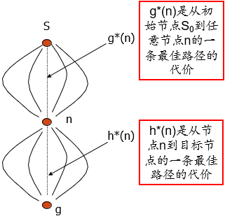

#### 定义

- 在图搜索过程中，如果第**8**步的重排**OPEN**表是依据$f(n)=g(n)+h(n)$进行的,则称该过程为**A算法**
- 在A算法中,如果对所有的n存在$h(n)≤h^*(n)$,则称$h(n)$为$h^*(n)$的下界,它表示某种偏于保守的估计
- 采用$h^*(n)$的下界$h(n)$为启发函数的A算法，称为$A^*$算法。$h(n)=0$时，A*算法就变为等代价搜索算法

#### 利用A*算法求解八数码问题

- **方案1**

  - $f(n)=g(n)+h_1(n)$
    - $g(n)$：节点n的层数
    - $h_1(n)$：**表示“不在位” 的将牌数**（错放的棋子数）
    - 显然$h_1(n)≤h^*(n)$

- **方案2**

  - $f(n)=g(n)+h_2(n)$
    - $g(n)$：节点n的层数
    - $h_2(n)$：**节点n的每一将牌与其目标位置之间的距离总和**
    - 显然$0≤ h_1(n)≤ h_2(n)≤ h^*(n)$

- 结果：

  | 启发函数 | $h(n) = 0$ | $h(n) = h_1(n)$ | $h(n) = h_2(n)$ |
  | :------: | :--------: | :-------------: | :-------------: |
  | 扩展节点 |     26     |        6        |        5        |
  | 生成节点 |     46     |       13        |       11        |

- A\*算法的搜索效率很大程度上取决于$h(n)$, **在满足$h(n)\le h^*(n)$的前提下，h(n)的值越大越好**

#### 算法过程

（略）

#### 算法流程图

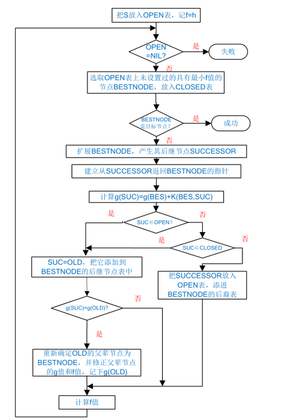

### 启发式搜索小结

- 启发式策略就是利用与问题有关的启发信息进行搜索的策略。

- 利用估价函数来估计待搜索节点的希望程度，并以此排序。估价函数一般由两部分组成：
  $$
  f(n)=g(n)+h(n)
  $$

- $g(n)$是从初始节点到节点$n$已付出的实际代价，$h(n)$是从节点$n$到目的节点的最佳路径的估计代价。 $h(n)$体现了搜索的启发信息。
- 在$f(n)$中，$g(n)$的比重越大，越倾向于宽度优先搜索，而$h(n)$的比重越大，表示启发性越强。 
- $g(n)$的作用一般是不可忽略的，保持$g(n)$项就保持了搜索的宽度优先成分，这有利于搜索的完备性，但会影响搜索的效率。
- **A算法**
  - 在GRAPH SEARCH过程中，如果第8步重排OPEN表是依据$f(n)=g(n)+h(n)$进行的,则称该过程为A算法;
  - 显然，A算法对$h(n)$没有明确的限制。
- **A*算法**
  - 采用$h^*(n)$的下界$h(n)$为启发函数的A算法，称为A*算法。
  - A\*算法要求$h(n)\le h^*(n)$。它表示某种偏于保守的估计。
  - 如果算法有解，A*算法一定能够找到最优的解答。
  - 一般说来，在满足$h(n)≤h^*(n)$的前提下，$h(n)$的比重越大越好，$h(n)$的比重越大表示启发性越强。

