# 知识表示

## 2-0	概述

### 什么是知识

- 数据、信息 $\neq$ 知识
- 知识层次
  - 噪声
  - **数据**：一些无关联的**事实(fact)**
    - 例：下雨了
  - **信息**：建立了事实间的联系后形成信息，提供对what, who, when, where等问题的回答
    - 例：温度下降了15度后就下雨了
  - **知识**：当能建立模式之间的联系后便涌现了知识，提供对how的回答
    - 例：如果湿度非常大并且温度下降显著，大气无法保留湿气便下雨了
  - **智慧**：能描述模式之间关系的规律，提供对why的回答
    - 例：理解下雨、蒸发、空气状况、温度等级及它们的变化之间的相互作用

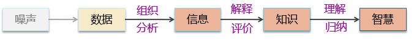

### 知识及其表示对机器智能的重要性

- 人类智能活动的目的：观察、获取并运用知识
- 知识——人类智能发展与延续的基础
- 计算机要有智能→须能模拟人类智能行为→须让它具有知识
- 但知识需要用适当的模式表示→才能存储到计算机中去
- **知识表示的过程：非形式化的自然语言描述$\rightarrow$形式化的易于被计算机理解**

- **==知识的表示成为人工智能中十分重要的研究课题==**

### 知识的特性

- 相对正确性
  - 在一定的条件及环境下，知识一般是正确的，可信任的
- 不确定性
  - 由随机性引起的不确定性
  - 由模糊性引起的不确定性
  - 由经验性引起的不确定性
  - 由不完全性引起的不确定性
- 可表示性和可利用性
  - 知识是可以表示出来的
  - 知识是可以利用的

### 知识的表示 Knowledge Representation

- 将人类知识形式化或者模型化
  - 对知识的一种描述或约定——机器可接受的用于描述知识的数据结构
  - 贯穿人工智能发展历程 贯穿哲学和科学的发展历史
- 目的：让机器存储和运用人类的知识
- 选择知识表示方法的原则：
  - 充分表示领域知识
  - 有利于对知识的利用
  - 便于对知识的组织、维护与管理
  - 便于理解与实现

### 几种知识表示的方法

- 符号主义
  - 谓词逻辑、产生式系统、框架系统
  - 早期的人工智能研究，主要采用符号主义，这里的符号其实就是表示知识的工具。
  - 符号主义的本质，是用符号体系来描述知识，再对表示得到的符号公式进行计算，从而求解问题。

- 经验主义
  - 状态表示、特征表示
  - 在经验主义方法中，知识不再由人工抽象、归纳符号体系来得到，而是通过样本数据的状态、特征来间接体现。
  - 在经验主义中，样本数据的特征表示，就对应了某种知识。智能系统通过“体验”样本特征，来获取知识。
- 连接主义
  - 语义向量、网络权重
  - 在连接主义中，知识的表示更加抽象。连接主义的核心就是要模拟人类大脑神经元连接的结构。
  - 在这种情况下，从样本数据中获得的知识，就变为神经网络中的语义向量、网络权重。

### 本章内容

- 无法涉及所有的知识表示形式。
- 给大家介绍基于逻辑规则的知识表示方法。这也是人工智能第一次发展浪潮中的研究热点之一。
- 涉及的内容包括：一阶谓词逻辑、产生式表示法、框架式表示法、语义网络表示法、状态空间表示法。

[TOC]

## 2-1	谓词逻辑至语义网络

**机器自动推理：**

- 图灵：一个用规则和事实来程序化的高速数字计算机可能表现的行为
- 经典人工智能技术主要以**符号表示，符号处理**为实现智能的主要手段，**推理和搜索**是其中的核心技术
- 要解决推理和搜索的问题，首先需要解决问题的表示，我们需要一种适合计算机的问题表示方法

### 谓词逻辑表示法

#### 命题

- <u>命题（proposition）</u>：一个非真即假的陈述句。
  - 当命题的意义为真，则称它的真值为真，记为“T”
  - 当命题的意义为假，则称它的真值为假，记为“F”
  - 一个命题可以在一种情况下为真，在另一种条件下为假。

#### 命题逻辑

- <u>命题逻辑（Propositional Logic）</u>：研究命题和命题之间关系的符号逻辑系统。
- 联结词和复合命题
  - 上述诸如“没有”、“如果...那么...”等连词称为**联结词**（Connectives） 
  - 由联结词和命题连接而成的更加复杂的命题称为复合命题（Compound Proposition）；相对地，不能分解为更简单的命题的命题称为**简单命题**
  - **复合命题的真假完全由构成它的简单命题真假所决定**
- 详见离散数学

#### 谓词

- 命题逻辑虽然能够把客观世界的各种事实表示为逻辑命题，但具有很大局限性，不适合表达比较复杂的问题
- 谓词逻辑是一种形式语言。接近自然语言，又方便存入计算机处理
- 用于刻画个体的性质、状态和个体之间关系的语言成分就是**谓词**
- **二元以上谓词称作多元谓词**
- 语法元素（略）

#### 连词和量词

详见离散数学

#### 推理规则

详见离散数学

#### 表示方法

**自然语言的形式化**

#### 谓词逻辑小结

- 可以表达对客观世界的陈述，及对象关系、逻辑关系。
- 优点：
  - 自然性
  - 精准性
  - 容易实现
- 不足：
  - 不能表示不确定性知识
  - 形式过于自由，兼容性差
- 应用：
  - 自动问答系统（QA3 by Green）
  - 机器人行动规划系统（STRIPS by Fikes）
  - 机器博弈系统（FOL by Filman）
  - 问题求解系统（PS by Kowalski）

### 产生式表示法

- 产生式规则（Production Rule）
  - 1943年：美国数学家波斯特首先提出
  - 1972年：纽厄尔和西蒙在研究人类的认知模型中开发了基于规则的产生式系统
  - 通常用于表示事实、规则以及它们的不确定性度量，适合于表示事实性知识和规则性知识
  - 二十世纪七十年代：成功应用于自动推理器和专家系统
  - 当时人工智能学科的主流方法
  - 随后被应用于形式语言学、计算语言学中的句法分析器等领域

#### 产生式

- 确定性规则知识的产生式表示
  - 基本形式：IF  $P$  THEN  $Q$
    - 或者：$P\rightarrow Q$
    - ==P称为规则的前件  Q称为规则的后件；如果前件P成立，那么对应的后件Q成立==
  - 例如：IF  动物会飞  AND  会下蛋  THEN  该动物是鸟
- 不确定规则知识的产生式表示
  - 基本形式：IF  $P$  THEN  $Q$  （置信度）
    - 或者：$P\rightarrow Q$  （置信度）
  - 例如：IF  发烧  THEN  感冒  （0.6）
- 确定性事实性知识的产生式表示
  - 三元组表示：（对象，属性，值）
    - 或者：（关系，对象1，对象2）
  - 例：
    - 老李年龄是40岁：  （*Li*，*age*，40）   
    - 老李和老王是朋友：（*friend*，*Li*，*Wang*）
- 不确定事实性知识的产生式表示
  - 四元组表示：（对象，属性，值，置信度）
    - 或者：（关系，对象1，对象2，置信度）
  - 例：
    - 老李年龄很可能是40岁：（*Li*，*age*，40，0.8）
    - 老李和老王不大可能是朋友：（*friend*，*Li*，*Wang*，0.1）
- 产生式和谓词逻辑中的蕴含式的区别
  - 产生式与谓词逻辑中的蕴涵式的基本形式相同，但蕴涵式只是产生式的一种特殊情况。
  - 除逻辑蕴含外，产生式还包括各种操作、规则、变换、算子、函数等。 **例如，“如果炉温超过上限，则立即关闭风门”是一个产生式，但不是蕴含式。**
  - **蕴含式只能表示精确知识**，而产生式不仅可以表示精确的知识，还可以表示不精确知识。蕴含式的匹配总要求是精确的。产生式匹配可以是精确的，也可以是不精确的，只要按某种算法求出的相似度落在预先指定的范围内就认为是可匹配的。

#### 基本结构

- 一个产生式系统由**规则库、综合数据库、控制系统（推理机）**三部分组成。
- *当专家根据具体知识，设计好一组产生式知识库之后，需要进一步设计产生式系统，利用知识库进行问题求解。*

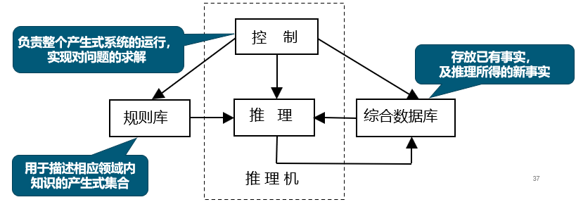

- 控制系统的工作
  1. **推理：**从规则库中选择与综合数据库中的已知事实进行**匹配**
  2. **冲突消解：**匹配成功的规则可能不止一条，进行冲突消解
  3. **执行规则：**执行某一规则时，如果其右部是一个或多个**结论**，则把这些结论加入到综合数据库中：如果其右部是一个或多个**操作**，则执行这些操作。对于不确定性知识，在执行每一条规则时还要按一定的算法计算结论的不确定性
  4. **检查推理终止条件：**检查综合数据库中是否包含了最终结论，决定是否停止系统的运行
- 例子（略）
- 优点：
  - 自然性
  - 模块性
  - 有效性
  - 清晰性
- 缺点
  - 效率不高
  - 不能表达结构性知识
- 适合领域
  - 自然性领域知识间关系不密切 不存在结构关系。 
  - 经验性及不确定性的知识，且相关领域中对这些知识 没有严格、统一的理论
  - 领域问题的求解过程可被表示为一系列相对独立的操作，且每个操作可被表示为一 条或多条产生式规则 

#### 产生式规则表示法与人工智能的发展

- 在AI发展的早期，该知识表示方法，配合推理器，成为主流，推动了定理证明、自动推理、专家系统等方法的发展。
- 不仅如此，其作为一种通用的人类知识的表示形式，也成功应用于许多领域，如早期的基于规则的句法分析器、机器翻译器等。
- 目前，事实性知识的产生式表示方法，发展为知识图谱，成为近几年AI领域知识表示的核心方法。

#### 专家系统（Expert System）

- 专家系统奠基人-斯坦福大学的费根鲍尔定义为：一种智能的计算机程序，运用知识和推理来解决只有专家才能解决的复杂问题。
- 即：**专家系统可以模拟某个领域专家的决策能力。**如医生的诊断能力、数据分析解释能力、预测能力、判断能力等。

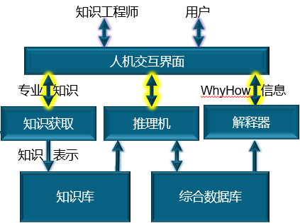

#### 应用与发展

- 第一代专家系统针对高度专业化问题设计，**但通用性不够**
- 最典型代表：斯坦福大学的医学专家系统，成功用于细菌感染性疾病的诊断和治疗
- 第一个完整结构的系统；**第一次使用知识库、可信度，实现不确定性推理**

#### 专家系统的局限性

- 知识获取瓶颈问题
- 规则“跷跷板”问题
- 知识动态化、知识更新问题
- 随着时代发展，人工建设专家系统的效率低、成本高，逐渐成为历史，但基于知识的人工智能方法仍然在不断进步。
- 近几年来成为研究热点的知识图谱，某种程度上就可以看作是大规模的知识集合。

### 框架表示法

- 框架理论：人们对现实世界中各种事物的认识都是以一种类似于框架的结构存储在记忆中的。
- 框架表示法：一种结构化的知识表示方法，已在多种系统中得到应用。  
- 例如：
  - 描述“上课”的知识：可抽象出许多要素
    - 上课的时间、地点、班级、科目、教师
    - 涉及到讲台、课桌、投影仪、音响设备
    - 关联教学活动：提问、回答、讨论、作业…
  - 最终这些知识相互关联，形成对上课的“整体认识”，这就是框架

#### 一般结构

- **框架表示法：**一种结构化的知识表示方法，已经在多种系统中得到应用
- **框架：**一种一种描述所论对象（一个事物、事件或概念）属性的数据结构
- 框架通常由描述事务的各个方面的**槽（slot）**组成，每个槽可以拥有若干个**侧面（faced）** ，而每个侧面可以拥有若干个值。
  - 一个槽用于描述所论对象某一方面的属性
  - 一个侧面用于描述相应属性的一个方面
  - 槽和侧面所具有的属性值分别被称为槽值和侧面值

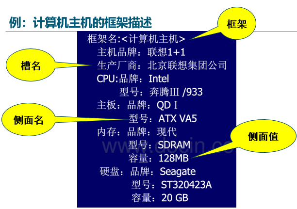

#### 例子

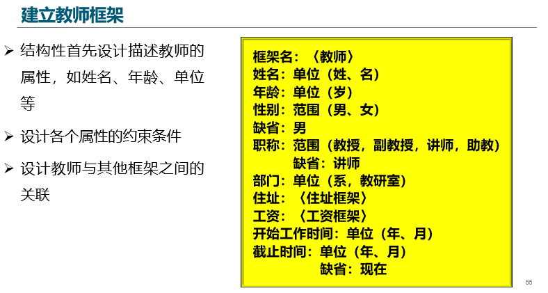

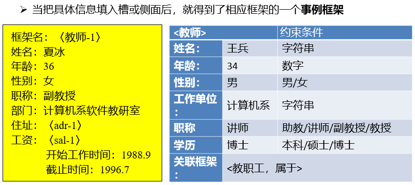

#### 框架库

完整的框架库往往包含许多框架，其间存在从属关系。一个框架的槽值或侧面值可以是另外一个框架的名字，这就在框架之间建立了横向联系。

#### 典型的框架知识库：FrameNet

[FrameNet]:https://framenet.icsi.berkeley.edu/fndrupal

- 目前最著名的语义知识框架库，由加州大学伯克利分校主持构建， 旨在建立通用的语义知识库
- 包括1200多个语义框架，设计13000多个语义单元，提供超过200万个标注框架的例句，广泛应用于信息提取、机器翻译、事件识别、情感分析等应用

#### 特点

- 结构性
  - 便于表达结构性知识，便于表达结构性知识，能够将知识的内部结构关系及知识间的联系表示出来
- 继承性
  - 框架网络中，下层框架可以继承上层框架的槽值，也可以进行补充和修改
- 自然性
  - 框架表示法与人在观察事物时的思维活动是一致的

### 语义网络表示法

#### 基本概念

- 语义网络
  - 通过概念及其语义关系来表达知识的一种网络图，是一种“带标识”的有向图
  - 它由节点和弧组成：
    - 节点表示各种事物，概念，情况，属性，动作，状态等
    - 弧表示各种语义关系，必须带有标识
- **语义基元**
  - 语义网络中最基本的语义单元称为语义基元
  -   **(节点1，弧，节点2)**
- 基本网元 
  - 一个语义基元对应的有向图 

#### 常用联系

- **实例关系：**ISA，“具体与抽象”的概念，例：李刚是一个人
- **分类关系：**AKO，“子类与超类”的概念，例：鸟是一种动物
- **成员关系：**A-Member-of，“个体与集体”的概念，例：张强是一名共青团员
- **属性关系：**Have，Can，Age，例：鸟有翅膀
- **聚类关系：**Part of，“部分与整体”的概念，例：大脑是人体的一部分
- **时间关系：**Before，After，At，例：北京奥运会在悉尼奥运会之后
- **位置关系：**Located-on(-at，-under，-inside，-outside)，例：书在桌**子上**
- **相似关系：**Similar-to，Near-to，例：猫似虎

#### 事务和概念

- 表示一些简单事实，如占有关系和其它情况：以节点表示实体与概念，节点间关系以有向链关联
- 例：小燕是一只燕子，燕子是一种鸟，鸟有翅膀；巢-1是小燕的巢，巢-1是巢中的一个

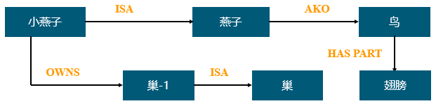

- 问题：上述的语义网络为二元关系，无法表示复杂事实，如：小燕从春天到秋天占有巢-1

#### 情况和动作的表示

- 表示方法：西蒙提出了增加情况和动作节点的描述方法
  - 允许节点既可以表示一个物体或一组物体，也可以表示情况与动作
  - 小燕从春天到秋天占有巢-1，设立**占有权**节点，表示占有物和占有时间等

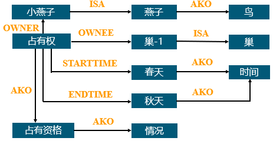

- 用语义网络表示事件或动作时，需要设立一个时间或者动作节点

  - 动作节点：由一些向外引出的弧来指出动作的主体与客体
    - 例：张三给李四一张磁盘

  - 事件节点：用一个事件节点描述

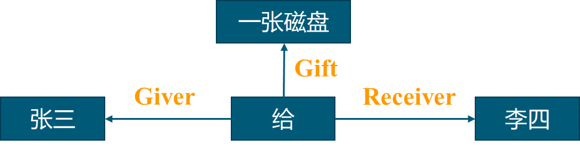

------

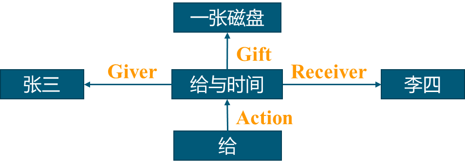

#### 特点

- 优点
  - 结构性
  - 联想性
  - 自索引性
  - 自然性
- 缺点
  - 非严格性
  - 复杂性

## 2-2	状态空间表示法

### 状态空间表示法

#### 问题求解

- 人工智能的多个研究领域从求解现实问题的过程来看，都可以抽象为一个**“问题求解”**过程
- 问题求解的目的
  - 机器自动找出某问题的正确解决策略
  - 更进一步，能够举一反三，具有解决同类问题的能力
- 是从人工智能初期的智力难题、棋类游戏、简单数学定理证明等问题的研究中开始形成和发展起来的一大类技术
- 求解的手段多种多样，其中搜索技术是问题求解的主要手段之一
  - **问题的表示**
  - **求解的方法**
- **状态空间表示法**：用来表示问题及其搜索过程的一种方法。

#### 问题

- 调度、分配、导航、路径规划、游戏

#### 问题的状态空间表示

- **状态空间法：**用来表示问题及其搜索过程的一种方法，它是以状态和算符为基础来表示和求解问题的。

- 主要包括：

  - **状态**
  - **操作**
  - **状态空间**

- 典型：下棋、迷宫、游戏

- **状态：**表示问题求解过程中每一步问题状况的**数据结构**，一般有一组数据表示：
  $$
  S=[S_1, S_2,\cdots ,S_n]^T \qquad 状态的矢量形式 \\
  S_k=[S_{k0},S_{k1},\cdots ,S_{kn}]^T \qquad 给定每个分量的具体状态
  $$

- 式中每个元素为集合的分量，称为**状态变量**

  - 每一个分量给予确定的值时，得到一个具体的状态。
  - 任何一种类型的数据结构都可以用来描述状态，只要它有利于问题求解。
  - 在程序中用字符、数字、记录、数组、结构、对象等表示状态

- **算符（Operator，算子，操作符）：**当对一个问题状态使某个可用操作时，它将引起该状态中某些分量值的变化，从而使问题从一个状态变为另一个具体状态。
  $$
  F=\{f_1,f_2,\cdots,f_m\}
  $$

  - 算符可理解为状态集合上的一个函数，它描述了状态之间的关系。
  - 算符可以是某种操作、规则、行为、变换、函数、算子、过程等。
  - **算符也称为操作**，问题的状态也只能经定义在其上的这种操作而改变。

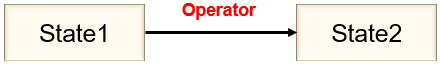

#### 问题的状态空间

- **问题的状态空间（State space）**：利用状态变量和操作符号，描述一个问题的全部状态以及这些状态之间的相互关系。
- 状态空间用一个三元组表示：（S, F, G）
  - S：为问题的所有初始状态的集合
  - F：算符的集合
  - G：为目标状态的集合

#### 状态图示法

- 状态空间的图示表示形式称为**状态空间图（有向图）**
- 其中图的节点表示状态，图的边表示算符
- 问题求解过程就是**寻求图的某一路径的问题**，实际上是一个搜索过程

#### 例子：八数码难题

- 在$3Ⅹ3$的棋盘，摆有八个棋子，每个棋子上标有1至8的某个数字。棋盘上还有一个空格，与空格相邻的棋子可以移到空格中。**如何将棋盘从某一初始状态变成最后的目标状态？**

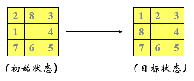

- 将棋局用向量$S=(X0,X1,X2,X3,X4,X5,X6,X7,X8)$表示状态$X_i$为变量，$X_i$的值就是方格$X_i$内的数字，取值为$\{0,1,2,\cdots,8\}$，其中$0$表示空格。于是，向量$S$就是该问题的状态表达式。
  - **初始状态**：$S_0=(028345671)$
  - **目标状态**：$S_g=(012345678)$

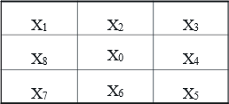

- 制定**操作符集**：
  - 直观方法——为每个棋牌制定一套可能的走步：**左、上、右、下**四种移动。这样就需要**32个操作算子**
  - 简易方法——仅为空格制定这**4种走步**，因为只有紧靠空格的棋牌才能移动。空格移动的唯一约束是不能移出棋盘。

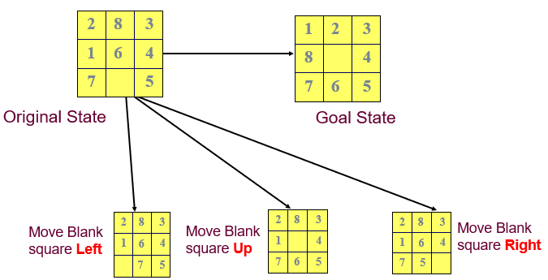

- 从初始棋局开始，试探由每一合法走步得到的各种新棋局，然后再走一步而得到的下一组棋局这样继续下去，直至达到目标棋局为止。把初始状态可达到
- 各状态所组成的空间设想为一幅由各种状态对应的节点组成的图。**这种图成为状态空间图**。
- 图中每个节点是它所代表的棋局。首先把适用的算符用于初始状态，以产生新的状态；*算符可用看成状态空间图的边*。

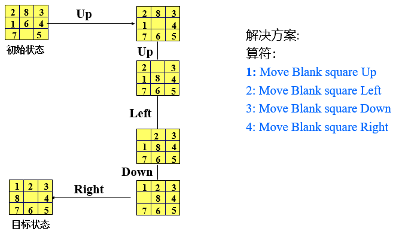

#### 其他例子

- 二阶梵塔问题
- 猴子与香蕉问题
- 传教士野人过河问题

（详见PPT）