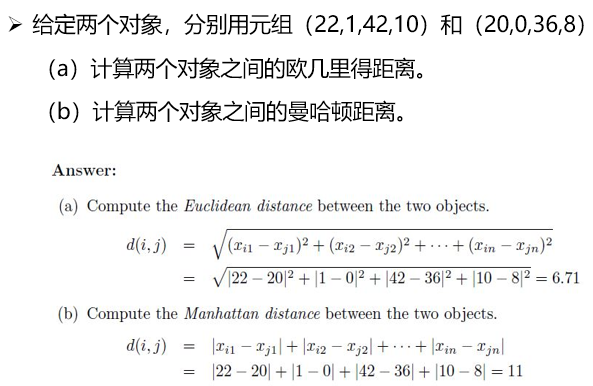
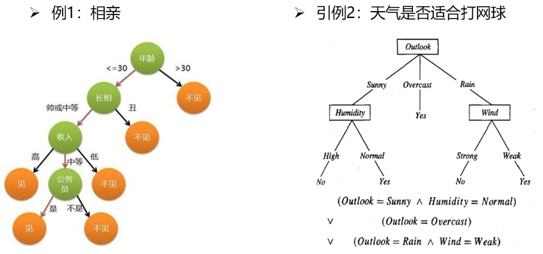

# 第五章	机器学习

[TOC]

## 5-1	概述

### 什么是学习

- 人类具有的重要智能行为 
- 众说纷纭，主要观点
  - **学习是系统改进其性能的过程**——西蒙的观点
    - 就是系统在不断重复的工作中，对本身能力的增强或者改进，使得系统在下一次执行同样任务或类似任务时，会比现在做得更好或效率更高
  - **学习是获取知识的过程**——从事专家系统研究的观点
  - **学习是技能的获取**——心理学家的观点
  - **学习是事物规律的发现过程**

### 什么是机器学习

- 无公认的统一定义，一般认为：**研究如何使用机器来模拟人类学习活动** 
- 最早的具有学习能力的程序：
  - 1959年美国的塞缪尔(Samuel)设计了一个下棋程序，这个程序具有学习能力，它可以在不断的对奕中改善自己的棋艺。4年后，这个程序战胜了设计者本人。又过了3年，这个程序战胜了美国一个保持8年之久的常胜不败的冠军。
- 机器学习是人工智能的一个子领域，是人工智能的核心。
- 深度学习是机器学习的一个子领域，是目前最火的方向。
- 机器学习是从数据通往智能的技术途径，是现代人工智能的本质。

### 相关学科

- 模式识别
  - 数字识别（车牌）
  - **模式识别尤其关注面向应用的鲁棒特征提取**
- 计算机视觉
  - 行人再识别
  - **计算机视觉通过机器学习技术提升图像视频处理方法**
- 数据挖掘
  - 消费习惯分析
  - **数据挖掘旨在数据中找出潜在的知识（模型或规则）**
- 自然语言处理
  - 说话人识别与语音分类
  - **自然语言处理运用机器学习技术改进主要步骤的性能**
- 社交媒体计算
  - 网络行为预测与推荐
  - **社交媒体计算运用机器学习技术提升用户服务质量**
- 经济金融
  - 时序建模与量化分析
  - **经济、金融运用机器学习提高效率**
- 统计学习
- 语音识别

### 研究内容

- 任务-T：机器学习要解决的问题
  - **任务是机器学习的研究对象**
- 方法-A：各种机器学习方法
  - **方法是机器学习的核心内容**
- 经验-E：训练模型的数据，实例
  - **经验是机器学习的动力源泉**
- 性能-P：方法针对任务的性能评估准则
  - **性能是机器学习的检验指标**
- 例子：
  - T：**人脸识别**
    - A：线性回归
    - E：已标定身份的人脸图片数据
    - P：人脸识别准确率
  - T：**象棋博弈**
    - A: 人工神经网络
    - E: 指令化棋谱
    - P: 对随机对手的获胜比率
  - T：**股价预测**
    - A: 多项式回归
    - E: 不同股票近三年各交易日股价数据
    - P: 估价误差（方差）

### 基本过程

​		计算机从给定的数据中学习规律，即从观测数据（样本）中寻找规律、建立模型，并利用学习到的规律（模型）对未知或无法观测的数据进行预测。

### 分类

- **监督学习(supervised learning)**
  - 数据都有明确的标签，根据机器学习产生的模型可以将新数据分到一个明确的类或得到一个预测值。一般为回归或分类等任务
  - 根据已知的输入和输出数据训练一个模型，使它能预测未来的输出。
- **无监督学习(unsupervised learning)**
  - 数据没有标签，机器学习出的模型是从数据中提取出来的模式（提取决定性特征或者聚类等），一般为聚类或若干降维任务
  - 对输入数据自我归纳、挖掘内在规律。
- **半监督学习（semi-supervised learning）**
  - 部分数据有标签，机器学习出的模型是从数据中提取出来的模式（提取决定性特征或者聚类等），一般是分类或回归等任务
- **强化学习(reinforcement learning)**
  - 外部环境对输入只给出评价信息而非正确答案，学习机通过强化受奖励的动作来改善自身的性能。常见的应用场景包括动态系统以及机器人控制等。

### 基本概念

### 数据划分

- 训练集（Training Set）
  - 用来训练模型或确定模型参数。
- 测试集（Testing Set）
  - 测试已经训练好的模型的推广能力。
- 验证集（Validation set）可选
  - 用来做模型选择（model selection），即做模型的最终优化及确定的

### 误差与精度

- **误差（error）**：学习器（Learner）的实际预测输出与样本的真实输出之间的差异
- **错误率（error rate）**：被错误分类的样本在总样本中的比例。
- **精度（accuracy）**：被正确分类的样本在总样本中的比例，即*1 – error rate*
- **训练误差（training error）**：学习器在训练集上的误差，也称作经验误差（empirical error） 
- **测试误差（testing error）**：学习器在测试集上的误差，用来近似泛化误差。
- **泛化误差（generalization error）**：在新样本的误差，实际误差！

### 监督学习和无监督学习的区别

|          | **有监督学习**                                               | **无监督学习**                                   |
| -------- | ------------------------------------------------------------ | ------------------------------------------------ |
| 样本标签 | 必须由带标签的训练样本组成                                   | 无预先分类标签                                   |
| 样本类型 | 有训练集与测试样本——用训练集寻找规律，而对测试样本使用这种规律 | 没有训练集、只有一组数据——在该组数据集内寻找规律 |
| 模型作用 | 匹配输入与期望输出，给待识别数据加上标签                     | 按发现数据集呈现的聚集性划分新数据               |

- 训练样本：书籍内容
- 标签：书的类别-计算机/经济/文学/美术…
- 学习：将书籍内容丢给计算机，找出训练文字与标签的映射关系模型；当有特征而无标签的书籍文字输入时，通过该模型推断新书籍的标签

### 本课程涉及内容

- 机器学习
  - 监督学习：==基于输入和输出数据的预测模型==
    - 分类
      - **K近邻**
      - **决策树**
      - 支持向量机
      - 朴素贝叶斯
    - 回归
      - **线性回归**
      - 树回归
      - 支持向量回归
      - 集成方法
  - 无监督学习：==基于输入数据进行归纳挖掘==
    - 聚类
      - **K均值聚类**
      - 层次聚类
      - 谱聚类
      - 主成分分析

### 分类与回归

- **==分类技术==**：预测分类响应（电子邮件—有用or垃圾，肿瘤—癌症or良性）；分类模型将输入数据分为不同类别；典型的应用包括医学成像、图像和语音识别以及信用评分。
- **==回归技术==**：预测连续响应（房价变化、温度变化或电力需求波动）；典型的应用包括电力负荷预测和算法交易。

### 如何选择正确的算法

- 似乎比较困难：各种监督/非监督算法——不同的学习方式
- 没有放之四海而皆准的所谓“最好”
- **有训练样本：监督学习 vs. 无训练样本：不能用监督学习**
- 复杂模型：过拟合数据——可能噪声所产生的微小变化
- 简单模型：容易理解、但预测精度可能较低
- 需要权衡利弊：运算速度、预测精度、复杂程度
- 核心：反反复复试验

## 5-2	监督学习—分类—KNN

### 分类 (Classification)

- 分类（图像、视频、文本……）
- 识别（语音、人脸、指纹……）
- 检测（行人、车辆、军事目标……）

### K-最近邻算法（K-Nearest Neighbors）

- 最简单的机器学习分类算法
- 适用于多分类问题
- 核心思想——**近朱者赤 近墨者黑**==（人文思想$\rightarrow$机器学习算法？）==
  - 给定训练集，对于新输入样本，则在与其最邻近前K个训练样本中某个类居多，就认为新样本属于该类别
  - 不需要使用训练集进行训练，靠周围有限的邻近样本属性多少判断
- “朱” / ”墨“：已知颜色标签
- 待分类物件：离谁近$\rightarrow$是何色

### 举例一

- 十字星待预测样本点：属于三角形or正方形？==如何计算？==
  - 首先计算十字星点与各已知类别点之间的距离
  - 按距离最短$\rightarrow$最远排序
  - 取前K个，统计不同类别的个数
  - 十字星点属于个数最多的类别
    - K=3：则十字星点属于”三角形“
- 缺点：==WHY？==
  - 对参数选择很敏感
  - 计算量大

### K最近邻算法中k的选取影响

- 较小k值$\rightarrow$陷入局部，易发生过拟合
  - k=1：离哪种样本最近，易受噪声影响
- 较大k值$\rightarrow$较大邻域，预测易错误
  - k=N：所有样本谁最多，太简单不可取
- 选取一个较小的数值，通常采取交叉验证法来选取最优的k值
  - 实验调参

### 距离度量

- 在训练数据集中找到与该实例最邻近的K个样例，其中的多数属于某个类$\rightarrow$判定此预测点属于哪个类
- 欧几里得距离、曼哈顿距离、切比雪夫距离等
- 距离函数的选择应该根据数据的特性和分析的需要而定

### 小知识：距离计算

- 给定 𝑥_𝑖=(𝑥_𝑖1,…, 𝑥_𝑖𝑝)  𝑥_𝑗=(𝑥_𝑗1,…, 𝑥_𝑗𝑝)  数据

  - 曼哈顿距离（Manhattan Distance）：方格线距离

    $d(x_i,x_j)=|x_{i1}-x_{j1}|+\dots+|x_{ip}-x{jp}|$

  - 欧氏距离（Euclidean Distance）：2个点之间的坐标距离

    $d(x_i,x_j)=\sqrt{\vert x_{i1}-x_{j1}\vert^2+\dots+|x_{ip}-x_{jp}|^2}$

    

### 特征属性归一化的必要性

PPT 10~11

### 案例：电影分类

### 优缺点

- 优点
  - 算法简单，理论成熟，既可以用来做分类也可以用来做回归
  - 可用于非线性分类
  - 没有明显的训练过程，而是在程序开始运行时，把数据集加载到内存后，不需要进行训练，直接进行预测，所以训练时间复杂度为0。
  - 由于KNN方法主要靠周围有限的邻近的样本，而不是靠判别类域的方法来确定所属的类别，因此对于类域的交叉或重叠较多的待分类样本集来说，KNN方法较其他方法更为适合。
  - 该算法比较适用于样本容量比较大的类域的自动分类，而那些样本容量比较小的类域采用这种算法比较容易产生误分类情况。
- 缺点
  - 需要算每个测试点与训练集的距离，当训练集较大时，计算量相当大，时间复杂度高，特别是特征数量比较大的时候。
  - 需要大量的内存，空间复杂度高。
  - 样本不平衡问题（即有些类别的样本数量很多，而其它样本的数量很少），对稀有类别的预测准确度低。
  - 是lazy learning方法，基本上不学习，导致预测时速度比起逻辑回归之类的算法慢。

### KNN思考

- 样本不平衡怎么办？
- 怎么降低唯一一个超参数K的影响？
- 分类问题中距离的本质是什么？
- 符号或布尔值如何度量距离？
- 如何加快运算速度？

## 5-3	监督学习—分类—决策树

### 引例

### 问题背景

- 问题举例
  - 根据症状或检查结果**分类**患者
  - 根据起因或现象**分类**设备故障
  - 根据拖欠支付的可能性**分类**贷款申请
- 分类问题
  - 把样例分类到各可能的离散值对应的类别
- 问题特征
  - 实例由**“属性-值”**对表示
  - 属性可以是连续值或离散值
  - 具有离散的输出值

### 决策树定义

- 决策树(Decision Tree)
  - 决策树是一种**树型结构**，由结点和有向边组成
  - 结点
    - *内部结点*表示一个属性或特征
    - *叶结点*代表一种**类别**，对应于决策结果
  - 有向边/分支
  - 分支代表一个测试**输出**

### 决策树算法

- 基本思想
  - 采用自顶向下的**递归方法**，以信息熵为度量构造一棵熵值下降最快的树，到叶子结点处的熵值为零，此时每个叶结点中的实例都属于同一类
    - 决策树可以看成一个**if-then的规则集合**
    - 一个决策树将特征空间划分为不相交的单元(Cell)或区域(Region)

### 算法流程

- 基本流程分为两步：
  - **第1步：**<u>训练</u>，从数据中获取知识进行学习
    - 利用训练集建立一棵决策树，构建决策树模型。
  - **第2步：**<u>测试</u>，利用生成的模型对输入数据进行分类
    - 对测试样本，从根结点依次测试记录的属性值，直至到达某个叶结点，找到该样本所在的类别。

### 主要算法

- 建立决策树的关键，即在当前状态下**选择哪个属性作为分类依据**
- **目标**：每个分支结点的样本尽可能属于同一类别
- 根据不同的目标函数，建立决策树主要有以下**三种算法**
  - ID3（Iterative Dichotomiser 3，迭代二叉树3代）：*信息增益*
  - C4.5：信息增益率
  - CART：基尼指数

### 决策树分类算法——ID3算法

- 决策树算法的一个重要问题是在**树的各个内部节点处寻找一个属性**，该属性能最好的将训练集进行分类。
- ID3是最早的决策树的一个重要算法，它是建立在推理系统和概念学习系统的基础上的算法。
- ID3算法是以信息论为基础，以**信息熵和信息增益度**作为衡量标准，从而实现对数据的归纳分类

#### 信息熵（Information Entropy）

- **<u>分类问题的信息熵</u>**（Information **Ent**ropy）:
  $$
  Ent(D)=-\sum_{k=1}^mp_klog_2p_k
  $$

- 其中$ p_𝑘 $是集合D中第$ 𝑘 $类样本所占的比例（用占比表征概率）。
- **信息熵越小，信息量越小，不确定性越小，样本纯度越高。**

#### 信息增益（Information Gain）

​		信息增益是针对一个一个特征而言的，就是看一个特征 ，系统有它和没有它时的信息量各是多少，两者的差值就是这个特征给系统带来的信息量，即**信息增益**。

假设属性a有V种可能取值$\{a^1,a^2,⋯,a^V\}$, $a^v$对应划分后的数据子集为$D^v$

信息增益（Information **Gain**）：
$$
Gain(D,a)=Ent(D)−\sum_{v=1}^V\frac{|D^v|}{|D|}Ent(D^v)
$$
**信息增益越大**→用属性*a*划分所获的**“纯度提升”越大**

**ID3算法即是以此信息增益为准则，对每次递归的结点属性进行选择的**

#### 例子—西瓜好坏的决策树—信息增益准则

==**PPT 12~17**==

#### ID3算法小结

- *核心思想*
  -  以信息增益来度量属性的选择，选择分裂后信息增益最大的属性进行分裂。该算法采用自顶向下的贪婪搜索遍历可能的决策空间。
- *算法优点* 
  - 只需对训练实例进行较好地标注，就能进行学习，从一类无序、无规则事物(概念)中推理出分类规则。
  - 分类模型是树状结构，简单直观，可将决策树中到达每个叶结点的路径转换为IF-THEN形式的分类规则，比较符合人类的理解方式。
- *算法缺点* 
  - 信息增益偏好取值多的属性
  - 可能会受噪声或小样本影响，易出现过拟合问题 
  - 无法处理连续值的属性 
  - 无法处理属性值不完整的训练数据 

#### 偏好取值多的属性——C4.5算法改进

- 假设使用的数据集为D ，待计算的特征为A ，g ( D , A ) 则信息增益比为（加大对取值多的属性的惩罚）：

  

- ID3算法使用的是信息增益，它偏向于分类较多的变量；C4.5算法使用的是信息增益比，它偏向于分类较少的变量。

- 为了克服这些问题，可以采取如下方式：首先计算信息增益和信息增益比，然后选取信息增益在平均值以上的那些变量，最后在这些变量中选择信息增益比最大的变量。

### 过拟合问题

- 预剪枝

  ​		预剪枝就是在生成决策树的同时进行剪枝。正常决策树的生成是只要有信息增益就要进行分支。预剪枝就是设定一个阈值，只有在信息增益大于这个阈值的时候（也即是在分类后的信息混乱程度减小程度大于一定标准的时候）才进行分类。如果在信息增益过小的情况下，即使存在信息增益的现象，也不会对其进行分支。

- 后剪枝

  ​		后剪枝就是在决策树构造完成后进行剪枝。剪枝的过程是对拥有相同父节点的一组节点进行检查，如果将其合并，熵增小于某一阈值，那么这一组节点可以合并一个节点。如果将其合并后熵增大于这个阈值，那么说明将其分枝是合理的。后剪枝就是删除一些子树，然后用其叶节点代替。这个叶节点代表的子集不一定都是“纯”的。那么，这个叶子节点所标识的类别通过大多数原则确定。大多数原则就是指这个叶节点所代表的子集中大多数的类别来表示这个叶节点。

### 随机森林

​		随机选择样本数，随机选取特征，随机选择分类器，建立多颗这样的决策树，然后通过这几课决策树来投票，决定数据属于哪一类(**投票机制有一票否决制、少数服从多数、加权多数**)

## 5-4	监督学习—线性回归

### 回归与分类的区别

- 回归与分类：均是挖掘和学习输入变量和输出变量之间潜在关系模型，基于学习所得模型将输入变量映射到输出变量。

  

  - 回归分析：学习得到一函数将输入变量映射到连续输出空间，如价格和温度等，即**值域是连续空间**。
  - 分类模型：学习得到一函数将输入变量映射到离散输出空间，如人脸和汽车等，即**值域是离散空间**。

### 线性回归(Linear Regression)

- 在现实生活中，往往需要分析若干变量之间的关系
  - 如碳排放量与气候变暖之间的关系、某一商品广告投入量与该商品销售量之间的关系等
- 分析不同变量之间存在关系——**回归分析**
- 刻画不同变量之间关系的模型——**回归模型**
- 如果这个模型是线性的——**线性回归模型**
- 一旦确定了回归模型，就可以进行预测等分析工作
  - 如从碳排放量预测气候变化程度、从广告投入量预测商品销售量等。

### 参数学习

- 回归模型参数求取：$y_i=ax_i+b\quad(i\le i\le n)$
- 记在当前参数下第$𝑖$个训练样本$𝑥_𝑖$的预测值为$𝑦_𝑖$
- $𝑥_𝑖$的标注值（实际值）$𝑦_𝑖$与预测值$\hat{Y}_i$之差记为$(y_i-\hat{Y}_i)^2$
- 训练集中𝑛个样本所产生误差总和为：$L(a,b)=\sum_{i=1}^n(y_i-a\times x_i -b)^2$
  - 目标：寻找一组$𝑎$和$𝑏$，使得误差总和$𝐿(𝑎, 𝑏)$值最小。
  - 在线性回归中，解决如此目标的方法叫**最小二乘法**。
  - 一般而言，要使函数具有最小值，可对$𝐿(𝑎, 𝑏)$ 参数$𝑎$和$𝑏$分别求导，令其导数值为零，再求取参数$𝑎$和$𝑏$的取值。

### 回归分析：从线性到非线性

## 5-5	无监督学习及K均值

### 无监督学习的重要因素

#### 数据特征和相似度函数都很重要

### K均值聚类(K-means)

- 输入：𝑛个数据（无任何标注信息）
- 输出：𝑘个聚类结果
- 目的：将𝑛个数据聚类到𝑘个集合（也称为类簇）

#### 算法描述

#### 算法步骤

- k均值聚类算法的实现分为四个步骤：
  1. 随机选取K个对象作为初始聚类中心；
  2. 将数据样本集合中的样本按照最小距离原则分配到最近邻聚类；
  3. 根据聚类的结果，重新计算K个聚类的中心，并作为新的聚类中心；
  4. 重复步骤2、3直到聚类中心不再变化。

#### 举例

**==PPT 11~20==**

### K均值聚类小结

- 需事先确定聚类数K——很多时候并不知道应被聚类的数目
- 需初始化聚类质心——其对聚类结果有较大的影响
- 算法是迭代执行——时间开销非常大
- 欧氏距离——假设数据每个维度之间的重要性是一样的

### 小知识：K-近邻与K-均值的区别？

- 有监督 or 无监督？
- 计算方法？
- 是否有聚类中心？
- 待预测数据样本归属哪个类别的方式？
