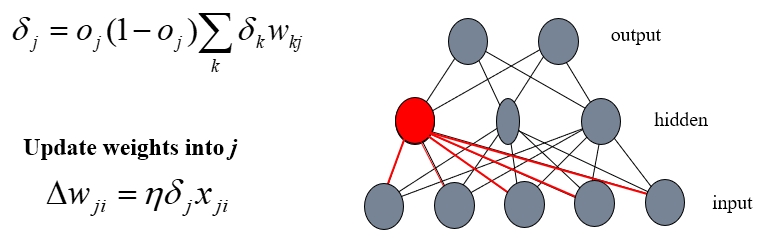
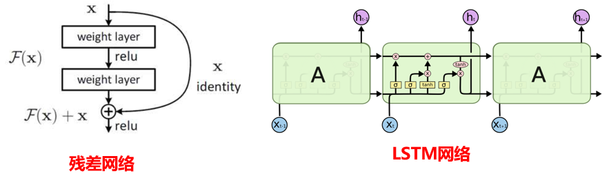
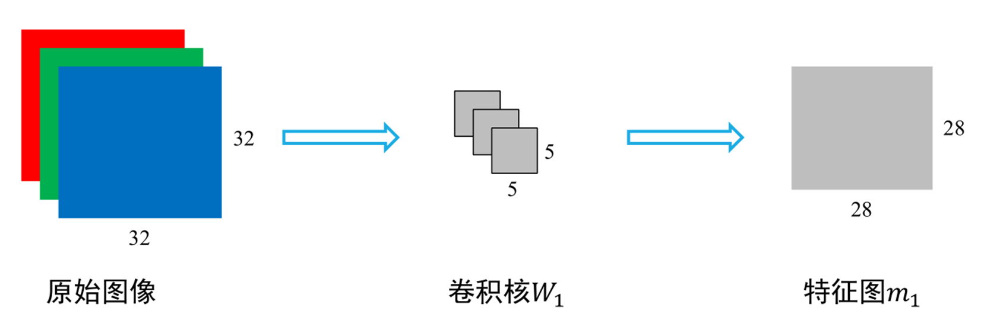

# 第六章	人工神经网络

[TOC]

## 6-1	概述及感知机

### How our brain works?

- 大脑含有大量（约$10^{11}$个）高度连接的神经元。
- **神经元**：神经系统的基本单元
  - 按不同的结合方式构成了复杂的神经网络
  - 通过神经元及其联接的可塑性，使大脑具有**学习、记忆和认知**等各种智能

- **工作机制**： 每个神经元根据上一个神经元传入的信号会处于抑制或激发状态，并产生相应的信号传给另一个；众多神经元相互连接，最终产生对输入信号的认知。
  - **胞体**：是神经细胞的本体
  - **树突**：用以接受来自其它细胞元的信号
  - **轴突**：用以输出信号，与多个神经元连接
  - **突触**：是一个神经元与另一个神经元相联系的特殊部位，通过神经元轴突的端部靠化学接触和电接触将信号传递给下一个神经元的树突。

### Connecting Theory—Artificial Neural Networks

- Imitating the brain’s intelligence by use of ANN ：
  1. Physical structure(物理结构)—to realize the function of bioneuron(模拟生物神经元的功能)
  2. Computation Simulating(计算模拟)—parallel processing system(大规模并行模拟处理系统)
  3. Storage & operating(存储与操作)—distributed depositing(分布存放)
  4. Training/Learning(训练)—to gain related knowledge(获取相关知识)

### 神经元模型

### 人工神经网络（ANN）的特性

- 这些特性使得人工神经网络具有应用于各种智能系统的巨大潜力：

  - 并行分布处理

  - 非线性映射

  - 通过训练进行学习

  - 适应与集成

  - 硬件实现

### 人工神经网络发展历史

- **萌芽期（20世纪40年代）**
  - 40年代初，美国McCulloch和Pitts从信息处理的角度。研究神经细胞行为的数学模型表达。提出了二值神经元模型。**MP模型**的提出开始了对神经网络的研究进程。
  - 1949年，心理学家Hebb提出著名的**Hebb学习规则**，即由神经元之间结合强度的改变来实现神经学习的方法。
- **第一次高潮期（20世纪50-60年代）**
  - 现代串行计算机的奠基人Von Neumann注意到计算机与人脑的差异，对类似与神经网络的分布系统做了许多研究
  - 50年代末期，Rosenblatt提出**感知机模型**，它基本符合神经生理学的原理。在60代掀起了神经网络研究的第一次高潮。
- **反思期（1969-1980年）**
  - 1969年，人工智能创始人之一的Minsky和Papert出版了《感知器》，从数学上深入分析了**感知器**的原理，指出其局限性。
  - Minsky的结论是悲观的，神经网络的研究进入了低潮。主要有自适应共振理论，自组织映射，认知机网络模型理论，BSB模型等等，为神经网络的发展奠定了理论基础。
- **第二高潮期(1981~1990)**
  - 1982年，Hopfield提出了人工神经网络的一 种数学模型，引入了能量函数的概念，设计出用电子线路实现这一网络的方案，大大促进了人工神经网络的研究。
  - 1986年，Rumelhart及Hinton等学者提出了**多层感知器**的反向传播算法，解决了**多层前向神经网络**的学习问题，证明了多层神经网络具有很强的学习能力。

- **再认识与应用研究期(1991~2006年)**
  - 开发现有模型的应用，并在应用中根据实际运行情况对 模型、算法加以改进，以提高网络的训练速度和运行的准确度。
  - 在理论上寻找新的突破，建立新的专用/通用模型和算法。
  - 进一步对生物神经系统进行研究，不断地丰富对人脑的认识。
- **深度神经网络时期(2006~)**
  - 2006年，Hinton提出了更有效的训练神经元的新方法，通过“逐层初始化（ layer- wise pre-training ）”来克服多层神经网络在训练上的难度。
  - 2012年，Alex Krizhevsky 在ImageNet图像分类竞赛中取得了里程碑式的突破，Top5 分类准确率由74%提升至85%.

### 第一个神经元模型

​		**1、神经元的活动是个非0即1的过程；2、神经元被激活的条件具有可重复性；3、神经系统的延迟主要来自突触；4、被抑制的突触同时阻止神经元的激活；5、神经网络的结构不随时间而改变。**

- 1943年，McCulloch和Pitts提出首个神经元模型M-P模型，该模型是一个简单的二元分类器，它接受n维的输入：  (x1, x2, ┄ xn ) , x∈ {0,1} ，随后对这个n维的输入进行加权求和，并将其与阈值θ进行比较， 若大于阈值输出1，否则输出0。

- $𝒙_𝒊$ ：第 𝑖 个神经元的输入
- $ 𝒘_𝒊  $：第 𝑖 个神经元的权重
- $ 𝜽 $：阈值(threshold)或称为偏置(bias)
- $   𝒚  $：**神经元状态（兴奋或抑制）**
- $   𝒇  $：激励函数,有很多形式

### 原始神经元的缺点

- 该神经元可以看作是一个定义好的逻辑门电路，主要的意义在于具有计算的能力。

  - ==**输入输出都是二元的**==
    - 无法对连续的实数进行处理，也不能处理多分类问题

  - ==**不能训练也没有学习能力**==
    - 权重是人工设定的，无法根据输出自动调整

### 赫布学习规则

​		**M-P模型抽象出了神经元的结构，但并没有给出W权重该如何确定，是强还是弱，什么时候强，什么时候弱，由什么因素决定。Hebb学习规则尝试着给了回答。**

​		巴普洛夫实验触发Hebb认为同时被激发的神经元间的连接会被强化。比如，铃声触发一个神经元，同时食物激发相邻的另一个神经元，那么这两个神经元间的联系就会强化，从而记住这两个事物之间存在着联系。相反，如果两个神经元不会被同步激发，那么它们间的连接将会变弱。

​		**反射活动的持续与重复会导致神经元稳定性的持久性提升当神经元A的轴突与神经元B很近并参与了对B的重复持续的兴奋时，这两个神经元或其中一个便会发生某些生长过程或代谢变化，致使A作为能使B兴奋的细胞之一，它的效能增强了。**

### 神经模型的改进—感知机（Perceptron）

- 感知机与神经元模型相似，主要有以下几点改进：
  - 输入为一个实数向量；
  - 有多种激活函数可以选择；
  - 属于一个可学习模型。
- ==**感知机由两层神经元组成，是最简单的神经网络。**==

### 激活函数（ Activation function ）

#### 常用的典型激活函数

### 单层感知机模型

### 感知机模型

- 定义：假设输入空间（特征空间）是$𝒳⊆𝑅^𝑛$，输出空间是$𝒴=\{+1,−1\}$，输入$𝑥∈𝒳$表示实例的特征向量，对应于输入空间的点；输出$𝑦∈𝒴$表示实例的类别，由输入空间到输出空间的函数如下：
  $$
  f(x)=sign(w\cdot x+b)
  $$
  

### 感知机学习算法

- 距离：
  $$
  \frac{1}{\vert|w|\vert}\vert w\cdot x_0+b\vert
  $$

- 误分类点距离
  $$
  -\frac{1}{||w||}y_i(w\cdot x_i+b)
  $$

- 损失函数：**误分类点到超平面的总距离：**
  $$
  L(w,b)=-\sum_{x_i\in M}y_i(w\cdot x_i+b)
  $$

- 求解最优化问题：
  $$
  min\ L(w,b)=-\sum_{x_i\in M}y_i(w\cdot x_i+b)
  $$

- 随机梯度下降法：

  - 首先任意选择一个超平面$(w，b)$，然后不断极小化目标函数：
    $$
    \nabla_wL(w,b)=-\sum_{x_i\in M}y_ix_i,\quad \nabla_bL(w,b)=-\sum_{x_i\in M}y_i
    $$

  - 选取误分类点$(y_i (w\cdot x_i+b)≤0)$更新：
    $$
    w \leftarrow w+\eta y_ix_i,\quad b\leftarrow b+\eta y_i
    $$
    

### 例子

### 单层感知机

#### 感知机模型的数学原理之一

#### 线性可分问题例解

#### 感知机模型的数学原理之二

#### 逻辑运算的实现

#### 单层感知机模型的缺点

​		1969年：Minsky和Papert指出感知机的缺陷：仅能解决一阶谓词逻辑，即**==只能完成线性划分==**，对于非线性或者其他分类会遇到很多困难，就连简单的XOR（异或）问题都解决不了。

### 多层感知机

#### 提出

​		异或问题无法用一个超平面将两类样本分割开，于是人们考虑对多个感知机模型进行组合，即采用多个超平面去分割——**==多层感知机==**

#### 求解异或问题

​		==多层网络虽然很好地解决了线性不可分问题，但是，由于无法知道网络隐藏层的神经元的理想输出，所以，感知器的训练算法是难以直接用于多层网的训练。==

#### 曲线拟合问题

### 感知机小结

- 其学习过程与求线性判决函数(单样本感知器算法)的过程是等价的
- 单层感知器只能解决线性可分的问题
- 可以证明，只要隐层和隐层单元数足够多，多层感知器网络可实现任何模式分类
- 但是，多层感知器网络的权值如何确定，即网络如何进行学习，没有得到解决
- 多层感知机带来大量的权重，需要一种高效的学习方法来训练这样的网络。

### 梯度下降的思想

- 人们通常使用均方误差来衡量预测值与真实值之间的差距，此处考虑单输出的情况，即：
  $$
  e=|y-y_{true}|^2
  $$
  对于神经网络模型：
  $$
  y=wx+b
  $$

- 我们训练神经网络的目的实际上是通过确定合适的w，b使得误差e尽可能地变小;

- 要想知道w, b是如何影响误差e的， 我们可以用误差e对w, b进行求导；

- 导数的方向为误差e上升最快的方向，我们只需将w, b 向着导数的相反方向进行调整，即可使误差e减小——**==梯度下降==**。

## 6-2	BP神经网络

​		BP（Back Propagation）网络是1986年由Rumelhart和McCelland为首的科学家小组提出，是一种按**==误差逆传播算法训练==**的**==多层前馈神经网络==**，是目前应用最广泛的神经网络模型之一。

### 误差反向传播算法  (error back propagation, BP) 

- 在感知器算法中我们实际上是在利用理想输出与实际输出之间的误差作为增量来修正权值，然而在多层感知器中，我们只能计算出输出层的误差，中间隐层由于不直接与外界连接，其误差无法估计。
- **==反向传播算法（BP算法）的思想==**：从后向前反向逐层传播输出层的误差，以间接计算隐层的误差。算法可以分为两个阶段：
  - **==正向过程==**：从输入层经隐藏层逐层正向计算各单元的输出。   
  - **==反向过程==**：由输出误差逐层反向计算隐层各单元的误差，并用此误差修正前层的权重。

#### 多层前馈神经网络

- 多层前馈神经网络: 每层神经元与下一层神经元完全相连，神经元之间不存在同层连接，也不存在跨层连接。
- BP神经网络模型拓扑结构包括：
  - ==**输入层（input）**==
  - **==隐层(hide layer)==**
  - **==输出层(output layer)==**

#### 误差反向传播算法

#### BP算法的基本思想

- 从训练样本集中取一样本作为网络的**==输入==**
- 根据该输入依次计算各中间层和输出层的神经元的**==输出==**
- 计算网络的实际输出和该输入期望输出之间的**==误差==**
- 按照某种能使误差减小的原则，利用该误差<u>调整各神经元的</u>**==连接权值==**
- 重复以上步骤，直至整个训练样本集的**==误差达到要求==**

#### 如何设计一个多层前馈神经网络？

- 网络的输入对应于每个训练元组测量的属性。
- 输入同时提供给称作**==输入层==**的单元层
- 这些输入通过输入层，然后加权给**==隐藏层==**。
- 隐藏层的数量是任意的，尽管实践中通常只用一层。 
- 最后一个隐藏层的加权输出作为**==输出层==**的单元的输入，输出层发布给定元组的网络预测。
- 网络是**==前馈的==**：如果其权重都不回送到输入单元，或者前一层的输出单元。
- 从统计学观点来讲，网络进行**==非线性回归==**：给定足够多的隐藏单元和足够的训练样本，多层前馈网络可以逼近任何函数。
  - **==与多层感知器类似：融合不同的曲线来拟合毫无规律可循的复杂曲线==**

#### 如何设计网络拓扑结构？

- 设计**==网络拓扑结构==**: 在训练之前，用户必须说明输入层的单元数、隐藏层数、每个隐藏层的单元数和输出层的单元数
- ==规一化（Normalize）==训练元组的每个属性的测量输入值至$ [0.0-1.0]$
- 一个输入单元每个域值初始化为0
- 一个输出单元可以用来表示两个类，如果输出单元大于两个类，则每个类使用一个输出单元。一旦网络经过训练，并且其**==准确度不能接受==**，通常用不同的网络拓扑或使用不同的初始权重集

#### 如何后向传播？

- 后向传播迭代地处理训练元组数据集，将每个元组的网络预测和实际已知的目标值比较。
- 对于每个训练样本，修改权重使网络预测和实际目标值之间的**==均方误差最小==**。
- 修改“**==后向==**”进行：从输出层经每个隐藏层，到第一个隐藏层（因此称作**==后向传播==**）
- 算法步骤
  - 初始化权重为很小的随机数，每个单元有一个关联的偏置
  - 向前传播输入（通过运用激励函数） 
  - 向后传播误差（通过更新权重和偏置）
  - 终止条件（当误差很小等）

#### 后向传播算法

- **BP算法中权值的修正公式**

  

- 首先计算输出层单元的误差，并用该误差调整输出层的权值

  

- 最后根据隐层单元的误差调整下层的权值

  

### 举例说明

​		下图是多层前馈神经网络，令学习率为0.9，激活函数为Sigmoid，该网络的初始权值和偏移值以及第一个训练样本**==X={1,0,1}==**（其**==类标号为1==**）在下表中给出。

### BP算法小结

- 核心思想：利用**==前向传播==**，计算第 n 层**==输出值==**
- 优化目标：输出值和实际值的**==残差==**。
- 计算方法：将残差按影响**==逐步传递回==**第 n−1,n−2,⋯,2层，以修正各层连接权值。（即所谓的**==误差逆传播==**）
- 主要工具：链式法则（复合函数**==求偏导==**）。

### BP算法局限性

- 容易过拟合！ 
  - ==早停、正则化==
- 容易陷入局部最优！
  - ==选取多次初值、随机梯度下降法==
- 难以设置隐层个数！
  - ==试错法==

## 6-3	深度学习

### 目录

- 什么是深度学习？
- 深度学习的两大问题及解决方法
- 卷积神经网络
- 经典的卷积神经网络
- 其他深度学习模型

### 什么是深度学习？

- 人工智能、机器学习与深度学习
  - 人工智能诞生千20世纪50年代。简单来说，这是一门研究**使用计算机模拟人类智能行为的学科。**
  - 人类通常会借助过往的经验对当前情况作出决策。而机器学习研究的是**让系统利用“经验”来改善自身的性能。**
  - 深度学习是从数据中学习表示的一种数学框架。其借助多层神经网络模型，**从数据中提取出“有用”信息，并根据其实现决策、预测等行为。**

#### 深度学习与神经网络的关系

- 深度学习的概念由Hinton等人于2006年提出。
- 深度学习是一种**从数据中学习表示的数学框架**，它借助多层神经网络实现数据特征的 提取，并逐层将初级特征抽象为高级特征。
- 为了能更好地学习到数据的有效表示，它发展出了一系列的神经网络结构及网络训练方法。
- 广义上来说，“深度学习”是为了让层数较多的多层神经网络可以训练，而演化出来的一套理论及方法。

### 深度学习中的两大问题

- **<u>梯度消失问题：</u>**

  - 神经网络各层的权重是根据预测值与真实值之间的误差来进行调整的，对于中间隐层， 则需要将输出层中获得的误差反向传递回来。 而**误差在反向传播的过程中会逐渐衰减**。若神经网络的层数较多，误差在传递到靠前的隐层时已经变得很小了，这会使得靠前的神经网络权重难以调整。

- <u>**过拟合问题：**</u>

  - 过拟合（overfitting）是指在模型参数拟合过程中的问题，由于训练数据包含抽样误差，训练时，复杂的模型将**抽样误差**也考虑在内，将抽样误差也进行了很好的拟合。

  - 具体表现就是最终模型在训练集上效果好；在测试集上效果差。模型泛化能力弱

    

  - 神经网络从训练样本中学习出各个类别的特征，神经网络的层数越高，其学习能力也越强，但这会导致**神经网络将训练样本特有的特征（噪声）也误认为是类别特征**。使得训练好的神经网络对一般化样本不能作出准确的判断。

  - 例如对斑点狗样本进行学习后，认为所有的狗都应该有斑点。

#### 梯度消失的解决办法

- 采用合适的激活函数：常用的激活函数为**ReLU**(Rectified Linear Unit)

  

  - 从上图可以看出，ReLU函数的导数在正数部分是恒等于1的，因此在深层网络中使用ReLU激活函数就不会导致梯度消失和爆炸的问题。

- ==**采用批规范化方法：**==
  - 深层神经网络在做非线性变换前的输入值在训练过程中，其分布逐渐发生偏移，之所以训练收敛慢，一般是整体分布逐渐往非线性激活函数的两端靠近，这导致了反向传播时浅层神经网络的梯度消失。
  - **批规范化就是通过一定的规范化手段，将每个隐层输入的分布强行拉回到均值为0方差为1的标准正态分布上去，**这使得输入值落回到非线性激活函数“敏感”区域。这使得梯度变大，学习速度加快，大大提高收敛速度。
- 采用特殊的网络结构：如残差网络、循环神经网络	

#### 过拟合问题解决方法

- 获取更多数据：从数据源头获取更多数据；数据增强（Data Augmentation）;
- 数据清洗：将错误的标签纠正或者删除错误的数据；
- 使用合适的模型减少网络的层数、神经元个数等均可以限制网络的拟合能力；
- Dropout操作；
- 正则化：在训练的时候限制权值变大；
- 限制训练时间：通过评估测试确定停止训练的时间；
- ……

### 卷积神经网络（CNN）

- 卷积神经网络是一种经典的深度学习模型。卷积神经网络通过卷积操作（convolutions）和池化操作(pooling)学习输入特征的局部模式。
- 随着网络层数的增加，卷积神经网络对这些局部模式不断地进行组合、抽象，最终学习到高级特征。

#### 发展历史

  

#### 一般结构

- **输入层：**输入层是整个神经网络的输入，在处理图像的卷积神经网络中，它一般代表了一张 图片的像素矩阵。三维矩阵的长和宽代表了图像的大小， 而三维矩阵的深度代表了图像的色 彩通道 ( channel) 。
- **卷积层（Convolutional）：**提取不同层次的特征。
- **池化层（Pooling）：**向下采样，把分辨率较高的图片转化为分辨率较低的图片；减少参数！实现非线性，扩大感受野，赋予不变性。
- **全连接层（Full connection)：**在经过多轮卷积层和池化层的处理之后，在卷积神经网络的最后一般会是由一到两个全连接层来给出最后的分类结果。
- **输出层：**同样是全连接网络层，但激活函数通常选择Softmax ( 多分类）或sigmoid（二分类），该层主要用于将之前的网络层提取到的特征转化为我们需要的输出形式。

#### 主要特点

- CNN的核心思想有三种：

  1. **局部感受野(Local receptive field)：**

     

  2. **权值共享(Weights sharing)：**

     

  3. **时间或空间亚采样**

  4. **局部感受野+权值共享**

     

#### 卷积操作

- 图像经过特定卷积矩阵滤波后，所得到的卷积结果可认为是保留了像素点所构成的特定空间分布模式
  - 如下给出了两个7*7高斯卷积核的卷积结果

- 有一张32\*32\*3(RGB)的图像，使用5\*5\*3的卷积核$𝑊_1$，步长为1对其进行卷积操作。卷积核$𝑊_1$在原始图像上从左到右、从上到下进行计算，改变5*5子块区域中的中心像素点值，得到28\*28的特征图$𝑚_1$

  

  - 使用另一个5\*5\*3的卷积核$𝑊_2$与原始图像做卷积操作，得到特征图$𝑚_2$	

  

  - 使用6个5\*5\*3的卷积核与原始图像做卷积操作，则得到6个28\*28的特征图
  - 注意： 6个5\*5\*3的卷积核均是数据驱动学习得到，其刻画了不同的视觉模式

  

- **==采样层==**：**利用局部信息来采样，减少运算量，保留有用的信息**

  - ==减少参数和计算量，防止过拟合；==
  - ==使模型对尺度平移、旋转变化具有一定的不变性。==
  - 最大池化：最大值
  - 平均池化：平均值
  - Lp 池化：类似于范数
  - 混合池化：

  

#### 激励函数

- **常见的激励函数：**

#### 全连接层与分类层

#### 基本架构

### 经典的卷积神经网络

- LeNet-5模型是Yann LeCun教授于1998年提出的，它是第一个成功应用于数字识别问题的卷积神经网络，在MNIST数据集上可以达到约99.2%的正确率。 
- 该网络共有7层：两个卷积层，两个池化层，三个全连接层

- **AlexNet：2012**

#### Other Nets

- **VGGnet**

  - VGGNet模型是2014年的lmageNet分类的亚军，物体检测冠军，使用了更小的卷积核(3x3),并且连续多层组合使用。
  - 该模型有多种网络架构，较为常用的是VGG16和VGG19。

  

- **GoogLeNet**

  - GoogleNet模型是2014年的lmageNet分类的冠军，GoogleNet 提出了一种inception结构，该结构可以将不同的卷积层通过井联的方式结合在一起。Inception历经了v1、v2、v3、v4等多个版本的发展，不断趋于完善。Inception单元结构如下：

  

  

- **ResNet（残差神经网络）**

  

#### CNN Comparison

|            模型名            |    AlexNet     |      VGG       | GoogLeNet | ResNet  |
| :--------------------------: | :------------: | :------------: | :-------: | :-----: |
|           初入江湖           |      2021      |      2014      |   2014    |  2015   |
|             层数             |       8        |       19       |    22     |   152   |
|          Top-5错误           |     16.4%      |      7.3%      |   6.7%    |  3.57%  |
|      Data Augmentation       |       +        |       +        |     +     |    +    |
|        Inception(NIN)        |       -        |       -        |     +     |    -    |
|           卷积层数           |       5        |       16       |    21     |   151   |
|          卷积核大小          |     11,5,3     |       3        |  7,1,3,5  | 7,1,3,5 |
|          全连接层数          |       3        |       3        |     1     |    1    |
|         全连接层大小         | 4096,4096,1000 | 4096,4096,1000 |   1000    |  1000   |
|           Dropout            |       +        |       +        |     +     |    +    |
| Local Response Normalization |       +        |       -        |     +     |    -    |
|     Batch Normalization      |       -        |       -        |     -     |    +    |

### 其他深度学习模型

- DBN（Deep Belief Networks，深度置信网络）
- RNN（Recursive neural networks，递归神经网络）
- LSTM（Long short term memory，长短时记忆网络）
- DBM（Deep Boltzmann machines，深度玻尔兹曼机）
- GAN (Generative Against Network，生成对抗网络)
- Capsules  Network，胶囊网络
- ……