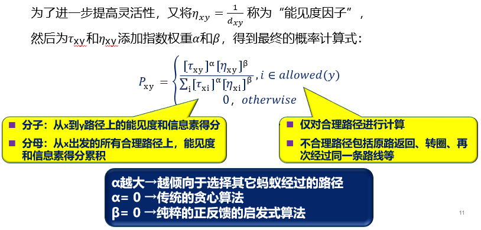

# 智能计算与应用

### 受自然界和生物界规律启迪

- 令人惊奇现象：蚂蚁搬家、鸟群觅食、蜜蜂筑巢……==**惊人的同步性**==
- **==模仿其原理==**设计求解问题的算法
  - 遗传/基因/免疫/蚁群/粒子群/蜂群/鱼群/细菌群/退火/模糊/神经网络……
- 典型的**==元启发式随机优化==**方法：
  -  “元”其实是一个哲学概念，表示：世界的组织单元。
  -  “启发式算法”就是：利用元启发式算法，结合被求解问题的特征，设计出来的面向特定问题的算法。
- 广泛用于组合优化、智能控制、模式识别、规划设计、网络安全等领域

### 群智能算法产生的背景

- AI研究的核心：**==模拟智能活动的特征和结果==**
- 之前所讨论的方法：**==模拟“单一”智能体的智能活动==**
  - 自动推理、知识图谱、搜索技术：实际上是受到人类智能现象的启发，建立计算模型来模拟一个人如何==总结知识==、如何==进行推理==、如何==求解问题==
- **==群智能==**：由简单个体组成的群落与环境以及个体之间的互动行为
  - 适者生存：物种的智能活动
  - 物种在时间和空间上通过调整自身行为、属性来适应环境，使整个物种生存并且不断发展、延续
  - 模拟物种“适者生存”的能力——属于智能计算的研究范畴

### 对物种适者生存能力的解读

- **<u>分时间和空间两个维度</u>**
  - **==时间维度==**：种群通过代际繁衍、不断进化以适应环境
    - 借鉴物种随时间进化的过程来求解问题——==**进化智能**==*（繁殖/突变/竞争/选择）*
    - 种群随着代际延续而不断发展、变化，以适应环境
  - **==空间维度==**：种群内的大量简单个体在限定条件下通过交互协作，使整体种群具有某种适应环境的能力
    - 研究群体产生智能的原理，并抽象建立计算模型——**==群体智能==**
    - 个体行为简单，不具备独立的复杂的智能能力；群体行为复杂，具有智能特征， 可解决许多复杂问题*（蚂蚁、蜜蜂、候鸟、鱼 群、微生物……）*
    - 同时期里，种群中大量简单个体通过交互、协作，整体表现出智能

### 授课所涉及的内容

- ==典型的进化智能算法==
  - 遗传算法
- ==典型的群体智能算法==
  - 粒子群优化算法
  - 蚁群算法

[TOC]

## 4-1	遗传算法

### 引言

- 生物物种作为复杂系统，具有奇妙的自适应、自组织和自优化能力，这是一种生物在进化过程中体现的智能
- 遗传算法：着眼于对生物群体进化过程的模拟
- 应用领域：函数优化、机器人路径规划、图像处理与模式识别、机器学习、智能控制等

### 生物学基础

- 达尔文的==**进化论**==——适者生存原理
  - 每一物种在发展中越来越适应环境。每个个体的基本特征由**后代所继承**，但后代又会产生一些**异于父代的新变化**；在环境变化时，只有那些**能适应环境的个体特征方能保留**下来。
- 孟德尔的**==遗传学说==**——基因遗传原理
  - 以密码方式存在细胞中，并以基因形式**包含在染色体内**。每个基因**有特殊的位置并控制**某种特殊性质，所以每个基因产生的个体对环境具有某种适应性；基金突变和基因杂交**可产生更适应于环境的后代**；经过**存优去劣**的自然淘汰，适应性高的基因结构得以保存下来。
- ==**适者生存+优胜劣汰**==

### 发展历史

- 1962年 Fraser提出了自然遗传算法
- 1965年 Holland首次提出了人工遗传操作的重要性
- 1967年 Bagley首次提出了遗传算法这一术语
- 1970年 Cavicchio把遗传算法应用于模式识别中
- 1971年 Hollstien在论文《计算机控制系统中人工遗传自适应方法》阐述了遗传算法用于数字反馈控制的方法
- 1975年 J. Holland出版《自然系统和人工系统的适配》；DeJong完成了重要论文《遗传自适应系统的行为分析》
-  20世纪80年代以后 遗传算法兴盛发展时期，广泛应用于自动控制、生产计划、图像处理、机器人等领域

### 概念

- 遗传算法（Genetic Algorithm, GA）是模拟达尔文生物进化论的自然选择和遗传学机理的生物进化过程的计算模型，是一种通过**模拟自然进化过程搜索最优解**的方法。

- 其主要特点是直接**对结构对象进行操作**，不存在求导和函数连续性的限定；具有内在的隐并行性和更好的全局寻优能力；采用**概率化的寻优方法**，不需要确定的规则就能自动获取和指导优化的搜索空间，自适应地调整搜索方向。

- 遗传算法以一种群体中的所有个体为对象，并利用随机化技术指导对一个被编码的参数空间进行高效搜索。其中，**选择、交叉和变异**构成了遗传算法的遗传操作；**参数编码、初始群体的设定、适应度函数的设计、遗传操作设计、控制参数设定五个要素**组成了遗传算法的核心内容。

### 生物进化过程

==**遗传算法**==（Genetic Algorithm）：通过生物遗传和进化过程中**选择、交叉、变异机理**的模仿，完成对问题求解的**自适应搜索**过程。

### 抽象模型

### 与生物进化对比

| 生物进化 |                   遗传算法                   |
| :------: | :------------------------------------------: |
|   群体   | 搜索空间的一组有效解（解的个数为群体的规模） |
|   种群   |               选择得到的新群体               |
|   环境   |                  适应度函数                  |
|  染色体  |                可行解的编码串                |
|   基因   |                 一个编码单元                 |
| 适应能力 |                  解的适应度                  |
|   婚配   |                 交换部分编码                 |
|   变异   |              某些编码的数值改变              |
| 适者生存 |       目标值比较大的解被选择的可能性大       |

### 基本思想

- 遗传算法：把问题的解表示成“**==染色体==**”，在算法中即是以一定方式编码的串
- 在执行遗传算法之前，给定一群“染色体”——即假设解
- 把这些假设解置于问题的“环境”中，并按==**适者生存**==的原则：
  - 从中**==选择==**出较适应环境的“染色体”进行复制
  - 再通过==**交叉、变异**==过程产生更适合环境的新一代“染色体”群
- 这样一代一代地进化，最后就会收敛到最适应环境的一个“染色体”上——它就是问题的==**最优解**==
- ==**5个基本要素：**==
  - 参数编码
  - 初始群体设定
  - 适应度函数设定
  - 遗传操作设计
  - 控制参数设定

### 基本流程

#### 1. 编码

- 用遗传算法解决问题，首先对待解决问题的模型结构和参数进行编码。
  - 将问题结构变换为位串形式编码表示的过程叫**==编码(Encoding)==** 
  - 将位串形式编码表示变换为原问题结构的过程叫**==解码或译码(Decoding)==**

- GA中的编码方式：二进制编码、浮点数编码、格雷码编码、符号编码等

- **二进制编码：**
  - 用若干二进制数表示一个个体，将原问题的解空间映射一个由0或1组成的编码串。
  - 假设解的取值范围为：$[X_{min},X_{max}]$
  - 某一个体的编码是：$b_L,b_{L-1},b_{L-2},\dots,b_2,b_1$
  - 则对应的解码公示为：$x=x_{min}+\delta\sum_{i=1}^L b_i 2^{i-1}$
  - 串长L取决于求解精度：$\delta = \cfrac{x_{max}-x_{min}}{2^L-1}$

  - 决策变量X（整数或实数）用二进制字符串表示。
  - 例如，对应三维空间的优化问题，设一个染色体的编码为：
    - （略）
  - 二进制编码存在的主要缺点是汉明（Hamming）悬崖。
    - 例如，7和8的二进制数分别为0111和1000，当算法从7改进到8时，就必须改变所有的位。

#### 2. 群体设定

- ==**初始种群**==的产生
  - 根据问题固有知识，把握最优解所占空间在整个问题空间中的分布范围，然后，在此分布范围内设定初始群体。
  - ==**随机产生**==一定数目的个体，从中==**挑选最好的个体**==加到初始群体中。这种过程不断迭代，直到初始群体中个体数目达到了预先确定的规模。
- ==**种群规模**==的确定
  - 规模太小：遗传算法的优化性能不太好，==**易陷入局部最优解**==
  - 规模太大：==**计算复杂**==

#### 3. 适应度函数（Fitness Function）

- 表示个体的优劣并作为遗传操作的依据
- 区分群体中个体好坏的标准，是进行自然选择的唯一依据
  - 个体适应度高：被选择的概率大；反之就小
- 直接将待求解优化问题的目标函数变换而得到
- 将目标函数映射成适应度函数的方法
  - 若目标函数为==**最大化**==问题，则：$Fit(f(x)) = f(x)$
  - 若目标函数为==**最小化**==问题，则：$Fit(f(x)) = \cfrac{1}{{f(x)}}$
- 适应度函数的尺度变换
  - 在遗传算法中，将所有妨碍适应度值高的个体产生、从而影响算法正常工作的问题统称为==**欺骗问题**==（Deceptive Problem）
  - ==**过早收敛**==：缩小这些个体的适应度，以降低这些超级个体的竞争力
  - **==停滞现象==**：改变原始适应值的比例关系，以提高个体之间的竞争力
  - 适应度函数的**==尺度变换==**（Fitness Scaling）或者**==定标==**：对适应度函数值域的某种映射变换
  - （见PPT）

#### 4. 选择

- 从当前群体中按一定概率选出优良个体，使其有机会作为父代繁殖下一代

- 判断个体优良的准则：各个个体的适应度值
  - 若总选最好的：变成确定性优化→种群过快收敛到局部最优解
  - 若随机选择：变成完全随机法→收敛非常慢或不收敛
  
- **关键：**既要种群收敛较快，也能维持种群的多样性

- 个体选择概论分配方法

  - ==**适应度比例方法**==（Fitness Proportional Model）或蒙特卡洛法（Monte Carlo）

    - 各个个体被选择的概率和其适应度值成正比

    - 个体$i$被选择的概率为：
      $$
      p_{si}=\frac{f_i}{\sum_{i=1}^Mf_i}
      $$

  - ==**排序方法**==（Rank-based Model）

    - **==线性排序：==**
      - 群体成员**==按适应值大小从好到坏依次排列==：**$x_1,x_2,\dots,x_N$
      - 线性排序，非线性排序

- 选择个体方法

  - **==轮盘赌==**选择（Roulette Wheel Selection）
    - 依据个体的适应度值计算每个个体在子代中出现的概率，并按照此概率随机选择个体构成子代种群
  
    - | 个体     | 1    | 2    | 3    | 4    | 5    | 6    | 7    | 8    | 9    | 10   | 11   |
      | -------- | ---- | ---- | ---- | ---- | ---- | ---- | ---- | ---- | ---- | ---- | ---- |
      | 适应度   | 2.0  | 1.8  | 1.6  | 1.4  | 1.2  | 1.0  | 0.8  | 0.6  | 0.4  | 0.2  | 0.1  |
      | 选择概率 | 0.18 | 0.16 | 0.15 | 0.13 | 0.11 | 0.09 | 0.07 | 0.06 | 0.03 | 0.02 | 0.0  |
      | 累积概率 | 0.18 | 0.34 | 0.49 | 0.62 | 0.73 | 0.82 | 0.89 | 0.95 | 0.98 | 1.0  | 1.0  |
  
  - **==最佳个体保存==**方法（Elitist Model）
  
    - 把群体中适应度最高的个体直接复制到下一代中，保证遗传算法终止时得到的最后结果一定是历代出现过的最高适应度的个体
  
  - ==**锦标赛**==选择（Tournament Selection）
  
    - 从群体中随机选择个个体，将其中适应度最高的个体保存到下一代。这一过程反复执行，直到保存到下一代的个体数达到预先设定的数量为止
      - **二元锦标赛**：每次按赌轮选择方法选取一对个体，然后让这两个个体进行竞争，适应度高者获胜。如此反复，直到选满为止
  

#### 5. 交叉

- 一点交叉（Single-point Crossover）
  - 在个体串中随机设定一个交叉点，实行交叉时，该点前或后的两个个体的部分结构进行互换，并生成两个新的个体

- 二点交叉（Two-point Crossover）
  - 随机设置两个交叉点，将两个交叉点之间的码串相互交换

#### 6. 变异

- 从一个染色体生成子代
- 维持个体的多样性
  - 交叉只能对现有基因池进行重组
  - 变异可以生成新的基因
- 变异应生成有效的染色体
- 变异概率$p_m$：
  - 控制算法中变异操作的使用频率
- 变异方式：
  - 位点变异
    - 群体中的个体码串，随机挑选一个或多个基因座，并对这些基因座的基因值以变异概率作变动
  - 逆转变异
    - 在个体码串中随机选择两点（逆转点），然后将两点之间的基因值以逆向排序插入到原位置中
  - 插入变异
    - 在个体码串中随机选择一个码，然后将此码插入随机选择的插入点中间
  - 互换变异
    - 随机选取染色体的两个基因进行简单互换
  - 移动变异
    - 随机选取一个基因，向左或者向右移动一个随机位数
- 位点变异：
  - 如果对于某个基因位，产生的随机数小于*p*m,则改变该基因的取值。否则该基因不发生变异，保持不变。

### 一般步骤

1. 使用随机方法或者其它方法，产生一个有N个染色体的初始群体；
2. 对群体中的每一个染色体，计算其适应度值；
3. 若满足停止条件，则算法停止；否则，以概率pi随机选择一些染色体构成一个新种群；
4. 以概率 $p_c$ 进行交叉产生一些新的染色体，得到一个新的群体；
5. 以一个较小的概率 $p_m$ 使染色体的一个基因发生变异，成为一个新的群体；
6. 返回2。

### 例子

==例：用遗传算法求函数$f(x)=x^2$的最大值，其中$x$为[0, 31]间的整数。==

求解过程：

1. **编码**

   题目中，x为0~31范围内的整数，其取值一共有32个, 只需要5个二进制位就可以表示∵ 25=32

   因此，采用二进制编码方法，其编码串的长度为5。==染色体对应的就是00000～11111的二进制编码==

2. **生成初始种群**

   若假设给定的种群规模N=4，则可用4个随机生成的长度为5的二进制串作为初始种群。再假设第0代随机生成的初始种群为：
   $$
   S_{01}=0\ 1\ 1\ 0\ 1\quad S_{02}=1\ 1\ 0\ 0\ 1\\
   S_{03}=0\ 1\ 0\ 0\ 0\quad S_{04}=1\ 0\ 0\ 1\ 0
   $$

3. **计算适应度**

   直接用f(x)来作为适应度函数。即：
   $$
   f(s)=f(x)=x^2
   $$
   其中的二进制串s对应着变量x的值。

   初始种群情况表：

   | 编号 | 个体串（染色体） | x    | 适应值 | 百分比% | 累计百分比% |
   | ---- | ---------------- | ---- | ------ | ------- | ----------- |
   | S01  | 01101            | 13   | 169    | 14.30   | 14.30       |
   | S02  | 11001            | 25   | 625    | 52.88   | 67.18       |
   | S03  | 01000            | 8    | 64     | 5.41    | 72.59       |
   | S04  | 10010            | 18   | 324    | 27.41   | 100         |

   可以看出，在4个个体中S02的适应值最大，是当前最佳个体。

4. **选择操作**

   假设采用轮盘赌方式选择个体，且依次生成的4个随机数（相当于轮盘上指针所指的数）为0.85、0.32、0.12和0.46，经选择后得到的新的种群为：
   $$
   S_{04}=1\ 0\ 0\ 1\ 0\quad S_{02}=1\ 1\ 0\ 0\ 1\\
   S_{01}=0\ 1\ 1\ 0\ 1\quad S_{02}=1\ 1\ 0\ 0\ 1
   $$
   其中，染色体11001在种群中出现了2次，而原染色体01000则因适应值太小而被淘汰 

5. **交叉**

   假设交叉概率$P_i$为50%，则种群中只有1/2的染色体参与交叉。若规定种群中的染色体按顺序两两配对交叉，有$S_{01}$与$S_{02}$交叉，$S_{03}$与$S_{04}$不交叉

   初始种群的交叉情况表：

   | 编号 | 个体串（染色体） | 交叉对象 | 交叉位 | 子代  | 适应值 |
   | ---- | ---------------- | -------- | ------ | ----- | ------ |
   | S04  | 10**010**        | S02      | 3      | 10001 | 289    |
   | S02  | 11**001**        | S01      | 3      | 11010 | 676    |
   | S01  | 01101            | S04      | N      | 01101 | 169    |
   | S02  | 11001            | S03      | N      | 11001 | 625    |

   可见，经交叉后得到的新的种群为：
   $$
   S_{01}=10001\quad S_{02}=11010\quad S_{03}=01101\quad S_{04}=11001\quad
   $$

6. **变异**

   变异概率Pm一般都很小，假设本次循环中没有发生变异，则变异前的种群即为进化后所得到的第1代种群。即：
   $$
   S_{11}=10001\quad S_{12}=11010\quad S_{13}=01101\quad S_{14}=11001\quad
   $$

7. 对第1代种群，同样重复上述4~6的操作。其选择情况:

第1代种群的情况表：

| 编号 | 个体串（染色体） | x    | 适应值 | 百分比% | 累计百分比% | 选中次数 |
| ---- | ---------------- | ---- | ------ | ------- | ----------- | -------- |
| S11  | 10001            | 27   | 289    | 16.43   | 16.43       | 1        |
| S12  | 11010            | 26   | 676    | 38.43   | 54.86       | 2        |
| S13  | 01101            | 13   | 169    | 9.61    | 64.47       | 0        |
| S14  | 11001            | 25   | 625    | 35.53   | 100         | 1        |

其中若假设按轮盘赌选择时依次生成的4个随机数为0.14、0.51、0.24和0.82，经选择后得到的新的种群为：
$$
S_{11}=10001\quad S_{12}=11010\quad S_{13}=11010\quad S_{14}=11001\quad
$$
可以看出，染色体11010被选择了2次，而原染色体01101则因适应值太小而被淘汰。

8. 对第1代种群，其交叉情况：

第1代种群的交叉情况表：

| 编号 | 个体串（染色体） | 交叉对象 | 交叉位 | 子代      | 适应值 |
| ---- | ---------------- | -------- | ------ | --------- | ------ |
| S11  | 10**001**        | S12      | 3      | 10**010** | 324    |
| S12  | 11**010**        | S11      | 3      | 11**001** | 625    |
| S13  | 11**010**        | S14      | 2      | 11**001** | 625    |
| S14  | 11**001**        | S13      | 2      | 11**010** | 675    |

可见，经杂交后得到的新的种群为：
$$
S_{11}=10010\quad S_{12}=11001\quad S_{13}=11001\quad S_{14}=11010\quad
$$
可以看出，第3位基因均为0，已经不可能通过交叉达到最优解。这种过早陷入局部最优解的现象称为早熟。为解决这一问题，需要采用变异操作。

9. 对第1代种群，其变异情况：

第1代种群的变异情况表：

| 编号 | 个体串（染色体） | 是否变异 | 变异位 | 子代  | 适应值 |
| ---- | ---------------- | -------- | ------ | ----- | ------ |
| S11  | 10010            | N        |        | 10010 | 324    |
| S12  | 11001            | N        |        | 11001 | 625    |
| S13  | 11001            | N        |        | 11001 | 625    |
| S14  | 11010            | Y        | 3      | 11110 | 900    |

它是通过对$S_{14}$的第3位的变异来实现的。变异后所得到的第2代种群为：
$$
S_{21}=10010\quad S_{22}=11001\quad S_{23}=11001\quad S_{24}=11100\quad
$$

10. 对第2代种群，同样重复上述(4)-(6)的操作。

第2代种群的情况表：

| 编号 | 个体串（染色体） | x    | 适应值 | 百分比% | 累计百分比% |
| :--- | ---------------- | ---- | ------ | ------- | ----------- |
| S21  | 10010            | 18   | 324    | 23.92   | 23.92       |
| S22  | 11001            | 25   | 625    | 22.12   | 46.04       |
| S23  | 11001            | 25   | 625    | 22.12   | 68.16       |
| S24  | 11110            | 30   | 900    | 31.84   | 100         |

不断迭代

11. **经过几代遗传之后，种群就会稳定下来，同时适应度不再提升**

| 编号 | 个体串（染色体） | x    | 适应值 | 平均适应值 |
| ---- | ---------------- | ---- | ------ | ---------- |
| S01  | 01101            | 13   | 169    | 296        |
| S02  | 11001            | 25   | 625    |            |
| S03  | 01000            | 8    | 64     |            |
| S04  | 10010            | 18   | 324    |            |
| S11  | 10001            | 27   | 289    | 440        |
| S12  | 11010            | 26   | 676    |            |
| S13  | 01101            | 13   | 169    |            |
| S14  | 11001            | 25   | 625    |            |
| S21  | 10010            | 18   | 324    | 619        |
| S22  | 11001            | 25   | 625    |            |
| S23  | 11001            | 25   | 625    |            |
| S24  | 11110            | 30   | 900    |            |

==**可以证明遗传算法在概率上会收敛到最优解**==

==**但并不意味着每一次求解一定能得到最优解**==

### 遗传算法与搜索技术的比较

- 从形式上：遗传算法与状态空间搜索法非常类似
  - 状态表示为向量 = 状态表示为个体
  - 状态转移 = 个体繁殖
- 在应用中，两种方法略有差别，需要根据实际问题合理选择
  - 状态空间搜索适合于问题清晰、优化目标清晰，容易设想“怎样会更好”，这时设计启发函数，采用状态空间搜索效率很高；若使用遗传算法，往往效率不佳。
  - 但对于一些限制条件非常多的问题，此时设计启发函数很难，因为很难证明所设计的启发函数是A*的，从而就无法保证搜索总是有效的。这种情形，使用遗传算法反而更有优势

## 4-2	粒子群算法

### 引言

​		1995年，受到鸟群活动的规律性启发，Russel Eberthart和James Kennedy建立了一个简化社会模型，并最终形成了粒子群优化算法（Particle Swarm Optimization, PSO）

### 思路

​		粒子群算法通过设计一种无质量的粒子来模拟鸟群中的鸟，粒子仅具有两个属性：**速度和位置**，速度代表移动的快慢，位置代表移动的方向。

​		每个粒子在搜索空间中单独的搜寻最优解，并将其记为当前个体极值，并*将个体极值与整个粒子群里的其他粒子共享，找到最优的那个个体极值作为整个粒子群的当前全局最优解，粒子群中的所有粒子根据自己找到的当前个体极值和整个粒子群共享的当前全局最优解来调整自己的速度和位置。*

### 算法介绍

- 假设在n维搜索空间中，有m个粒子

  - 其中第i个粒子的位置向量表示为：
    $$
    𝑥^𝑖 (𝑘)=[𝑥_1^𝑖,𝑥_2^𝑖，⋯,𝑥_𝑛^𝑖 ]
    $$

  - 其飞行速度向量表示为： 
    $$
    𝑣^𝑖 (𝑘)=[𝑣_1^𝑖,𝑣_2^𝑖，⋯,𝑣_𝑛^𝑖 ]
    $$

  - 第i个粒子经历过的最优位置为：
    $$
    𝑝^𝑖 (𝑘)=[𝑝_1^𝑖,𝑝_2^𝑖，⋯,𝑝_𝑛^𝑖 ]
    $$

  - 群体中所有粒子经历过的最优位置为：
    $$
    𝑝^𝑔 (𝑘)=[𝑝_1^𝑔,𝑝_2^𝑔，⋯,𝑝_𝑛^𝑔 ]
    $$

- 粒子速度和位置的更新

  - $v_j^i (k+1)=ω(k) v_j (k)+φ_1 rand(0,a_1 )(p_j^i (k)-x_j^i (k))+φ_2 rand(0,a_2 )(p_j^g (k)-x_j^i (k))$
  - $x_j^i (k+1)=x_j^i (k)+v_j^i (k+1),\quad i=1,2,⋯,m;\quad j=1,2,⋯,n$
  - 其中， $ω$是惯性权重因子。 $φ_1$和$φ_2$是加速常数，均为非负值。 $rand(0,a_1 )$和$rand(0,a_2 )$为$[0,a_1 ]$，$[0,a_2 ]$范围内的具有均匀分布的随机数，$a_1$与$a_2$为相应的控制参数。
  - 
  - *惯性部分*，对自身运动状态的信任
  - *认知部分*，对粒子本身的思考，即来源于自己经验的部分
  - *社会部分*，粒子间的信息共享，来源于群体中的其他优秀粒子的经验
  - 随机系数增加搜索方向的随机性和算法的多样性

### 流程图

1. 初始化每个粒子，即在允许范围内随机设置每个粒子的初始位置和速度
2. 评价每个粒子的适应度，计算每个粒子的目标函数
3. 设置每个粒子经历过的最好位置
4. 设置全局最优值
5. 更新粒子的速度和位置
6. 检查终止条件。如果未达到设定条件（预设误差或者迭代的次数），则返回第2步

### 参数分析

- PSO算法的参数
  - 包括：群体规模$m$，惯性权重$ω$，加速度$φ_1$和$φ_2$，最大速度$V_{max}$，最大代数$G_{max}$
  - 最大速度$V_{max}$
    - 算法中有最大速度$V_{max}$作为限制，如果当前粒子的某维速度大于最大速度$V_{max}$ ，则该维的速度就被限制为最大速度$V_{max}$
  - 惯性权重$ω$
    - 保持运动惯性，使其有扩展搜索空间的趋势
    - 在解决实际问题时，往往希望先采用全局搜索，使搜索空间快速收敛于某一区域，然后采用局部精细搜索以获得高精度的解
    - 自适应调整的策略，即随着迭代的进行，线性地减小𝜔的值
    - $𝜔_{𝑚𝑎𝑥}$、 $𝜔_{𝑚𝑖𝑛}$分别是$𝜔$的最大值和最小值
    - $𝑖𝑡𝑒𝑟$、 $i𝑡𝑒𝑟_{𝑚𝑎𝑥}$分别是当前迭代次数和最大迭代次数
    - $𝜔= 𝜔_{𝑚𝑎𝑥}−\frac{𝜔_{𝑚𝑎𝑥}−𝜔_{𝑚𝑖𝑛}}{iter_{𝑚𝑎𝑥}} ×𝑖𝑡𝑒𝑟$
  - 加速度$φ_1$和$φ_2$
    - 是代表将粒子推向个体最优位置和群体最优位置的统计加速项的权重
    - 通常将$𝜑_1$和$𝜑_2$统一为一个控制参数，$𝜑=𝜑_1 + 𝜑_2$
    - 如果$𝜑$很小，粒子群运动轨迹将非常缓慢；如果$𝜑$很大，则粒子位置变化非常快
- 位置更新方程中各部分的影响
  - $v_j^i (k+1)=ω(k) v_j (k)+φ_1 rand(0,a_1 )(p_j^i (k)-x_j^i (k))+φ_2 rand(0,a_2 )(p_j^g (k)-x_j^i (k))$
    - **只有第1部分**：粒子将一直以当前的速度飞行，直到达边界。由于它只能搜索有限的区域，所以很难找到好解
    - **没有第1部分**：速度只取决于粒子当前位置和其历史最好位置$P_i$ 和$ P_g$，速度本身没有记忆性。
    - **没有第2部分**：粒子没有认知能力，也就是“只有社会模型”。在粒子的相互作用下，有能力达到新的搜索空间。但对复杂问题，容易陷入局部最优点。
    - **没有第3部分**：粒子间没有社会共享信息，也就是“只有认知”模型。因为个体间没有交互，一个规模为M的群体等价于M个单个粒子的运行，因而得到最优解的机率非常小。

### 特点

- 优点
  - 简单易实现
  - 收敛速度快
  - 粒子具有记忆性

- 缺点
  - 缺乏速度的自适应调节，容易陷入局部最优，可能导致收敛精度低或者不收敛
  - 标准粒子群算法不能有效求解离散及组合优化问题
  - 参数难以确定，对不同的问题，需选择合适的参数来达到最优效果

### 分析与改进

- 缺点：局部搜索能力差，容易陷入局部极值，搜索精度低
  - 第一类改进方法为**改变粒子关系的拓扑结构**。最经典的改进为master-slave算法。建立粒子帮派，保证组织内的联合寻优和组织间的独立寻优
  - 第二类改进方法为**引入新的机制**。通过引入新的控制粒子的机制来加快收敛速度，并且避免陷入局部最优。淘汰从众的低速粒子，增加活跃粒子。

## 4-3	蚁群算法

- *由意大利Marco Dorigo等1992年提出*
- *灵感源于蚁群在觅食过程中，总能找到与食物之间最短路径现象*
  - 一群蚂蚁看似在“乱走”
  - 一旦遇到食物，很快就能看到蚂蚁排起队接力
- *蚂蚁是怎么找到这条路的呢？*

### 蚁群觅食

- **==大量蚂蚁整体表现出优秀的“寻路”能力==**

  - **蚂蚁“智能”程度非常低，单个觅食路线有很大随机性**

  - **简单个体所组成的群体却表现出极其复杂的行为，能够完成复杂的任务，不仅如此，还能适应环境的变化**

  - **突然出现障碍物时，蚂蚁能很快重新找到最优路径**

### 基本原理

- **蚁群靠什么找出最短路径？**
  - **信息素（Pheromone)**：信息素是一种由蚂蚁自身释放的易挥发的物质，能够实现蚁群内的间接通讯。蚂蚁在寻找食物时，其经过的路上释放信息素。该信息素可以被其它的蚂蚁感知， 并且信息素的浓度越高，对应的路径越短
  - **正反馈**：蚂蚁会以较大的概率选择信息素浓度较高的路径，并释放一定量的信息素，从而使距离较短路径的信息素被加强，形成一个正反馈。

### 建立蚁群算法

- 要模拟蚁群觅食，做出四个方面的抽象：
  - 如何模拟蚂蚁以及其行为
  - 如何模拟蚂蚁觅食的环境
  - 如何模拟蚂蚁选择路线的行为
  - 如何模拟蚂蚁释放信息素、信息素消散的现象

#### 1. 模拟蚂蚁

- 蚂蚁是最基本的单位——“人工蚂蚁”应具有的特点：
  - 每只蚂蚁都有相同的目标，以相同速度运动
  - 蚂蚁在行走过程中，在达到目的地前，不走回头路，不转圈
  - 每只蚂蚁都根据相同的原则释放信息素、选择路径
  - 每只蚂蚁都记得自己经历路径的长度和过程
  - 种群中蚂蚁的数量不会发生变化

#### 2. 模拟“地图”

- 我们将蚂蚁觅食的环境抽象成“具有N个节点的全连通图”
  - 图上一共有n个节点，每个节点都与其他所有节点直接相连
  - 任意两点X、Y之间的距离记为：**$d_{xy}$**均为已知
  - 具有明确的起点和终点

#### 3. 模拟蚂蚁选择路线

- **第一种情况-先<u>不考虑信息素</u>的影响，此时：**
  - 人工蚂蚁仅仅知道从A点出发到其余各点的距离
  - 则蚂蚁应从经济性角度出发，选择距离最短的路线行动
  - 符合“贪心原则”
- **第二种情况-不<u>考虑各点间的距离</u>，此时：**
  - 蚂蚁应该选择“信息素”值最大的路线行动
- **由于蚂蚁智力有限，上面的准则应该<u>概率化</u>，有：**
  - 蚂蚁选择路线的概率：与该路线的**长度成反比**
    - **路线越短，选择概率越高**
  - 蚂蚁选择路线的概率：与该路线上**信息素浓度成正比**
    - **信息素越高，选择概率越高**

#### 4. 模拟信息素的释放与消散

- 在实际中，每个蚂蚁独立行动，边运动边释放信息素，同时信息素随着时间推移而消散——**整个过程与时间相关**
- 可在系统中添加真实时间如秒、分钟等，来精确模拟每个蚂蚁在一定时间段中的行为。
- 一种常见策略：将时间“片段化”，以“cycle”为单位来模拟时间
  -  一个cycle：表示蚁群中所有蚂蚁均从出发点成功达到目标点
  - 信息素：在一个cycle结束之后统一更新，不考虑cycle期间的消散和累积

- 这种假设称为“蚁圈模型”(Ant-Cycle System)

  - 该模型中，以cycle为时间单位，每个cycle结束后，时间t增加1
  - 为了模拟信息素的消散，可简单认为其随时间按一定比例逐渐衰减
  - 这个比例设计成“信息素保持系数”——0<ρ<1

- 如，对于路径xy而言，如果没有蚂蚁经过，则：
  $$
  𝜏_{𝑥𝑦}(𝑡+1)=𝜌\cdot 𝜏_{𝑥𝑦}(𝑡)<𝜏_{𝑥𝑦}(𝑡)
  $$

- 由于ρ<1，因此若xy路径始终没有蚂蚁经过，则该路径上的信息素会逐渐减少，直至衰减至零

- **==让算法能“逐渐忘记”不好的路径==**

- 如果在t对应的cycle中，有若干蚂蚁经过了xy路径，则应对xy上的信息素有所增加——将这个信息素增量记为：$∆𝜏_{xy}(𝑡)$

- 假设有k只蚂蚁，在t对应的cycle经过了xy路径，则xy路径下一个cycle对应的信息量应该为：
  $$
  𝜏_{𝑥𝑦} (𝑡+1)=𝜌\cdot 𝜏_{𝑥𝑦} (𝑡)  +[∆𝜏_{xy}^1 (𝑡)+∆𝜏_{xy}^2 (𝑡)+ ⋯ + ∆𝜏_{xy}^𝐾 (𝑡)]
  $$

- 那么，我们的问题就再次转化为：每只蚂蚁对路径xy的信息素增量$∆𝜏_{xy}^𝑘 (𝑡)$是多少？

- 一只蚂蚁，在一个cycle结束之后，其经过的路径是可以记录的
- 可以认为，能找到好路线的蚂蚁属很“优秀”，因此它留下的信息素更有价值。*若蚂蚁$k$找到的路线越短，则沿途的信息素应该越多*
- 因此，若$k$经过了$xy$，则它留下的信息素：$∆𝝉_{𝒙𝒚}^𝒌 (𝒕) = \frac 𝑸{𝑳_𝒌}$
- 其中，Q为常数，$𝐿_𝑘$是蚂蚁$k$在当前cycle中所走路径的总长度
- **==总是走最短路径的蚂蚁 其留下的信息素值越高==**
  **==全局范围内较短路径的生存能力越高→提高搜索速度==**

### 参数选择

- **信息素启发因子𝛂**
  - 反映了蚁群在路径搜索中随机性因素作用的强度
  - 𝛼值越大，蚂蚁选择以前走过的路径的可能性越大，搜索的随机性减弱
  - 当𝛼过大时会使蚁群的搜索过早陷于局部最优
- **期望值启发因子𝜷**
  - 反映了蚁群在路径搜索中先验性、确定性因素作用的强度
  - 𝛽值越大，蚂蚁在某个局部点上选择局部最短路径的可能性越大
  - 虽然搜索的收敛速度得以加快，但蚁群在最优路径的搜索过程中随机性减弱，易于陷入局部最优
- **信息素挥发度𝝆**
  - 当要处理的问题规模比较大时，会使那些从来未被搜索到的路径（可行解）上的信息量减小到接近于0，因而降低了算法的全局搜索能力
  - 当ρ过大时，以前搜索过的路径被再次选择的可能性过大，也会影响到算法的随机性能和全局搜索能力
  - 反之，通过减小信息素挥发度ρ虽然可以提高算法的随机性能和全局搜索能力，但又会使算法的收敛速度降低

### 算法介绍

- **蚁群算法的第一个应用是著名的旅行商问题**
  - *旅行商问题（Traveling Salesman Problem, TSP）*，是数学领域中著名问题之一。假设有一个旅行商人要拜访n个城市，他必须选择所要走的路径，路径的限制是每个城市只能拜访一次，而且最后要回到原来出发的城市。可选的路径方案很多，TSP问题的目标是希望选出所有路径之中路程最短的路径方案。

### 解决TSP问题的基本流程

### 应用

- 旅行商问题（Traveling Salesman Problem, TSP）

  1. 问题描述

     - ABCDE五个城市的坐标依次为(0,0)、(2,1)、(1,-1)、(-1,1)、(-2,-2)
     - 假设蚂蚁种群的规模𝑚=3，参数𝛼=1，β=2， ρ=0.5

  2. 问题求解

     - **步骤1**：初始化。首先利用贪心算法得到路径（ACBDEA），
         则$C=f(𝐴𝐶𝐵𝐷𝐸𝐴)=√2+√5+3+√10+2√2=12.6$。求得$𝜏_0=\frac mC=\frac3 {12.6}=0.24$
         初始化所有边上的信息素$𝜏_{ij}$=$𝜏_0$

     - **步骤2.1**：为每只蚂蚁随机选择出发城市，假设蚂蚁1选择城市A，蚂蚁2选择城市B，蚂蚁3选择城市D

       

     - **步骤2.2**：为每只蚂蚁选择下个城市。仅以蚂蚁1为例。当前城市为A，可访问城市为B，C，D，E。计算蚂蚁1选择B，C，D，E的概率：

       

       

       

     - 用轮盘赌选择方法选择下一城市。假设蚂蚁1会选择城市E，蚂蚁2选择城市D，蚂蚁3选择城市A。

     - **步骤2.3**：利用之前的方法继续进行下一城市的概率，并利用轮盘赌选择方法确定城市。假设蚂蚁1将会选择城市D,B，蚂蚁2选择城市A,C，蚂蚁3选择城市B,C。

     - **步骤2.4**：此时路径已经构造完成，蚂蚁1构建路径为（AEDBCA），蚂蚁2构建的路径为（BDACEB），蚂蚁3构建的路径为（DABCED）

     - **步骤3**：信息素更新

       - 算每只蚂蚁构建的路径长度：$C_1=2√2+√10+3+√5+√10=14.4，C_2=14，C_3=12.2$
       - 更新每条边上的信息素：$𝜏_{AB}=𝜌×𝜏_{AB}+∑_{k=1}^3Δ 𝜏_{𝐴𝐵}^𝑘=0.5×0.24+1/12.2=0.20\\𝜏_{AC}=𝜌×𝜏_{AC}+∑_{k=1}^3Δ 𝜏_{𝐴C}^𝑘=0.5×0.24+1/14.4+1/14=0.26，……$

       

     - 步骤4：如果满足结束条件则输出全局最优结果并结束程序，否则，转向步骤2.1继续执行。

     - 算法结束后，得到的其中一条最优路径为：ABCEDA
       最优路径长度为：12.2109

  3. 对比

     - 贪心算法：ACBDEA，路径长度$√2+√5+3+√10+2√2=12.6$
     - 蚁群算法：ABCEDA，路径长度$√2+√5+√5+√10+√10=12.2$

- 旅行商问题（Traveling Salesman Problem, TSP）

  1. 工件排序
     - 设有n个工件等待在一台机床上加工，加工完𝑖，接着加工𝑗，这中间机器需要花费一定的准备时间$t_{ij}$，问如何安排加工顺序使总调整时间最短？
     - 此问题可用TSP的方法求解，𝑛个工件对应𝑛个顶点，$t_{ij}$表示边(𝑖,𝑗)上的权重
  2. 计算机布线
     - 一个计算机接口含几个组件。每个组件上都置有若干管脚。这些管脚需要导线连接。考虑到以后改变方便和管脚的细小，要求每个管脚最多连两条线。为避免信号干扰以及布线的简洁，要求导线总长度尽可能小

### 特点

- 优点
  - 蚁群算法与其他启发式算法相比，在求解性能上具有很强的鲁棒性，搜索能力较强
  - 蚁群算法是一种基于种群的算法，具有本质并行性，易于并行实现
  - 蚁群算法很容易与其他算法，如：遗传算法、粒子群算法结合，以改善算法性能
- 不足
  - 如果初始化参数设置不当，会导致求解速度很慢且所得解的质量特别差
  - 基本蚁群算法即无改进的蚁群算法，计算量大，求解所需时间较长
